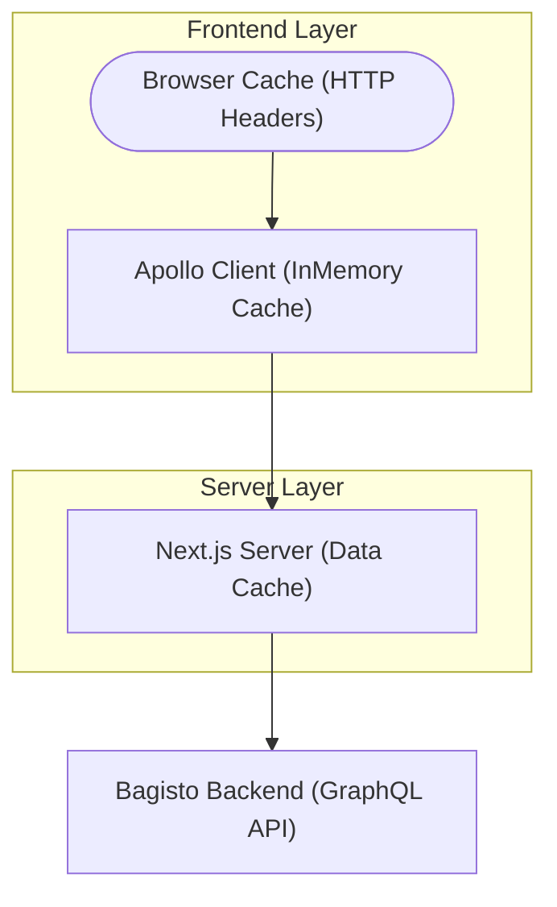

# Cache Options & Configuration

High-performance e-commerce requires a sophisticated caching strategy. Bagisto Headless utilizes a multi-layered approach to balance lightning-fast loads with data integrity.

## 1. Multi-Layered Architecture



| Layer            | Technology               | Primary Purpose                        |
| :--------------- | :----------------------- | :------------------------------------- |
| **HTTP Headers** | Browser/CDN              | Static asset & full-page caching.      |
| **Apollo Cache** | Apollo Client            | Client-side normalized data storage.   |
| **Data Cache**   | Next.js `unstable_cache` | Server-side GraphQL query persistence. |

## 2. Apollo Client Fetch Policies

These policies control how components interact with the client-side cache.

| Policy                  | Behavior                                      | Best Use Case                    |
| :---------------------- | :-------------------------------------------- | :------------------------------- |
| **`cache-first`**       | Check cache, then network.                    | Static content, categories.      |
| **`network-only`**      | Always fetch from API.                        | Real-time data, SSR.             |
| **`cache-and-network`** | Show cache immediately, update in background. | Product details, search results. |
| **`no-cache`**          | Never read or write to cache.                 | Sensitive/Transactional data.    |

> [!TIP]
> Use `cache-and-network` for a "perceived" instant load while ensuring the user eventually sees the most up-to-date metadata.

## 3. Next.js Server-Side Caching

We use a preset system in `src/lib/graphql-fetch.ts` to manage server-side TTL (Time To Live).

### Cache Life Presets

| Preset        | TTL | Typical Content                          |
| :------------ | :-- | :--------------------------------------- |
| **`seconds`** | 10s | Stock levels, limited-time flash sales.  |
| **`minutes`** | 1m  | Standard product details, price updates. |
| **`hours`**   | 1h  | Navigation menus, category listings.     |
| **`days`**    | 24h | Homepage banners, footer links.          |
| **`max`**     | 1yr | Legal documents, archived pages.         |

## 4. Revalidation & Invalidation

Keep your storefront accurate by clearing the cache when data changes.

### Tag-Based Invalidation

Use constants from `src/utils/constants.ts` to group related queries for bulk invalidation.

```tsx
// src/utils/constants.ts
export const TAGS = {
  products: "products",
  cart: "cart",
  theme: "themeCustomize",
};

// Revalidating from a Server Action
import { revalidateTag } from "next/cache";
revalidateTag(TAGS.products);
```

## 5. HTTP Cache Strategy (next.config.ts)

Control CDN behavior using standard HTTP headers.

```tsx

// Dynamic Routes (Short CDN Cache)
{
  source: "/product/:path*",
  headers: [{
    key: "Cache-Control",
    value: "public, s-maxage=3600, stale-while-revalidate=86400",
  }],
}
```

```tsx
// Private Routes (No Caching)
{
  source: "/checkout/:path*",
  headers: [{
    key: "Cache-Control",
    value: "private, no-cache, no-store, must-revalidate",
  }],
}
```

```tsx
// Static Assets (Long Persistence)
{
  source: "/_next/static/:path*",
  headers: [{
    key: "Cache-Control",
    value: "public, max-age=31536000, immutable",
  }],
}
```

## 6. Decision Matrix

| Question                           | Recommended Strategy                    |
| :--------------------------------- | :-------------------------------------- |
| **Is it user-specific?**           | `no-cache` / `private` headers.         |
| **Is it critical for SEO?**        | Server-side `hours` preset.             |
| **Does price/stock change often?** | `minutes` preset + `cache-and-network`. |
| **Is it a static legal page?**     | `max` preset + `immutable` headers.     |

📖 **Continue Reading:**

- [Apollo Client Setup](/bagisto-headless-ecommerce/apollo-client/apollo-setup.md)
- [GraphQL Request Utility](/bagisto-headless-ecommerce/apollo-client/request-utility.md)
- [Environment Variables](/bagisto-headless-ecommerce/getting-started/environment-variables.md)
