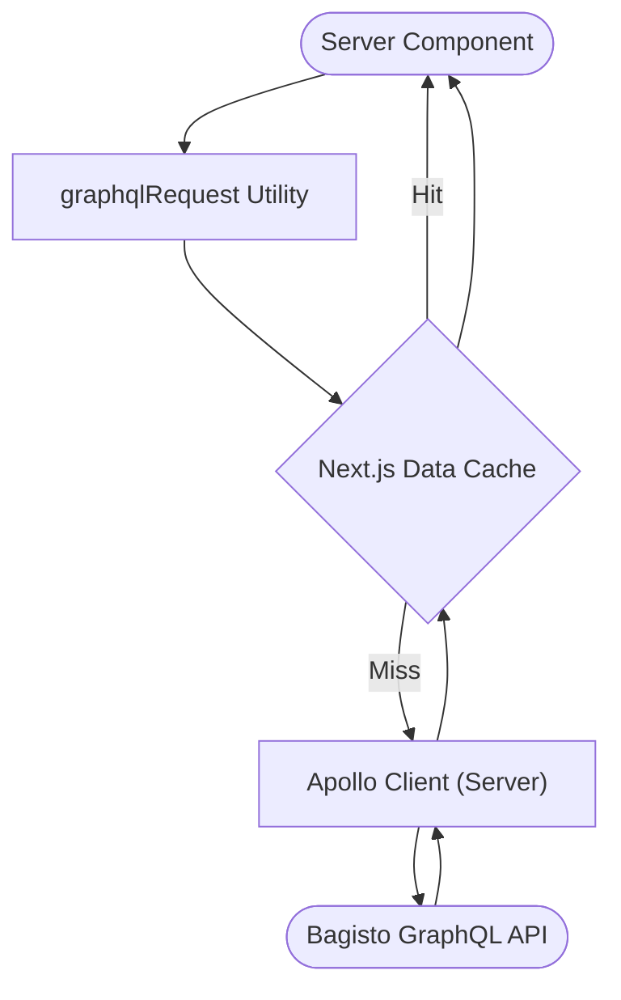

# GraphQL Request Utility

The `graphqlRequest` utility is a high-performance, server-side data fetching solution for Next.js Server Components. It bridges **Apollo Client** with **Next.js Caching APIs** (`unstable_cache`) to provide a seamless e-commerce experience.

## 1. Why Use This Utility?

Unlike traditional client-side hooks, this utility runs on the server, ensuring your storefront is fast, SEO-friendly, and secure.

| Feature          | `graphqlRequest` (Server)   | `useQuery` (Client)          |
| :--------------- | :-------------------------- | :--------------------------- |
| **SEO**          | ✅ Excellent (Pre-rendered) | ❌ Limited (Client-rendered) |
| **Performance**  | ✅ Fast (Server-to-Server)  | ⚠️ Varied (Client-to-Server) |
| **Caching**      | Next.js Data Cache          | Apollo InMemory Cache        |
| **Auth Headers** | Injected on Server          | Injected via Client Link     |

## 2. Architecture & Data Flow



## 3. Core Implementation

The utility is defined in `src/lib/graphql-fetch.ts`. Hover or swipe to see the primary patterns.

```tsx
// Standard Query with Caching
import { graphqlRequest } from "@/lib/graphql-fetch";
import { GET_PRODUCTS } from "@/graphql/queries";

export default async function ProductGrid() {
  const data = await graphqlRequest(
    GET_PRODUCTS,
    { limit: 10 },
    {
      life: "hours", // TTL Preset
      tags: ["catalog"], // For manual revalidation
    }
  );

  return <View products={data.products} />;
}
```

```tsx
// Non-Cached Query (User Data)
import { graphqlRequestNoCache } from "@/lib/graphql-fetch";
import { GET_CART } from "@/graphql/queries";

export default async function CartTotal() {
  // Bypasses Next.js cache entirely
  const data = await graphqlRequestNoCache(GET_CART);

  return <span>{data.cart.total}</span>;
}
```

```tsx
// Type-Safe Integration
interface ProductData {
  products: { name: string }[];
}

const data = await graphqlRequest<ProductData>(GET_PRODUCTS);
console.log(data.products[0].name); // Fully typed
```

## 4. Cache Configuration

### TTL Presets (`life` option)

We provide standard presets to simplify cache management across different page types.

| Preset        | TTL  | Use Case                        |
| :------------ | :--- | :------------------------------ |
| **`seconds`** | 10s  | Search results, dynamic stock.  |
| **`minutes`** | 60s  | Product pages, pricing.         |
| **`hours`**   | 1hr  | Category lists, navigation.     |
| **`days`**    | 24hr | Homepage banners, footer links. |
| **`max`**     | 1yr  | CMS pages, Legal documents.     |

### Tagging & Invalidation (`tags` option)

Group queries geographically or by entity to clear them simultaneously.

```typescript
// Create entry
await graphqlRequest(QUERY, vars, { tags: ["products", `id-${pid}`] });

// Invalidate in a Server Action
import { revalidateTag } from "next/cache";
revalidateTag("products"); // Clears all product queries
```

## 5. Technical Safeguards

- **Stable Key Generation:** The utility sorting variables alphabetically before hashing to ensure consistent cache keys regardless of object order.
- **Context Handling:** Caching is automatically disabled if a custom `context` is provided (e.g., dynamic headers), preventing sensitive data leaks.
- **Memoized Printing:** GraphQL query ASTs are memoized to strings to minimize CPU overhead on the server.

## 6. Decision Decision Matrix

> [!IMPORTANT] > **When to use `graphqlRequestNoCache`?**  
> Always use the non-cached variant for:
>
> - Shopping Carts
> - Customer Profiles
> - Checkout Steps
> - Any data dependent on `Cookie` or `Authorization` headers.

📖 **Continue Reading:**

- [Cache Options & Configuration](/bagisto-headless-ecommerce/apollo-client/cache-options.md)
- [Apollo Client Setup](/bagisto-headless-ecommerce/apollo-client/apollo-setup.md)
- [Quick Start Guide](/bagisto-headless-ecommerce/getting-started/quick-start-guide.md)
