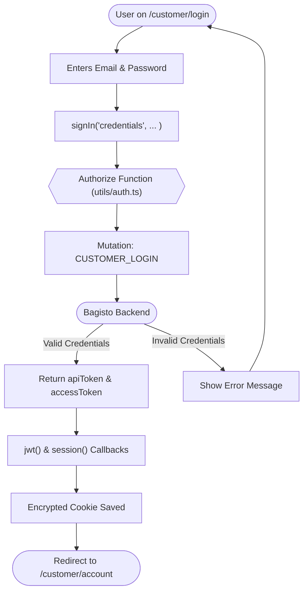

# Authentication Flow

This document provides a sequential breakdown of the authentication lifecycle in the Bagisto Headless project. It covers how a user transitions from an anonymous state to an authenticated one and how sessions are maintained across requests.


## 3.1 Scenario: Customer Login Flow

The following flow describes the journey from the Login Page to an authenticated Account Dashbaord.




## 3.2 State Management & Persistence

Authentication state is handled at multiple levels to ensure a fluid user experience.

| Layer | Responsibility | persistence |
| :--- | :--- | :--- |
| **NextAuth.js** | Manages the primary session and encrypted JWT. | **HTTP-Only Cookie:** Persists across browser refreshes and tabs. |
| **Apollo Client** | Injects the `accessToken` from the session into every GraphQL request header. | **In-Memory:** The token is retrieved from the session provider dynamically. |
| **Redux/Zustand** | (Optional) Stores non-sensitive user metadata like `firstName` or `email`. | **Client State:** Optimized for instant UI updates (e.g., "Hello, User"). |


## 3.3 Route Protection Strategies

The storefront handles protected routes (like `/customer/account` or `/checkout`) using two main methods:

### A. MiddleWare Level (Global)
Controls access before the page even begins to render.
- **Workflow:** Redirects unauthenticated users to `/customer/login` immediately.

### B. Page Level (Server Component)
Check session before fetching dashboard data.
```typescript
const session = await getServerSession(authOptions);
if (!session) redirect('/customer/login');
```


## 3.4 Data Flow: Token Injection

Once authenticated, every request sent to the Bagisto backend follows this pattern:

1. **Retreival:** The `ApolloLink` fetches the `accessToken` from the NextAuth session.
2. **Injection:** Adds the header: `Authorization: Bearer <token>`.
3. **Verification:** Bagisto verifies the Sanctum/API token.
4. **Resolution:** Bagisto returns user-specific data (e.g., personalized cart).

```mermaid
sequenceDiagram
    participant UI as React Component
    participant Link as Apollo Auth Link
    participant API as Bagisto GraphQL
    
    UI->>Link: useQuery(GET_PROFILE)
    Link->>Link: Get token from Session
    Link->>API: POST /graphql { Authorization: Bearer ... }
    API-->>UI: Return Profile Data
```


## 3.5 Session Termination (Logout)

When a user logs out:
- `signOut()` is triggered from the frontend.
- NextAuth clears the encrypted session cookie.
- The Apollo Cache is reset to prevent stale data leaks.
- The user is redirected to the Homepage or Login page.


📖 **Continue Reading:**
- [NextAuth Integration](/bagisto-headless-ecommerce/authentication/nextauth-setup.md)
- [Apollo Client Setup](/bagisto-headless-ecommerce/apollo-client/apollo-setup.md)
- [Environment Variables](/bagisto-headless-ecommerce/getting-started/environment-variables.md)
