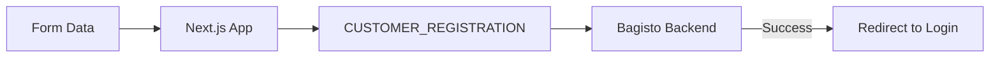

# Customer Authentication

This document details the user-facing authentication features of the Bagisto Headless storefront. It covers registration, profile management, and password recovery, highlighting the specific GraphQL mutations that power these flows.

## 5.1 Authentication Suite

The storefront provides a comprehensive suite of authentication features, leveraging specialized GraphQL mutations for each action.

| Feature | Component | GraphQL Mutation |
| :--- | :--- | :--- |
| **Login** | `LoginForm.tsx` | `CUSTOMER_LOGIN` |
| **Registration** | `RegistrationForm.tsx` | `CUSTOMER_REGISTRATION` |
| **Logout** | `CredentialModal.tsx` | `CUSTOMER_LOGOUT` |
| **Forget Password** | `ForgetPassword.tsx` | `FORGET_PASSWORD` |
| **Email Verification** | — | `VERIFY_CUSTOMER` |

## 5.2 Customer Registration

Registration creates a new customer record in Bagisto and optionally subscribes them to the newsletter.



### Required Fields
The `createCustomerInput` typically requires:
- `firstName`, `lastName`
- `email`, `password`
- `passwordConfirmation`


## 5.3 Password Management

We implement a secure, multi-step password recovery flow.

 #### 5.3.1 Forget Password Request
```graphql

// src/graphql/customer/mutations/ForgetPassword.ts
mutation forgotPassword($email: String!) {
  createForgotPassword(input: { email: $email }) {
    forgotPassword {
      success
      message
    }
  }
}
```
 #### 5.3.2 Verification Flow
```graphql

// Logic in src/graphql/customer/mutations/VerifyCustomer.ts
mutation verifyCustomer($token: String!) {
  verifyCustomer(token: $token) {
    status
    message
  }
}
```

## 5.4 Account Lifecycle Management

### Session Termination
Logout is handled by both NextAuth (to clear the secure cookie) and a GraphQL mutation (to invalidate the token on the Bagisto server).

```tsx

// Logical Logout (src/components/customer/credentials/CredentialModal.tsx)
const onSubmit = async () => {
  await logoutAction(); // Server Action for GQL Logout
  await signOut({ callbackUrl: "/customer/login" }); // NextAuth Logout
};

```

## 5.5 Developer Tips

> [!TIP]
> **Form Validation:** The storefront uses `react-hook-form` across all authentication components for real-time validation and improved UX.

- **Guest vs. Customer:** Bagisto supports guest carts. Upon login, the project logic (via `useGuestCartToken`) ensures any existing guest items are merged or handled according to the session transition.
- **Role Scoping:** By default, all authentication from the storefront is scoped to the `customer` role.


📖 **Related Documentation:**
- [Authentication Flow](/bagisto-headless-ecommerce/authentication/auth-flow.md)
- [NextAuth Integration](/bagisto-headless-ecommerce/authentication/nextauth-setup.md)
- [Protected Routes](/bagisto-headless-ecommerce/authentication/protected-routes.md)
