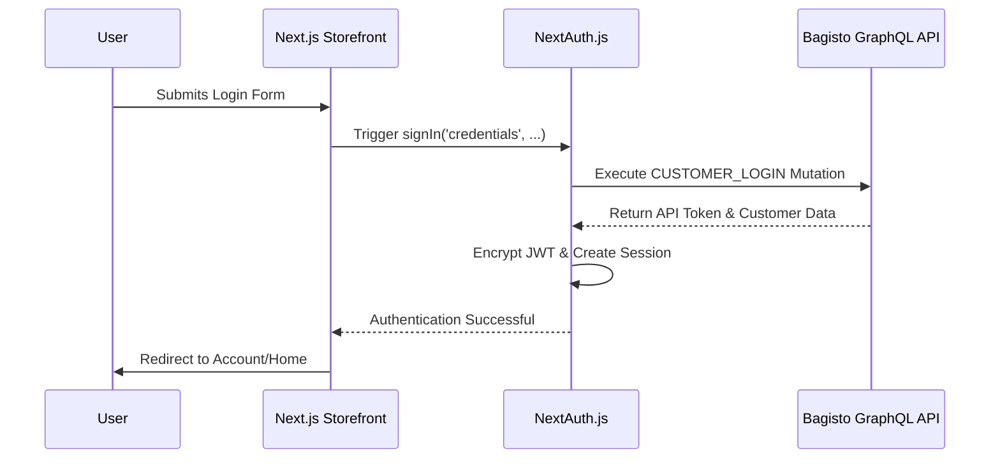

# NextAuth Integration

This guide explains how authentication is implemented in the Bagisto Headless storefront using **NextAuth.js**. We use a decoupled authentication flow where NextAuth manages the application session while communicating with the Bagisto GraphQL API for credential verification.

## 2.1 Implementation Architecture




## 2.2 Core Files & Logic

| File Path | Purpose |
| :--- | :--- |
| **[`utils/auth.ts`]** | Defines `authOptions`, including the custom Credentials provider and callbacks. |
| **[`api/auth/[...nextauth]/route.ts`]** | The NextAuth dynamic API route that handles all auth requests. |
| **[`providers/NextAuthProvider.tsx`]** | Client-side wrapper that provides session context to the entire application. |
| **[`types/next-auth.d.ts`]** | TypeScript definitions to extend the User and Session objects with custom fields. |


## 2.3 Custom Credentials Provider

The storefront uses a custom credentials provider to authenticate customers directly against the Bagisto backend.

```typescript
// Logic from src/utils/auth.ts
CredentialsProvider({
  name: "Credentials",
  authorize: async (credentials) => {
    // 1. Fetch from Bagisto
    const res = await bagistoFetch({
      query: CUSTOMER_LOGIN,
      variables: { input: { email, password } },
    });

    const login = res?.body?.data?.createLogin?.login;

    // 2. Validate response
    if (!login?.success) throw new Error(login?.message);

    // 3. Return user object to persist in JWT
    return {
      email: credentials.username,
      apiToken: login.apiToken,
      accessToken: login.token, // Sanctum token
    };
  },
})
```
<!-- slide -->
```typescript
// Session Persistence Logic
callbacks: {
  async jwt({ token, user }) {
    if (user) {
      token.accessToken = user.accessToken;
      token.apiToken = user.apiToken;
    }
    return token;
  },
  async session({ session, token }) {
    session.user.accessToken = token.accessToken;
    session.user.apiToken = token.apiToken;
    return session;
  },
}
```


## 2.4 Token Usage in GraphQL

When making authenticated requests (e.g., adding to cart, viewing orders), the `accessToken` is retrieved from the NextAuth session and injected into the GraphQL headers via the Apollo Link.

📖 **See:** [Apollo Client Setup](/bagisto-headless-ecommerce/apollo-client/apollo-setup.md)


## 2.5 Security Best Practices

> [!IMPORTANT]
> **NEXTAUTH_SECRET:** This environment variable is critical for encrypting the session JWT. Ensure it is a long, random string generated via `openssl rand -base64 32`.

- **Client-Side:** Use the `useSession()` hook to check authentication status.
- **Server-Side:** Use `getServerSession(authOptions)` for secure server-side checks.
- **Token Storage:** Authentication tokens are stored in an encrypted HTTP-only cookie by NextAuth for maximum security.


## 2.6 Common Workflows

### Manual Sign-In
```typescript
import { signIn } from "next-auth/react";

const handleLogin = async (data) => {
  await signIn("credentials", {
    username: data.email,
    password: data.password,
    callbackUrl: "/customer/account",
  });
};
```
---

### Checking Auth in Middleware
To protect entire routes, use Next.js Middleware in conjunction with NextAuth.


🏗️ **Next Steps:**
- [Project Setup](/bagisto-headless-ecommerce/getting-started/project-setup.md)
- [Apollo Client Setup](/bagisto-headless-ecommerce/apollo-client/apollo-setup.md)
- [Environment Variables](/bagisto-headless-ecommerce/getting-started/environment-variables.md)
