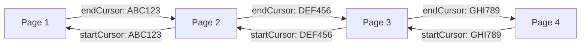

# Pagination Strategies

### Cursor-Based Pagination

Bagisto GraphQL uses **cursor-based pagination** for efficient data fetching.

#### How It Works



**Advantages:**
- ✅ Consistent results even when data changes
- ✅ No duplicate items across pages
- ✅ Efficient for large datasets
- ✅ Supports both forward and backward navigation


### Pagination Component


```ts

"use client";

import { usePathname, useSearchParams, useRouter } from "next/navigation";

export default function Pagination({
  itemsPerPage,
  itemsTotal,
  currentPage,
  nextCursor,
}) {
  const router = useRouter();
  const pathname = usePathname();
  const currentParams = useSearchParams();

  const pageCount = Math.ceil(itemsTotal / itemsPerPage);

  const handlePageClick = (page: number) => {
    if (page < 0 || page >= pageCount) return;

    const params = new URLSearchParams(currentParams.toString());
    params.set("page", String(page + 1));

    // Store cursor for next page
    if (page === currentPage + 1 && nextCursor) {
      params.set("cursor", nextCursor);
    } else {
      params.delete("cursor");
    }

    const newUrl = createUrl(pathname, params);
    router.replace(newUrl);
  };

  return (
    <ul className="flex gap-2">
      {/* Previous Button */}
      <li>
        <button
          onClick={() => handlePageClick(currentPage - 1)}
          disabled={currentPage <= 0}
        >
          Previous
        </button>
      </li>

      {/* Page Numbers */}
      {renderPageButtons()}

      {/* Next Button */}
      <li>
        <button
          onClick={() => handlePageClick(currentPage + 1)}
          disabled={currentPage >= pageCount - 1}
        >
          Next
        </button>
      </li>
    </ul>
  );
}
```


### Implementing Pagination in Search Page

```ts
export default async function SearchPage({ searchParams }) {
  const params = await searchParams;
  const { page, cursor } = params;
  const itemsPerPage = 12;
  const currentPage = page ? parseInt(page) - 1 : 0;

  let currentAfterCursor = cursor;

  // If navigating to a page without a cursor, calculate it
  if (currentPage > 0 && !cursor) {
    const cursorData = await graphqlRequest(GET_PRODUCTS_PAGINATION, {
      query: searchValue,
      first: currentPage * itemsPerPage,
      sortKey: "CREATED_AT",
      reverse: true,
    });
    currentAfterCursor = cursorData?.products?.pageInfo?.endCursor;
  }

  // Fetch products for current page
  const data = await graphqlRequest(GET_PRODUCTS, {
    query: searchValue,
    first: itemsPerPage,
    sortKey: "CREATED_AT",
    reverse: true,
    ...(currentAfterCursor && { after: currentAfterCursor }),
  });

  const products = data?.products?.edges?.map((e) => e.node) || [];
  const pageInfo = data?.products?.pageInfo;
  const totalCount = data?.products?.totalCount;

  return (
    <div>
      <ProductGrid products={products} />
      
      {totalCount > itemsPerPage && (
        <Pagination
          itemsPerPage={itemsPerPage}
          itemsTotal={totalCount}
          currentPage={currentPage}
          nextCursor={pageInfo?.endCursor}
        />
      )}
    </div>
  );
}
```

