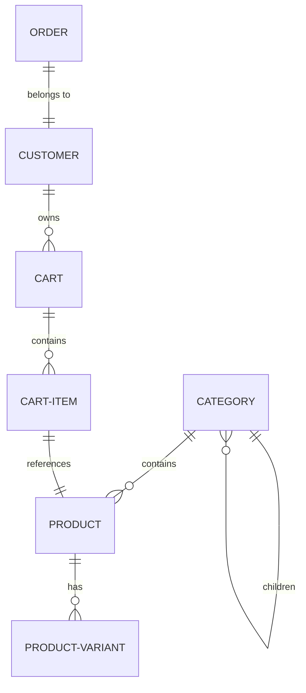

# Understanding the Schema

Bagisto Headless uses a powerful GraphQL API to communicate between the Next.js storefront and the Laravel backend. This document provides an overview of how the schema is organized and the key entities you will interact with.


## 1. Schema Organization

The GraphQL integration is modularly organized in `src/graphql/`, divided by core e-commerce domains:

| Module | Responsibility |
| :--- | :--- |
| **`catalog`** | Product listings, individual details, and category trees. |
| **`cart`** | Cart management, adding/removing items, and merging tokens. |
| **`checkout`** | Multi-step checkout, addresses, shipping, and payments. |
| **`customer`** | Authentication, registration, login and verify-customer |
| **`theme`** | Storefront configuration, banners, and static page content. |


## 2. Core Entity Relationships




## 3. Key Type Definitions

We use TypeScript interfaces to mirror the GraphQL types, providing full type safety across the frontend.

| Type | Description | File |
| :--- | :--- | :--- |
| **`ProductCore`** | Minimal product data for grids (ID, SKU, Price, Image). | `types/product.types.ts` |
| **`ProductDetailed`** | Complete product metadata including cross-sells and variants. | `types/product.types.ts` |
| **`PageInfo`** | Standard Relay-style pagination metadata. | `types/product.types.ts` |
| **`Category`** | Hierarchical data with support for localized translations. | `catelog/queries` |


## 4. Pagination Pattern

Most listing queries (Products, Search, Categories) follow a **Relay-style pagination** pattern using Edges and Nodes.

```graphql
query GetProducts {
  products(first: 10) {
    totalCount
    pageInfo {
      hasNextPage
      endCursor
    }
    edges {
      node {
        id
        name
        price
      }
    }
  }
}
```

- **Edges:** An array of objects containing the item (Node) and potentially metadata about that specific connection.
- **Node:** The actual data object (e.g., the Product).
- **PageInfo:** Indicators of whether more pages exist and the cursors for fetching them.


📖 **Continue Reading:**
- [Architecture Overview](/bagisto-headless-ecommerce/overview/architecture-overview.md)
- [GraphQL Request Utility](/bagisto-headless-ecommerce/apollo-client/request-utility.md)
- [Apollo Client Setup](/bagisto-headless-ecommerce/apollo-client/apollo-setup.md)
