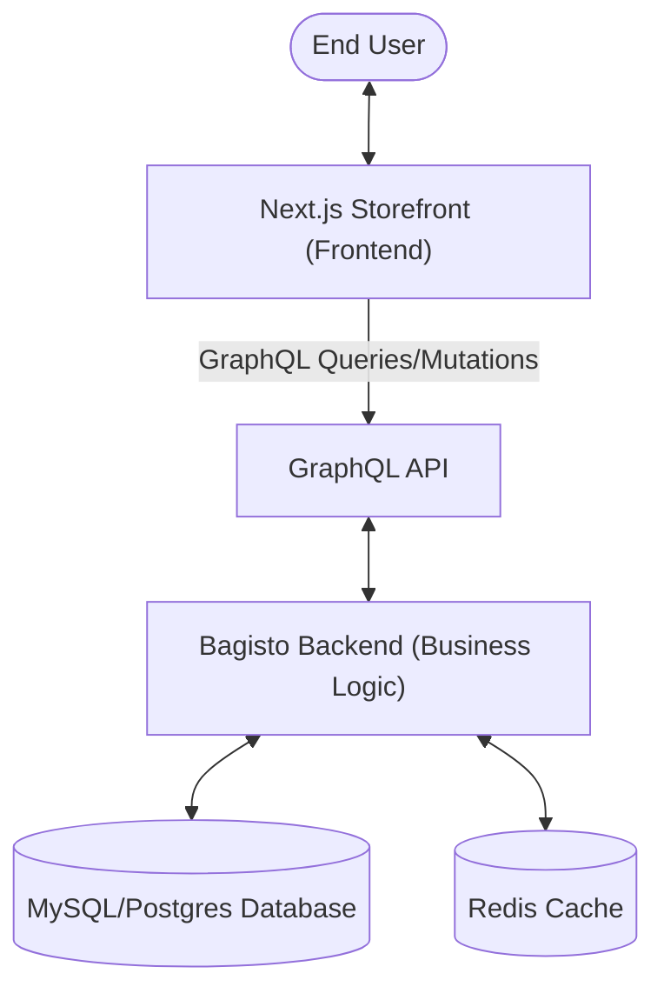
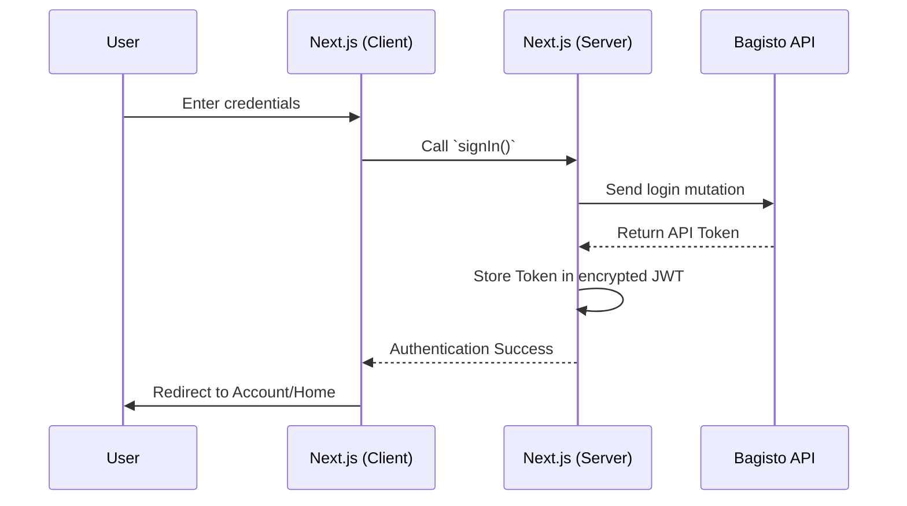

# Architecture Overview

This document provides a detailed look at the technical architecture of the Bagisto Headless project. It explains how the decoupled frontend (Next.js) and backend (Bagisto) interact via the GraphQL API to deliver a seamless e-commerce experience.

## 1. High-Level Architecture

The project follows a **headless architecture** (also known as "Modern Decoupled"), where the Presentation Layer is completely separated from the Commerce Logic and Data Storage.

## 2. Component Roles

### 2.1 Frontend: Next.js Storefront
The frontend is built with **Next.js**, leveraging React for the UI. Its primary responsibilities include:
- **Presentation:** Rendering the store UI using Tailwind CSS and HeroUI.
- **Routing:** Managing client-side and server-side navigation.
- **Data Fetching:** Initiating requests to the Bagisto API using Apollo Client.
- **State Management:** Tracking cart items, user sessions (via NextAuth.js), and UI states.
- **SEO/Performance:** Utilizing SSG for static content and ISR for dynamic product updates.

### 2.2 API Layer: GraphQL
Bagisto serves its GraphQL API. This layer acts as the bridge:
- **Schema Definition:** Defines the data types and operations (Queries/Mutations) available to the frontend.
- **Abstraction:** Hides the complexity of Laravel's internal models.
- **Efficiency:** Allows the frontend to request exactly what it needs, reducing payload sizes.

### 2.3 Backend: Bagisto Core
Built on **Laravel**, the backend manages the core commerce logic:
- **Catalog Management:** Categories, products, attributes.
- **Order Management:** Checkout flows, tax calculations, shipping.
- **Customer Management:** Profiles, wishlists, address books.
- **Admin Dashboard:** A centralized portal for store administrators.

## 3. Data Flow and Interaction

### 3.1 Fetching Catalog Data (SSG/ISR)
For public pages like Home or Production Detail Pages (PDP), Next.js performs the data fetch on the server side.

1. **Build/Regeneration:** Next.js triggers a `fetch` request to the `/graphql` endpoint.
2. **API Processing:** The query is resolved using Bagisto's internal services.
3. **HTML Generation:** Next.js receives the JSON, populates the React components, and generates static HTML.
4. **Delivery:** The static HTML is served to the user instantly.

### 3.2 Dynamic User Actions (Client-Side)
For actions like "Add to Cart" or "Login":
1. **User Action:** The user clicks a button in the browser.
2. **Mutation:** Apollo Client sends a GraphQL Mutation to the server.
3. **Session Handling:** The request includes an authentication token or session cookie.
4. **Live Update:** The backend updates the database/cart; the frontend updates the UI state immediately without a page refresh.

## 4. Authentication Flow

The project utilizes **NextAuth.js** integrated with Bagisto's authentication system.

## 5. Deployment Architecture

When deployed, the systems are typically partitioned:

- **Frontend Hosting:** Vercel or Netlify (highly optimized for Next.js).
- **Backend Hosting:** A VPS or Cloud Instance (AWS, DigitalOcean) running PHP, Nginx, and MySQL.
- **Asset Delivery:** Images are often served via a CDN (Cloudflare or Bagisto's integrated storage).

## Summary of Benefits

| Feature | Architectural Benefit |
|---------|-----------------------|
| **Decoupling** | Frontend and Backend can be updated independently. |
| **GraphQL** | Only the necessary data is transferred, improving speed on mobile devices. |
| **Next.js Rendering** | Fast First Contentful Paint (FCP) and excellent SEO. |
| **Scalability** | High-traffic storefronts can scale on the frontend without overloading the backend. |

> [!NOTE]
> For more information on how to configure the connection between these layers, see the [Quick Start Guide](/bagisto-headless-ecommerce/getting-started/quick-start-guide.md).
