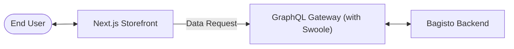

# Introduction

Welcome to the **[Bagisto Headless Commerce](https://bagisto.com/en/headless-ecommerce/)** developer documentation. This guide provides a comprehensive framework for integrating the Bagisto GraphQL API with Next.js to build cutting-edge, high-performance e-commerce storefronts.

## 1.1 What is Bagisto Headless?

Bagisto Headless is a modern architectural approach where the **presentation layer (frontend)** is completely decoupled from the **commerce engine (backend)**.

- **Bagisto Application Server:** The Bagisto Application Server is an API-first application that uses Swoole to run Laravel as a long-lived process, keeping the application in memory between requests. This reduces bootstrap overhead and improves performance for API-driven and headless commerce.
- **Frontend (Next.js):** A flexible, high-performance UI layer that consumes data from the backend via a GraphQL API.

> [!TIP]
> This decoupling allows for absolute design freedom, faster development cycles, and the ability to serve multiple platforms (web, mobile, IoT) from a single backend.

## 1.2 Why GraphQL?

In a headless ecosystem, the communication layer is vital. Bagisto utilizes **GraphQL** to provide a superior developer experience compared to traditional REST APIs.

### Key Advantages
- **No Over-fetching:** Request exactly the fields you need for a specific component.
- **Single Request:** Fetch complex data structures (e.g., product + reviews + related items) in a single round-trip.
- **Strongly Typed:** Benefit from IDE autocompletion and schema validation during development.
- **Self-Documenting:** Use tools like GraphQL Playground to explore the entire API live.

📖 **Learn more:** [Why GraphQL?](/bagisto-headless-ecommerce/overview/why-graphql.md)

## 1.3 Why Next.js?

Next.js is the industry standard for React-based commerce. By pairing it with Bagisto Headless, you gain:

### Key Features
- **SSR & SSG:** Server-side rendering for checkout security and static generation for lightning-fast product pages.
- **ISR (Incremental Static Regeneration):** Update product pages silently in the background when stock or prices change.
- **Image Optimization:** Built-in tools to handle high-resolution product photography without sacrificing load times.
- **SEO Ready:** Fully pre-rendered HTML for maximum visibility in search engine rankings.
- **Developer Velocity:** Built-in TypeScript support and Fast Refresh.
- **Secure Checkout:** Move sensitive logic to Server Actions to keep business rules off the client side.

📖 **Learn more:** [Why Next.js?](/bagisto-headless-ecommerce/overview/why-nextjs.md)

## 1.4 Architecture at a Glance

The following diagram illustrates the high-level data flow between the systems:

1. **Request:** The user navigates to a URL.
2. **Fetch:** Next.js sends a GraphQL query to the Bagisto backend.
3. **Resolve:** Bagisto processes the business logic and returns a JSON payload.
4. **Render:** Next.js generates the HTML and delivers a fully accessible page to the user.

## 1.5 Technology Stack

| Layer | Standard | Implementation |
|-------|----------|----------------|
| **Frontend** | React | Next.js 16+ (App Router) |
| **API Client** | GraphQL | Apollo Client / URQL |
| **Styling** | Utility-First | Tailwind CSS |
| **Backend** | PHP/Laravel | Bagisto Core |
| **Server Runtime** | High-concurrency | PHP Swoole|

## 1.6 What You'll Learn

This documentation is structured to take you from a fresh installation to a production-ready storefront:

✅ **Set up your Environment:** Configure your development environment and connect to the API.  
✅ **Data Fetching:** Master GraphQL queries for complex catalog structures.  
✅ **Features:** Implement cart, checkout, customer accounts, and wishlists.  
✅ **State:** Manage user sessions and local cart state effectively.  
✅ **Performance:** Apply advanced caching and rendering strategies like ISR.  

## Next Steps

Ready to build the future of e-commerce? Start with the setup guides:

- 📋 [Prerequisites](/bagisto-headless-ecommerce/overview/prerequisites.md) - Check your environment.
- 🚀 [Quick Start Guide](/bagisto-headless-ecommerce/getting-started/quick-start-guide.md) - Run your first storefront.
- 🏗️ [Architecture Overview](/bagisto-headless-ecommerce/overview/architecture-overview.md) - Deep dive into the system.
