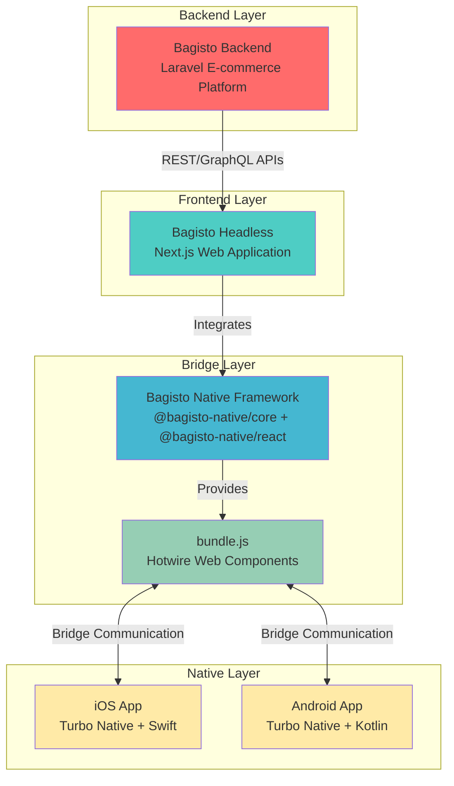

# High-level Architecture

Bagisto Native provides a complete ecosystem for building native mobile applications using web technologies. The architecture consists of four main layers that work together seamlessly.

## Architecture Overview

## Architecture Layers

### 1. Backend Layer: Bagisto Backend
- **Technology**: Laravel-based e-commerce platform
- **Role**: Provides core business logic, database management, and APIs
- **Responsibilities**:
  - Product catalog management
  - Order processing
  - User authentication and authorization
  - Payment gateway integration
  - Inventory management
  - API endpoints for frontend consumption

### 2. Frontend Layer: Bagisto Headless
- **Technology**: Next.js-based headless commerce storefront
- **Role**: Renders the user interface and handles client-side logic
- **Responsibilities**:
  - Server-side rendering (SSR) and static generation
  - SEO optimization
  - UI/UX presentation
  - Client-side routing
  - API integration with backend
  - Integration of Bagisto Native Framework components

### 3. Bridge Layer: Bagisto Native Framework
- **Technology**: TypeScript/JavaScript modules
- **Components**:
  - `@bagisto-native/core`: Core web components and utilities
  - `@bagisto-native/react`: React wrappers for web components
  - `bundle.js`: Minified Hotwire web components bundle
- **Role**: Creates a communication bridge between web and native layers
- **Responsibilities**:
  - Provides Web Components for native interactions
  - Manages bidirectional communication
  - Exposes utility functions and event triggers
  - Handles native feature integration (toast, location, search, etc.)

### 4. Native Layer: Mobile Applications
- **Technology**: 
  - iOS: Swift + Turbo Native iOS
  - Android: Kotlin + Turbo Native Android
- **Role**: Native mobile app shell that wraps the web application
- **Responsibilities**:
  - WebView management
  - Native UI components (navigation, toolbars)
  - Platform-specific features (camera, location, notifications)
  - App store distribution
  - Native performance optimization

## Data Flow

### Request Flow (User Action → Backend)
1. User interacts with the mobile app (iOS/Android)
2. Native app loads web content via Turbo Native WebView
3. Bagisto Headless (Next.js) renders the UI
4. User action triggers API call to Bagisto Backend
5. Backend processes request and returns response
6. Headless updates UI accordingly
7. Native app reflects the changes

### Native Feature Flow (Web → Native)
1. Web application uses Bagisto Native components
2. Component triggers event via `bundle.js` bridge
3. Turbo Native intercepts the event
4. Native code executes platform-specific functionality
5. Native sends result back via bridge
6. Web application receives and processes the result

## Key Architectural Principles

### Separation of Concerns
Each layer has a distinct responsibility:
- Backend handles business logic
- Headless manages presentation
- Native Framework provides the bridge
- Native apps deliver platform integration

### Progressive Enhancement
The application works as a web app first, then enhances with native features when available.

### Reusability
The same Bagisto Headless codebase serves:
- Web browsers
- iOS native app
- Android native app

### Performance
- SSR/SSG from Next.js for fast initial loads
- Native navigation for app-like experience
- Optimized bridge communication for smooth interactions

## Communication Mechanisms

### Web to Native
- Custom events dispatched by Web Components
- Hotwire bridge intercepts events
- Native listeners execute corresponding actions

### Native to Web
- Native components dispatch custom events
- JavaScript event listeners in web application
- React components react to state changes

## Technology Stack Summary

| Layer | Primary Technology | Supporting Technologies |
|-------|-------------------|------------------------|
| Backend | Laravel | MySQL/PostgreSQL, Redis, PHP |
| Headless | Next.js | React, TypeScript, Tailwind CSS |
| Bridge | Hotwire | Web Components, Custom Events |
| iOS | Swift | Turbo Native iOS, WebKit |
| Android | Kotlin | Turbo Native Android, WebView |

## Benefits of This Architecture

1. **Code Reusability**: Write once (web), deploy everywhere (web, iOS, Android)
2. **Rapid Development**: Leverage web development speed with native app benefits
3. **Easy Updates**: Update web content without app store submissions
4. **Native Performance**: Critical features use native code for best performance
5. **Maintainability**: Clear separation makes each layer easier to maintain
6. **Scalability**: Each layer can scale independently based on needs

## Next Steps

- Understand the [Web ↔ Native Communication Flow](./web-native-communication-flow.md)
- Learn about [Roles of Components](./roles-of-components.md)
- Explore [Hotwire & Turbo Native](./hotwire-turbo-native.md)