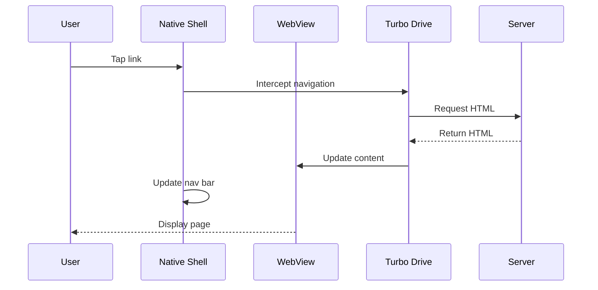

# Hotwire & Turbo Native

**Hotwire** (HTML Over The Wire) and **Turbo Native** are the foundational technologies that power Bagisto Native, enabling the creation of hybrid mobile applications that feel native while using web technologies.

## What is Hotwire?

Hotwire is a framework created by Basecamp (now 37signals) that allows you to build modern, fast web applications by sending HTML over the wire instead of JSON.

### Core Principle

```
Traditional Approach:          Hotwire Approach:
Server → JSON → Client         Server → HTML → Client
         ↓                              ↓
    JavaScript renders          Browser renders directly
```

### Hotwire Components

Hotwire consists of three main libraries:

1. **Turbo**: Handles navigation and page updates
2. **Stimulus**: Manages JavaScript behavior
3. **Strada** (optional): Native bridge for mobile apps

## What is Turbo Native?

**Turbo Native** is a framework that allows you to build mobile applications using native iOS and Android code with web views, powered by Turbo.

### Key Concept

```
┌──────────────────────────────┐
│     Native App Shell         │
│  ┌────────────────────────┐  │
│  │      WebView           │  │
│  │  (Your Web App)        │  │
│  │                        │  │
│  │  ┌──────────────────┐  │  │
│  │  │   Turbo Drive    │  │  │
│  │  └──────────────────┘  │  │
│  └────────────────────────┘  │
│                              │
│  ┌────────────────────────┐  │
│  │  Native UI Components  │  │
│  │  (Nav, Toolbar, etc.)  │  │
│  └────────────────────────┘  │
└──────────────────────────────┘
```

The native app provides:
- Native navigation
- Native UI chrome (nav bars, toolbars)
- Access to platform APIs (camera, location, etc.)

The web view provides:
- All your application content
- Business logic
- UI/UX that updates without app store submissions

## How Turbo Native Works

### 1. Navigation Flow



### 2. Visit Types

Turbo Native supports different visit types:

#### Advance (Default)
```
Page A → Page B
  ↓        ↓
 Cache   Fresh
         Content
```
- Pushes new page onto navigation stack
- Shows cached version immediately
- Fetches fresh content in background

#### Replace
```
Page A → Page B
  ↓        ↓
Remove   Replace
```
- Replaces current page in stack
- Used for redirects or form submissions

#### Restore
```
Back Button
    ↓
Cached Page
```
- Restores from cache when going back
- No server request needed

### 3. Page Rendering

#### Progressive Rendering:

1. **Instant Response**: Show cached version
2. **Background Fetch**: Load fresh content
3. **Seamless Update**: Replace cache with fresh content

```swift
// iOS Example
func session(_ session: Session, didProposeVisit proposal: VisitProposal) {
    // Configure visit action
    let action: VisitAction = proposal.properties["action"] == "replace" ? .replace : .advance
    
    // Perform visit with action
    session.visit(proposal.url, action: action)
}
```

## Turbo Features Used by Bagisto Native

### 1. Turbo Drive

Fast page transitions without full page reloads.

**Benefits:**
- Instant navigation (uses cached pages)
- Maintains scroll position
- Preserves form state
- Reduces server load

**How it works:**
```javascript
// When user clicks a link:
document.addEventListener('turbo:click', (event) => {
  // Turbo intercepts the click
  event.preventDefault();
  
  // Fetches new page via AJAX
  fetch(event.target.href)
    .then(response => response.text())
    .then(html => {
      // Replaces <body> content
      document.body.innerHTML = extractBody(html);
      
      // Updates browser history
      history.pushState({}, '', event.target.href);
    });
});
```

### 2. Turbo Frames

Update specific parts of a page independently.

```html
<!-- Example: Product Reviews Frame -->
<turbo-frame id="product-reviews">
  <div class="reviews">
    <!-- Reviews content -->
  </div>
  <a href="/products/123/reviews?page=2">Load more</a>
</turbo-frame>
```

When "Load more" is clicked:
- Only the `product-reviews` frame updates
- Rest of the page stays intact
- Native scroll position preserved

### 3. Turbo Streams

Real-time page updates via WebSocket or Server-Sent Events.

```html
<!-- Server sends Turbo Stream -->
<turbo-stream action="append" target="notifications">
  <template>
    <div class="notification">New order received!</div>
  </template>
</turbo-stream>
```

**Use cases in Bagisto Native:**
- Cart count updates
- Order status changes
- Stock availability updates
- Live chat messages

## Bridge Communication in Turbo Native

### Message Passing Architecture

```
Web Layer                Native Layer
    │                        │
    │  ┌──────────────┐      │
    │  │  bundle.js   │      │
    │  └──────┬───────┘      │
    │         │              │
    ├─────────┼──────────────┤
    │         │              │
    │    Turbo Bridge        │
    │         │              │
    ├─────────┼──────────────┤
    │         │              │
    │         ▼              │
    │   Platform Bridge      │
    │  (webkit/Android)      │
    │                        │
```

### iOS Bridge Example

```swift
// Native side
class ScriptMessageHandler: NSObject, WKScriptMessageHandler {
    func userContentController(
        _ userContentController: WKUserContentController,
        didReceive message: WKScriptMessage
    ) {
        guard let body = message.body as? [String: Any],
              let type = body["type"] as? String else {
            return
        }
        
        handleMessage(type: type, data: body["data"])
    }
}

// Web side (via bundle.js)
window.webkit.messageHandlers.nativeBridge.postMessage({
    type: 'toast',
    data: { message: 'Hello!' }
});
```

### Android Bridge Example

```kotlin
// Native side
class JavaScriptInterface {
    @JavascriptInterface
    fun postMessage(message: String) {
        val json = JSONObject(message)
        val type = json.getString("type")
        val data = json.getJSONObject("data")
        
        handleMessage(type, data)
    }
}

// Register interface
webView.addJavascriptInterface(JavaScriptInterface(), "NativeBridge")

// Web side (via bundle.js)
window.NativeBridge.postMessage(JSON.stringify({
    type: 'toast',
    data: { message: 'Hello!' }
}));
```

## Turbo Native Adapters

Turbo Native provides platform-specific adapters.

### iOS Adapter Features

| Feature | Description |
|---------|-------------|
| Session Management | Single session per app |
| Visit Handling | Customizable visit proposals |
| Path Configuration | Route-specific native screens |
| WebView Customization | Full control over WKWebView |
| Navigation | UINavigationController integration |

### Android Adapter Features

| Feature | Description |
|---------|-------------|
| Fragment-based | Each web page is a Fragment |
| Navigation Component | Jetpack Navigation support |
| WebView Configuration | Custom WebView settings |
| Deep Linking | App link handling |
| Back Stack | Proper back button handling |

## Path Configuration

Control which routes show native screens vs web views.

### iOS Path Configuration:

```swift
// PathConfiguration.swift
import Turbo

class PathConfiguration {
    static let shared = PathConfiguration()
    
    private let configuration: PathConfigurationJSONObject
    
    init() {
        let url = Bundle.main.url(forResource: "path-configuration", withExtension: "json")!
        let data = try! Data(contentsOf: url)
        configuration = try! JSONDecoder().decode(PathConfigurationJSONObject.self, from: data)
    }
    
    func properties(for url: URL) -> PathProperties {
        // Find matching rule
        for rule in configuration.rules {
            if url.path.hasPrefix(rule.patterns.first!) {
                return rule.properties
            }
        }
        
        return PathProperties(context: .default, uri: .web)
    }
}

// path-configuration.json
{
  "rules": [
    {
      "patterns": ["/products/*"],
      "properties": {
        "context": "default",
        "uri": "turbo://web"
      }
    },
    {
      "patterns": ["/checkout"],
      "properties": {
        "context": "modal",
        "uri": "turbo://native"
      }
    }
  ]
}
```

### Android Path Configuration:

```kotlin
// PathConfiguration.kt
class PathConfiguration(context: Context) {
    private val rules: List<PathRule>
    
    init {
        val json = context.assets.open("path-configuration.json")
            .bufferedReader()
            .use { it.readText() }
        
        rules = Json.decodeFromString(json)
    }
    
    fun properties(url: String): PathProperties {
        rules.forEach { rule ->
            if (url.startsWith(rule.pattern)) {
                return rule.properties
            }
        }
        
        return PathProperties(context = "default", uri = "turbo://web")
    }
}
```

## Advanced Features

### 1. Native Screens

Show fully native screens for specific routes.

```swift
// iOS: Native product detail screen
func session(_ session: Session, didProposeVisit proposal: VisitProposal) {
    let url = proposal.url
    
    if url.path.contains("/products/") {
        // Show native product screen
        let productVC = NativeProductViewController(url: url)
        navigationController.pushViewController(productVC, animated: true)
    } else {
        // Show web view
        session.visit(url)
    }
}
```

### 2. Modal Presentations

Show certain pages as modals.

```swift
// iOS: Modal checkout
func shouldPresentAsModal(url: URL) -> Bool {
    return url.path.contains("/checkout")
}

if shouldPresentAsModal(url: proposal.url) {
    let modalNav = UINavigationController()
    let webView = WebViewController(url: proposal.url)
    modalNav.viewControllers = [webView]
    present(modalNav, animated: true)
}
```

### 3. Pull-to-Refresh

Native pull-to-refresh gesture.

```swift
// iOS
webView.scrollView.refreshControl = UIRefreshControl()
webView.scrollView.refreshControl?.addTarget(
    self,
    action: #selector(refresh),
    for: .valueChanged
)

@objc func refresh() {
    session.reload()
    webView.scrollView.refreshControl?.endRefreshing()
}
```

### 4. Progress Indicators

Native loading indicators.

```swift
// iOS: Progress bar
class SessionController: SessionDelegate {
    let progressView = UIProgressView(progressViewStyle: .bar)
    
    func session(_ session: Session, didStartFormSubmission: URL) {
        progressView.progress = 0
        progressView.isHidden = false
    }
    
    func session(_ session: Session, didFinishFormSubmission: URL) {
        progressView.isHidden = true
    }
}
```

## Performance Optimization

### 1. Caching Strategy

```swift
// Configure cache
let cache = URLCache(
    memoryCapacity: 50 * 1024 * 1024,  // 50 MB
    diskCapacity: 100 * 1024 * 1024,    // 100 MB
    diskPath: "turbo_cache"
)

URLCache.shared = cache
```

### 2. Prefetching

```swift
// Prefetch likely next pages
func prefetchNextPages() {
    let urls = [
        URL(string: "https://store.com/categories"),
        URL(string: "https://store.com/cart")
    ]
    
    urls.forEach { url in
        session.coldBootVisit(url)
    }
}
```

### 3. Image Optimization

Use native image caching for better performance.

```swift
// iOS: Native image caching
import Kingfisher

webView.configuration.userContentController.add(
    makeHandler { message in
        if let imageUrl = message.body as? String {
            KingfisherManager.shared.retrieveImage(with: URL(string: imageUrl)!)
        }
    },
    name: "imageCache"
)
```

## Debugging Turbo Native

### Enable Debug Mode

```swift
// iOS: Debug logging
#if DEBUG
Turbo.config.debugLoggingEnabled = true
#endif
```

```kotlin
// Android: Debug logging
if (BuildConfig.DEBUG) {
    WebView.setWebContentsDebuggingEnabled(true)
}
```

### Common Issues

| Issue | Cause | Solution |
|-------|-------|----------|
| White screen | bundle.js not loaded | Check script tag |
| No navigation | Visit not handled | Implement delegate |
| Slow loading | No caching | Configure URLCache |
| Bridge not working | Interface not registered | Check addJavascriptInterface |

## Benefits of Turbo Native

### 1. Development Speed
- Write once (web), deploy to iOS and Android
- Update content without app store review
- Leverage web development tools

### 2. Native Experience
- Smooth transitions
- Native navigation
- Platform-specific features
- Offline support

### 3. Maintenance
- Single codebase for content
- Easy bug fixes
- Faster iteration cycles

### 4. Performance
- Instant page transitions
- Efficient caching
- Progressive loading
- Minimal network usage

## Limitations & Considerations

### What Turbo Native Is NOT

❌ **Not a WebView wrapper**: It's a sophisticated hybrid framework
❌ **Not Cordova/PhoneGap**: Different architecture and philosophy
❌ **Not React Native**: Uses web views, not native widgets
❌ **Not for games**: Better for content-driven apps

### When to Use Turbo Native

✅ **Content-driven apps**: E-commerce, news, social
✅ **Existing web app**: You already have a web application
✅ **Rapid iteration**: Need to update content frequently
✅ **Cross-platform**: Want to maintain one codebase

### When NOT to Use Turbo Native

❌ **Heavy animations**: Games, animation-heavy apps
❌ **Offline-first**: Apps that work primarily offline
❌ **Complex native UI**: Apps requiring lots of native widgets
❌ **High performance**: Apps requiring maximum performance

## Turbo Native vs Alternatives

| Feature | Turbo Native | React Native | Cordova | Flutter |
|---------|--------------|--------------|---------|---------|
| Web Content | ✅ Native | ❌ No | ✅ Yes | ❌ No |
| Native UI | ✅ Yes | ✅ Yes | ⚠️ Limited | ✅ Yes |
| Code Sharing | ✅ High | ⚠️ Medium | ✅ High | ⚠️ Medium |
| Learning Curve | ✅ Easy | ⚠️ Medium | ✅ Easy | ⚠️ Medium |
| Performance | ⚠️ Good | ✅ Excellent | ❌ Poor | ✅ Excellent |
| Hot Reload | ✅ Yes | ✅ Yes | ⚠️ Limited | ✅ Yes |
| App Size | ✅ Small | ⚠️ Medium | ✅ Small | ⚠️ Large |

## Best Practices

1. **Optimize web content** for mobile viewports
2. **Use progressive enhancement** for native features
3. **Cache aggressively** for offline support
4. **Keep bundle.js updated** with framework updates
5. **Test on real devices** not just simulators
6. **Monitor performance** with native profiling tools
7. **Follow platform guidelines** for UI/UX
8. **Version your APIs** for backward compatibility

## Real-World Examples

### Companies Using Turbo Native:

- **Basecamp**: Project management (originators)
- **HEY**: Email service
- **GitHub Mobile**: Code repository browsing
- **37signals**: Various products

## Next Steps

- Understand [Why WebView + Native Bridge](./why-webview-native-bridge.md)
- Learn about [High-level Architecture](./high-level-architecture.md)
- Explore [Web ↔ Native Communication Flow](./web-native-communication-flow.md)

## Additional Resources

- [Turbo Handbook](https://turbo.hotwired.dev/handbook/introduction)
- [Turbo Native iOS](https://github.com/hotwired/turbo-ios)
- [Turbo Native Android](https://github.com/hotwired/turbo-android)
- [Hotwire Discussion Forum](https://discuss.hotwired.dev/)
- [Turbo Native Directory](https://www.turbo-native.org/)
## Next Steps

- Explore [Why WebView + Native Bridge](./why-webview-native-bridge.md)
- Learn about [Packages](../packages/core-package.md)
- Understand [Integrating Native Framework](../integrating-native-framework/installing-packages.md)
