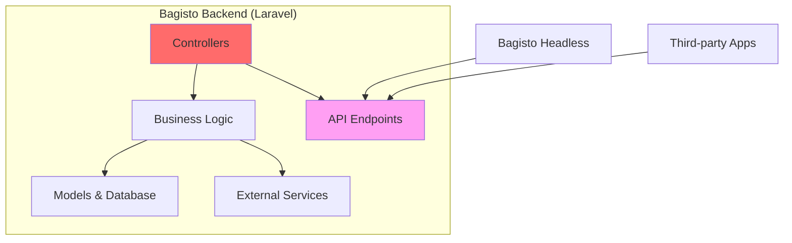

# Bagisto Backend

The **Bagisto Backend** is a Laravel-based e-commerce platform that serves as the foundation of the entire Bagisto Native ecosystem. It provides all the business logic, data management, and API endpoints required for a full-featured commerce application.

## Overview



## Technology Stack

| Component | Technology | Purpose |
|-----------|-----------|---------|
| Framework | Laravel 10+ | PHP framework |
| Database | MySQL / PostgreSQL | Data persistence |
| Cache | Redis | Performance optimization |
| Queue | Redis / Database | Async job processing |
| Storage | Local / S3 | File storage |
| API | REST / GraphQL | Data exposure |

## Core Responsibilities

### 1. Data Management

The backend is the **single source of truth** for all application data.

#### Managed Entities:
- **Products**: Catalog, attributes, variants, inventory
- **Categories**: Hierarchical organization
- **Customers**: User accounts, addresses, preferences
- **Orders**: Cart, checkout, order processing
- **Payments**: Transaction records, payment methods
- **Shipping**: Methods, rates, tracking
- **CMS**: Pages, blocks, banners
- **Configuration**: Store settings, locales, currencies

#### Database Schema:
```
┌─────────────┐     ┌─────────────┐     ┌─────────────┐
│  products   │────▶│order_items  │◀────│   orders    │
└─────────────┘     └─────────────┘     └─────────────┘
       │                                        │
       │                                        ▼
       ▼                                 ┌─────────────┐
┌─────────────┐                         │ customers   │
│ categories  │                         └─────────────┘
└─────────────┘
```

### 2. Business Logic

All core commerce logic resides in the backend.

#### Key Operations:
- **Product Management**: CRUD, pricing rules, inventory tracking
- **Order Processing**: Cart calculations, tax computation, order workflow
- **Payment Processing**: Gateway integration, transaction handling
- **Shipping Calculations**: Rate computation, carrier integration
- **Promotions**: Discount rules, coupon validation
- **Inventory Management**: Stock tracking, reservations
- **User Management**: Authentication, authorization, roles

#### Example: Order Processing Flow
```php
// Simplified Laravel order processing
class OrderService {
    public function processOrder(Cart $cart, Customer $customer) {
        // 1. Validate cart items
        $this->validateInventory($cart);
        
        // 2. Calculate totals
        $subtotal = $cart->calculateSubtotal();
        $tax = $this->taxService->calculate($cart, $customer);
        $shipping = $this->shippingService->calculate($cart, $customer);
        
        // 3. Create order
        $order = Order::create([
            'customer_id' => $customer->id,
            'subtotal' => $subtotal,
            'tax' => $tax,
            'shipping' => $shipping,
            'total' => $subtotal + $tax + $shipping
        ]);
        
        // 4. Process payment
        $this->paymentService->charge($order);
        
        // 5. Reserve inventory
        $this->inventoryService->reserve($order);
        
        return $order;
    }
}
```

### 3. API Endpoints

The backend exposes RESTful and/or GraphQL APIs consumed by the headless frontend.

#### REST API Structure:
```
/api/v1
  ├── /products
  │   ├── GET    /           # List products
  │   ├── GET    /{id}       # Get product details
  │   ├── POST   /search     # Search products
  │   └── GET    /featured   # Featured products
  │
  ├── /cart
  │   ├── GET    /           # Get cart
  │   ├── POST   /add        # Add to cart
  │   ├── PUT    /update     # Update cart item
  │   └── DELETE /remove     # Remove from cart
  │
  ├── /checkout
  │   ├── POST   /           # Place order
  │   └── GET    /confirm    # Order confirmation
  │
  ├── /customer
  │   ├── POST   /login      # Login
  │   ├── POST   /register   # Register
  │   ├── GET    /profile    # Get profile
  │   └── GET    /orders     # Order history
  │
  └── /cms
      ├── GET    /pages      # CMS pages
      └── GET    /blocks     # Content blocks
```

#### API Response Format:
```json
{
  "data": {
    "id": 1,
    "name": "Wireless Headphones",
    "price": 99.99,
    "images": [...]
  },
  "meta": {
    "timestamp": "2024-01-15T10:30:00Z",
    "version": "1.0"
  }
}
```

### 4. Authentication & Authorization

Handles user identity and permissions.

#### Authentication Methods:
- **Session-based**: For admin panel
- **Token-based (JWT/Sanctum)**: For API access
- **OAuth**: For third-party integrations

#### Authorization:
```php
// Role-based access control
class ProductController {
    public function update(Request $request, Product $product) {
        // Check permissions
        $this->authorize('update', $product);
        
        // Update logic...
    }
}
```

### 5. External Integrations

Connects with third-party services.

#### Common Integrations:
- **Payment Gateways**: Stripe, PayPal, Razorpay
- **Shipping Carriers**: FedEx, UPS, DHL
- **Email Services**: SendGrid, Mailgun
- **Analytics**: Google Analytics
- **CDN**: Cloudflare, AWS CloudFront
- **Search**: Elasticsearch, Algolia

## Architecture Patterns

### 1. MVC Pattern
```
┌──────────────┐     ┌──────────────┐     ┌──────────────┐
│   Route      │────▶│  Controller  │────▶│    Model     │
└──────────────┘     └──────────────┘     └──────────────┘
                            │                      │
                            ▼                      ▼
                     ┌──────────────┐     ┌──────────────┐
                     │     View     │     │   Database   │
                     └──────────────┘     └──────────────┘
```

### 2. Service Layer Pattern
```php
// Separating business logic from controllers
class CheckoutController {
    public function __construct(
        private OrderService $orderService,
        private PaymentService $paymentService
    ) {}
    
    public function placeOrder(Request $request) {
        $order = $this->orderService->create($request->all());
        $payment = $this->paymentService->process($order);
        
        return response()->json(['order' => $order]);
    }
}
```

### 3. Repository Pattern
```php
// Data access abstraction
interface ProductRepositoryInterface {
    public function find($id);
    public function search($criteria);
    public function featured($limit);
}

class ProductRepository implements ProductRepositoryInterface {
    public function find($id) {
        return Product::with('images', 'variants')->find($id);
    }
}
```

## Performance Optimization

### 1. Caching Strategy
```php
// Cache product data
$product = Cache::remember("product.{$id}", 3600, function() use ($id) {
    return Product::with('images', 'categories')->find($id);
});
```

### 2. Database Optimization
- **Eager Loading**: Prevent N+1 queries
- **Indexing**: Optimize frequently queried columns
- **Query Optimization**: Use database-specific features

### 3. Queue Processing
```php
// Async email sending
dispatch(new SendOrderConfirmationEmail($order));
```

## Security Considerations

### 1. Input Validation
```php
$validated = $request->validate([
    'email' => 'required|email',
    'password' => 'required|min:8',
]);
```

### 2. SQL Injection Prevention
```php
// Use Eloquent ORM or prepared statements
$products = Product::where('category_id', $categoryId)->get();
```

### 3. CSRF Protection
```php
// Laravel automatically handles CSRF for forms
Route::post('/cart/add', [CartController::class, 'add'])
    ->middleware('csrf');
```

### 4. Rate Limiting
```php
Route::middleware('throttle:60,1')->group(function () {
    Route::post('/api/search', [SearchController::class, 'search']);
});
```

## API Design Best Practices

### 1. Versioning
```php
// Route versioning
Route::prefix('api/v1')->group(function () {
    // V1 routes
});

Route::prefix('api/v2')->group(function () {
    // V2 routes
});
```

### 2. Pagination
```php
// Paginated responses
$products = Product::paginate(20);

return response()->json([
    'data' => $products->items(),
    'meta' => [
        'current_page' => $products->currentPage(),
        'total' => $products->total(),
        'per_page' => $products->perPage()
    ]
]);
```

### 3. Error Handling
```php
// Consistent error responses
try {
    $order = $this->orderService->create($data);
} catch (InsufficientStockException $e) {
    return response()->json([
        'error' => 'out_of_stock',
        'message' => 'Product is out of stock'
    ], 400);
}
```

## Configuration

### Environment Variables
```env
APP_URL=https://api.bagisto.com
DB_CONNECTION=mysql
DB_HOST=127.0.0.1
DB_DATABASE=bagisto
REDIS_HOST=127.0.0.1
STRIPE_KEY=sk_test_xxxxx
AWS_BUCKET=bagisto-media
```

### Multi-Store Configuration
```php
// config/stores.php
return [
    'default' => [
        'name' => 'Default Store',
        'locale' => 'en',
        'currency' => 'USD',
    ],
    'europe' => [
        'name' => 'Europe Store',
        'locale' => 'de',
        'currency' => 'EUR',
    ]
];
```

## Deployment

### Requirements
- PHP 8.1+
- MySQL 8.0+ or PostgreSQL 13+
- Redis 6.0+
- Composer
- Node.js & npm (for asset compilation)

### Deployment Checklist
- [ ] Configure environment variables
- [ ] Run migrations: `php artisan migrate`
- [ ] Seed database: `php artisan db:seed`
- [ ] Cache configuration: `php artisan config:cache`
- [ ] Optimize autoloader: `composer dump-autoload -o`
- [ ] Set up queue workers
- [ ] Configure scheduled tasks (cron)

## Monitoring & Logging

### Application Logs
```php
// Log important events
Log::info('Order placed', ['order_id' => $order->id]);
Log::error('Payment failed', ['error' => $e->getMessage()]);
```

### Performance Monitoring
- **Laravel Telescope**: Development debugging
- **New Relic / Datadog**: Production monitoring
- **Sentry**: Error tracking

## Extension & Customization

### Creating Custom Modules
```
packages/
  └── Webkul/
      └── CustomModule/
          ├── src/
          │   ├── Providers/
          │   ├── Http/
          │   ├── Models/
          │   └── Resources/
          └── composer.json
```

### Event System
```php
// Dispatch events for extensibility
event(new OrderPlaced($order));

// Listen to events
Event::listen(OrderPlaced::class, SendOrderNotification::class);
```

## Integration with Headless Frontend

The backend provides all data needed by Bagisto Headless:

```
┌─────────────────┐
│ Bagisto Backend │
└────────┬────────┘
         │ REST/GraphQL API
         ▼
┌─────────────────┐
│Bagisto Headless │
│   (Next.js)     │
└─────────────────┘
```

### Sample API Call from Headless
```typescript
// In Next.js frontend
const response = await fetch('https://api.bagisto.com/api/v1/products/123');
const product = await response.json();
```

## Best Practices

1. **Keep APIs Stateless**: Each request contains all necessary info
2. **Use API Resources**: Transform models consistently
3. **Implement Caching**: Reduce database load
4. **Version Your APIs**: Allow gradual migration
5. **Document APIs**: Use OpenAPI/Swagger
6. **Handle Errors Gracefully**: Return meaningful error messages
7. **Log Everything**: Aid in debugging and monitoring
8. **Test Thoroughly**: Unit, integration, and API tests

## Common Tasks

### Adding a New API Endpoint
```php
// 1. Define route
Route::get('/api/v1/featured-products', [ProductController::class, 'featured']);

// 2. Implement controller
public function featured() {
    $products = Product::where('is_featured', true)->limit(10)->get();
    return ProductResource::collection($products);
}

// 3. Create resource
class ProductResource extends JsonResource {
    public function toArray($request) {
        return [
            'id' => $this->id,
            'name' => $this->name,
            'price' => $this->price,
        ];
    }
}
```

## Next Steps

- Learn about [Bagisto Headless](./bagisto-headless.md)
- Understand [Bagisto Native Framework](./bagisto-native-framework.md)
- Explore [Native Apps](./native-apps.md)

## Additional Resources

- [Laravel Documentation](https://laravel.com/docs)
- [Bagisto Documentation](https://bagisto.com/en/docs/)
- [API Design Best Practices](https://restfulapi.net/)
## Next Steps

- Learn about [Bagisto Headless](./bagisto-headless.md)
- Understand the [Bagisto Native Framework](./bagisto-native-framework.md)
- Explore [Native Apps](./native-apps.md)
