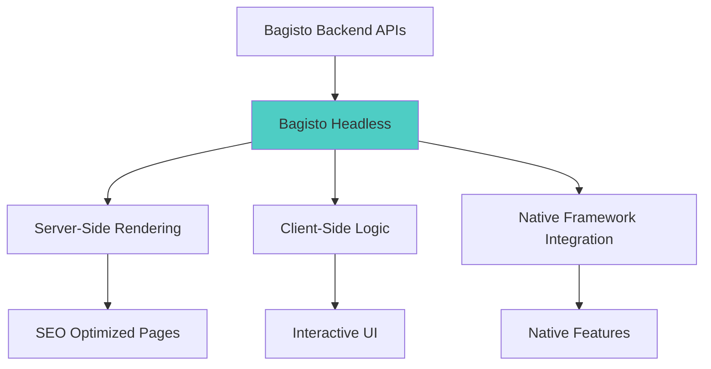

# Bagisto Headless

**Bagisto Headless** is a Next.js-based headless commerce storefront that provides the presentation layer for the Bagisto Native ecosystem. It renders the user interface, handles client-side logic, and integrates with both the Bagisto Backend and Bagisto Native Framework.

## Overview



## Technology Stack

| Component | Technology | Purpose |
|-----------|-----------|---------|
| Framework | Next.js 15+ | React framework with SSR/SSG |
| UI Library | React 18+ | Component-based UI |
| Styling | Tailwind CSS | Utility-first CSS |
| State Management | React Context / Zustand | Client state |
| API Client | Fetch / Axios | Backend communication |
| Type Safety | TypeScript | Static typing |
| Native Bridge | Bagisto Native Framework | Web-native integration |

## Core Responsibilities

### 1. User Interface Rendering

Bagisto Headless is responsible for all visual presentation.

#### Page Types:
- **Home Page**: Featured products, banners, categories
- **Product Listing**: Category pages, search results
- **Product Detail**: Product information, variants, reviews
- **Cart & Checkout**: Shopping cart, checkout flow
- **Account Pages**: Profile, orders, addresses
- **CMS Pages**: About, Contact, Terms, etc.

#### Component Structure:
```
components/
  ├── layout/
  │   ├── Header.tsx
  │   ├── Footer.tsx
  │   └── Navigation.tsx
  ├── product/
  │   ├── ProductCard.tsx
  │   ├── ProductGrid.tsx
  │   └── ProductDetail.tsx
  ├── cart/
  │   ├── CartItem.tsx
  │   └── CartSummary.tsx
  └── checkout/
      ├── CheckoutForm.tsx
      └── PaymentMethods.tsx
```

### 2. Server-Side Rendering (SSR)

Next.js enables server-side rendering for optimal performance and SEO.

#### Example: Product Page SSR
```typescript
// app/product/[id]/page.tsx
export async function generateMetadata({ params }: { params: { id: string } }) {
  const product = await fetchProduct(params.id);
  
  return {
    title: product.name,
    description: product.description,
    openGraph: {
      images: [product.image],
    },
  };
}

export default async function ProductPage({ params }: { params: { id: string } }) {
  const product = await fetchProduct(params.id);
  
  return <ProductDetail product={product} />;
}
```

### 3. Static Site Generation (SSG)

Generate static pages at build time for better performance.

```typescript
// Generate static paths for products
export async function generateStaticParams() {
  const products = await fetchAllProducts();
  
  return products.map((product) => ({
    id: product.id.toString(),
  }));
}
```

### 4. API Integration

Consumes APIs from Bagisto Backend.

#### API Client Setup:
```typescript
// lib/api.ts
const API_BASE = process.env.NEXT_PUBLIC_API_URL;

export async function fetchProducts(params?: ProductParams) {
  const response = await fetch(`${API_BASE}/api/v1/products`, {
    method: 'POST',
    headers: {
      'Content-Type': 'application/json',
    },
    body: JSON.stringify(params),
  });
  
  if (!response.ok) {
    throw new Error('Failed to fetch products');
  }
  
  return response.json();
}

export async function addToCart(productId: number, quantity: number) {
  const response = await fetch(`${API_BASE}/api/v1/cart/add`, {
    method: 'POST',
    headers: {
      'Content-Type': 'application/json',
      'Authorization': `Bearer ${getAuthToken()}`,
    },
    body: JSON.stringify({ product_id: productId, quantity }),
  });
  
  return response.json();
}
```

### 5. Native Framework Integration

Integrates Bagisto Native components for native features.

#### Setup in Root Layout:
```typescript
// app/layout.tsx
import { HotwireToast, HotwireHistorySync, DynamicButton } from '@bagisto-native/react';

export default function RootLayout({ children }: { children: React.ReactNode }) {
  return (
    <html lang="en">
      <head>
        <script src="/bundle.js" />
      </head>
      <body>
        {children}
        
        {/* Native Components */}
        <HotwireToast />
        <HotwireHistorySync />
        <DynamicButton cartCountEvent={true} style={{ display: 'none' }} />
      </body>
    </html>
  );
}
```

#### Using Native Features:
```typescript
// components/AddToCartButton.tsx
'use client';

import { triggerHotwireNativeToast, triggerCartCountValue } from '@bagisto-native/core';

export default function AddToCartButton({ product }) {
  const handleAddToCart = async () => {
    try {
      const response = await addToCart(product.id, 1);
      
      // Trigger native toast
      triggerHotwireNativeToast('Product added to cart!');
      
      // Update cart count badge
      triggerCartCountValue(response.cart.item_count);
      
    } catch (error) {
      triggerHotwireNativeToast('Failed to add product');
    }
  };
  
  return (
    <button onClick={handleAddToCart}>
      Add to Cart
    </button>
  );
}
```

## Architecture Patterns

### 1. App Router Structure (Next.js 13+)
```
app/
  ├── layout.tsx              # Root layout
  ├── page.tsx                # Home page
  ├── product/
  │   ├── [id]/
  │   │   └── page.tsx        # Product detail
  │   └── page.tsx            # Product listing
  ├── cart/
  │   └── page.tsx            # Cart page
  ├── checkout/
  │   └── page.tsx            # Checkout page
  └── account/
      ├── layout.tsx          # Account layout
      ├── profile/
      └── orders/
```

### 2. Server vs Client Components

#### Server Components (Default):
```typescript
// Fetch data on server
export default async function ProductListing() {
  const products = await fetchProducts();
  
  return (
    <div>
      {products.map(product => (
        <ProductCard key={product.id} product={product} />
      ))}
    </div>
  );
}
```

#### Client Components:
```typescript
'use client';

import { useState } from 'react';

export default function CartItem({ item }) {
  const [quantity, setQuantity] = useState(item.quantity);
  
  const handleUpdate = () => {
    // Client-side logic
  };
  
  return (
    <div>
      <input value={quantity} onChange={(e) => setQuantity(e.target.value)} />
    </div>
  );
}
```

### 3. State Management

#### Context API for Global State:
```typescript
// context/CartContext.tsx
'use client';

import { createContext, useContext, useState } from 'react';

const CartContext = createContext(null);

export function CartProvider({ children }) {
  const [cart, setCart] = useState(null);
  
  return (
    <CartContext.Provider value={{ cart, setCart }}>
      {children}
    </CartContext.Provider>
  );
}

export const useCart = () => useContext(CartContext);
```

## Routing & Navigation

### 1. File-based Routing
```
app/
  ├── page.tsx                    → /
  ├── about/page.tsx              → /about
  ├── product/[id]/page.tsx       → /product/123
  └── category/[slug]/page.tsx    → /category/electronics
```

### 2. Programmatic Navigation
```typescript
'use client';

import { useRouter } from 'next/navigation';

export default function SearchForm() {
  const router = useRouter();
  
  const handleSearch = (query: string) => {
    router.push(`/search?q=${encodeURIComponent(query)}`);
  };
  
  return <form onSubmit={(e) => {
    e.preventDefault();
    handleSearch(e.target.q.value);
  }}>...</form>;
}
```

### 3. History Sync with Native
```typescript
// app/HistorySync.tsx
'use client';

import { useEffect } from 'react';
import { usePathname, useSearchParams } from 'next/navigation';
import { triggerHistorySyncEvent } from '@bagisto-native/core';

export default function HistorySync() {
  const pathname = usePathname();
  const searchParams = useSearchParams();
  
  useEffect(() => {
    const url = new URL(`${window.location.origin}${pathname}`);
    if (searchParams.toString()) {
      url.search = searchParams.toString();
    }
    
    triggerHistorySyncEvent(url);
  }, [pathname, searchParams]);
  
  return null;
}
```

## Performance Optimization

### 1. Image Optimization
```typescript
import Image from 'next/image';

<Image 
  src={product.image}
  alt={product.name}
  width={300}
  height={300}
  priority={false}
  loading="lazy"
/>
```

### 2. Code Splitting
```typescript
// Dynamic imports for heavy components
import dynamic from 'next/dynamic';

const ProductReviews = dynamic(() => import('./ProductReviews'), {
  loading: () => <p>Loading reviews...</p>,
  ssr: false
});
```

### 3. Caching Strategies
```typescript
// Revalidate every hour
export const revalidate = 3600;

// Or use on-demand revalidation
import { revalidatePath } from 'next/cache';

export async function updateProduct(id: string) {
  await updateProductInBackend(id);
  revalidatePath(`/product/${id}`);
}
```

## SEO Optimization

### 1. Metadata Generation
```typescript
// app/product/[id]/page.tsx
import type { Metadata } from 'next';

export async function generateMetadata({ params }): Promise<Metadata> {
  const product = await fetchProduct(params.id);
  
  return {
    title: `${product.name} | Bagisto Store`,
    description: product.short_description,
    keywords: product.tags,
    openGraph: {
      title: product.name,
      description: product.description,
      images: [
        {
          url: product.image,
          width: 800,
          height: 600,
        }
      ],
    },
    twitter: {
      card: 'summary_large_image',
      title: product.name,
      description: product.description,
      images: [product.image],
    },
  };
}
```

### 2. Structured Data
```typescript
// components/ProductStructuredData.tsx
export default function ProductStructuredData({ product }) {
  const jsonLd = {
    '@context': 'https://schema.org',
    '@type': 'Product',
    name: product.name,
    image: product.image,
    description: product.description,
    sku: product.sku,
    offers: {
      '@type': 'Offer',
      price: product.price,
      priceCurrency: 'USD',
      availability: 'https://schema.org/InStock',
    },
  };
  
  return (
    <script
      type="application/ld+json"
      dangerouslySetInnerHTML={{ __html: JSON.stringify(jsonLd) }}
    />
  );
}
```

### 3. Sitemap Generation
```typescript
// app/sitemap.ts
export default async function sitemap() {
  const products = await fetchAllProducts();
  
  return [
    {
      url: 'https://store.com',
      lastModified: new Date(),
    },
    ...products.map((product) => ({
      url: `https://store.com/product/${product.id}`,
      lastModified: product.updated_at,
    })),
  ];
}
```

## Native-Specific Considerations

### 1. Detecting Native Environment
```typescript
'use client';

import { useEffect, useState } from 'react';
import { isTurboNativeUserAgent } from '@bagisto-native/core';

export default function ConditionalFeature() {
  const [isNative, setIsNative] = useState(false);
  
  useEffect(() => {
    setIsNative(isTurboNativeUserAgent());
  }, []);
  
  if (isNative) {
    return <NativeFeature />;
  }
  
  return <WebFeature />;
}
```

### 2. Native Search Integration
```typescript
// app/TurboSearchBridge.tsx
'use client';

import { useEffect } from 'react';
import { useRouter } from 'next/navigation';

export default function TurboSearchBridge() {
  const router = useRouter();
  
  useEffect(() => {
    const handleSearch = (e: Event) => {
      const customEvent = e as CustomEvent<{ query?: string }>;
      const query = customEvent.detail.query;
      
      if (query) {
        router.push(`/search?q=${encodeURIComponent(query)}`);
      }
    };
    
    window.addEventListener('turbo:next-search', handleSearch);
    
    return () => {
      window.removeEventListener('turbo:next-search', handleSearch);
    };
  }, [router]);
  
  return null;
}
```

### 3. Cart Modal Bridge
```typescript
// app/TurboCartModalBridge.tsx
'use client';

import { useEffect } from 'react';

export default function TurboCartModalBridge({ onOpen }) {
  useEffect(() => {
    const handleCartModal = () => {
      onOpen(); // Open your cart modal
    };
    
    window.addEventListener('turbo:next-cart-modal', handleCartModal);
    
    return () => {
      window.removeEventListener('turbo:next-cart-modal', handleCartModal);
    };
  }, [onOpen]);
  
  return null;
}
```

## Testing

### 1. Unit Testing
```typescript
// __tests__/components/ProductCard.test.tsx
import { render, screen } from '@testing-library/react';
import ProductCard from '@/components/product/ProductCard';

describe('ProductCard', () => {
  it('renders product information', () => {
    const product = {
      id: 1,
      name: 'Test Product',
      price: 99.99,
    };
    
    render(<ProductCard product={product} />);
    
    expect(screen.getByText('Test Product')).toBeInTheDocument();
    expect(screen.getByText('$99.99')).toBeInTheDocument();
  });
});
```

### 2. E2E Testing
```typescript
// e2e/checkout.spec.ts
import { test, expect } from '@playwright/test';

test('complete checkout flow', async ({ page }) => {
  await page.goto('/product/1');
  await page.click('text=Add to Cart');
  await page.click('text=Checkout');
  await page.fill('[name="email"]', 'test@example.com');
  await page.click('text=Place Order');
  
  await expect(page).toHaveURL(/\/order\/confirmation/);
});
```

## Environment Configuration

### Environment Variables
```env
# .env.local
NEXT_PUBLIC_API_URL=https://api.bagisto.com
NEXT_PUBLIC_STORE_NAME="Bagisto Store"
NEXT_PUBLIC_CURRENCY=USD
NEXT_PUBLIC_LOCALE=en
```

### Multi-Environment Setup
```typescript
// config/env.ts
export const config = {
  apiUrl: process.env.NEXT_PUBLIC_API_URL,
  storeName: process.env.NEXT_PUBLIC_STORE_NAME,
  currency: process.env.NEXT_PUBLIC_CURRENCY,
};
```

## Deployment

### Vercel Deployment (Recommended)
```bash
# Install Vercel CLI
npm i -g vercel

# Deploy
vercel --prod
```

### Self-Hosted Deployment
```bash
# Build
npm run build

# Start production server
npm run start
```

### Docker Deployment
```dockerfile
FROM node:18-alpine

WORKDIR /app
COPY package*.json ./
RUN npm ci --only=production
COPY . .
RUN npm run build

EXPOSE 3000
CMD ["npm", "start"]
```

## Best Practices

1. **Use Server Components by Default**: Fetch data on server when possible
2. **Minimize Client-Side JavaScript**: Keep bundles small
3. **Implement Error Boundaries**: Handle errors gracefully
4. **Optimize Images**: Use Next.js Image component
5. **Cache API Responses**: Reduce backend load
6. **Type Everything**: Use TypeScript for type safety
7. **Test Thoroughly**: Unit, integration, and E2E tests
8. **Monitor Performance**: Use Web Vitals and analytics

## Common Patterns

### Loading States
```typescript
export default function ProductPage({ params }) {
  return (
    <Suspense fallback={<ProductSkeleton />}>
      <ProductDetail id={params.id} />
    </Suspense>
  );
}
```

### Error Handling
```typescript
// app/product/[id]/error.tsx
'use client';

export default function Error({ error, reset }) {
  return (
    <div>
      <h2>Something went wrong!</h2>
      <button onClick={() => reset()}>Try again</button>
    </div>
  );
}
```

## Next Steps

- Learn about [Bagisto Native Framework](./bagisto-native-framework.md)
- Understand [Native Apps](./native-apps.md)
- Explore [Hotwire & Turbo Native](../hotwire-turbo-native.md)

## Additional Resources

- [Next.js Documentation](https://nextjs.org/docs)
- [React Documentation](https://react.dev)
- [Bagisto Headless Starter](https://github.com/bagisto/bagisto-headless)
## Next Steps

- Understand the [Bagisto Native Framework](./bagisto-native-framework.md)
- Explore [Native Apps](./native-apps.md)
- Learn about [Communication Flow](../web-native-communication-flow.md)
