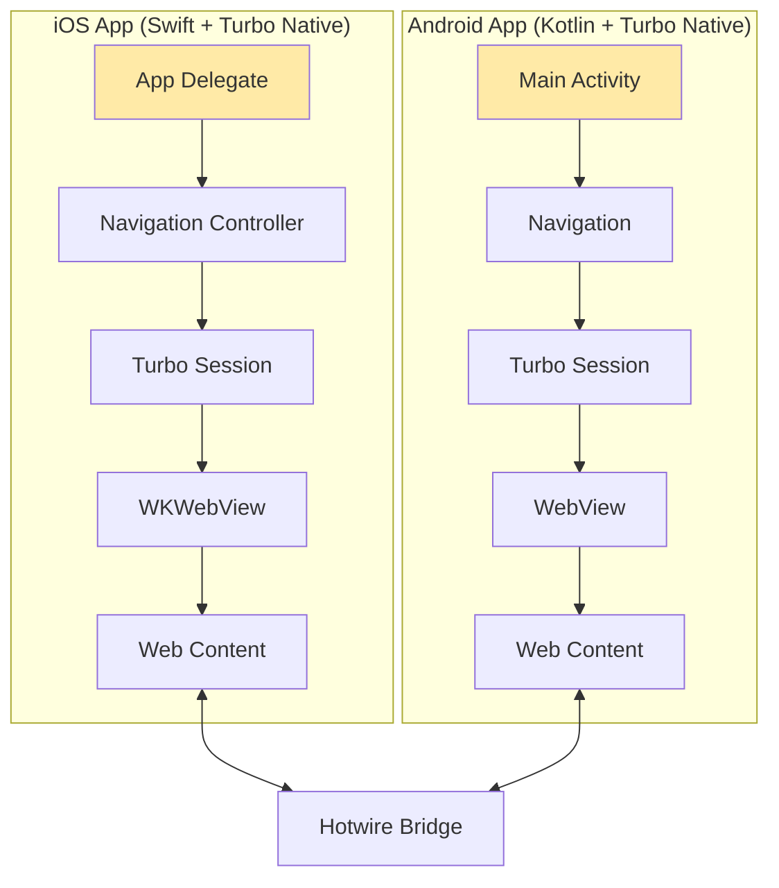

# Native Apps (iOS / Android)

The **Native Apps** are mobile applications built using Turbo Native that wrap your Bagisto Headless web application, providing a native shell with platform-specific features and app store presence.

## Overview



## Technology Stack

### iOS App

| Component | Technology | Purpose |
|-----------|-----------|---------|
| Language | Swift 5.5+ | Primary programming language |
| Framework | Turbo Native iOS | Hybrid app framework |
| WebView | WKWebView | Web content rendering |
| UI | UIKit / SwiftUI | Native UI components |
| Networking | URLSession | HTTP requests |
| Storage | UserDefaults / CoreData | Local data persistence |

### Android App

| Component | Technology | Purpose |
|-----------|-----------|---------|
| Language | Kotlin 1.8+ | Primary programming language |
| Framework | Turbo Native Android | Hybrid app framework |
| WebView | WebView | Web content rendering |
| UI | Jetpack Compose / XML | Native UI components |
| Networking | OkHttp / Retrofit | HTTP requests |
| Storage | SharedPreferences / Room | Local data persistence |

## Core Responsibilities

### 1. WebView Management

The primary responsibility is managing the WebView that displays web content.

#### iOS WebView Setup:

```swift
// SessionController.swift
import UIKit
import Turbo

class SessionController: UIViewController {
    private lazy var session: Session = {
        let configuration = WKWebViewConfiguration()
        let session = Session(webViewConfiguration: configuration)
        session.delegate = self
        return session
    }()
    
    override func viewDidLoad() {
        super.viewDidLoad()
        
        // Load the initial URL
        let url = URL(string: "https://store.bagisto.com")!
        session.visit(url)
    }
}

extension SessionController: SessionDelegate {
    func session(_ session: Session, didProposeVisit proposal: VisitProposal) {
        // Handle navigation
        session.visit(proposal.url)
    }
    
    func session(_ session: Session, didFailRequestForVisitable visitable: Visitable, error: Error) {
        // Handle errors
        print("Visit failed: \(error.localizedDescription)")
    }
}
```

#### Android WebView Setup:

```kotlin
// MainActivity.kt
package com.bagisto.store

import android.os.Bundle
import androidx.appcompat.app.AppCompatActivity
import dev.hotwire.turbo.session.TurboSession
import dev.hotwire.turbo.session.TurboSessionNavHostFragment

class MainActivity : AppCompatActivity() {
    private lateinit var turboSession: TurboSession
    
    override fun onCreate(savedInstanceState: Bundle?) {
        super.onCreate(savedInstanceState)
        setContentView(R.layout.activity_main)
        
        // Initialize Turbo session
        turboSession = TurboSession("main")
        turboSession.visit("https://store.bagisto.com")
    }
}
```

### 2. Native UI Components

Provide native navigation, toolbars, and UI elements.

#### iOS Navigation Bar:

```swift
// NavigationController.swift
import UIKit

class NavigationController: UINavigationController {
    override func viewDidLoad() {
        super.viewDidLoad()
        
        // Configure navigation bar
        navigationBar.prefersLargeTitles = false
        navigationBar.isTranslucent = true
        
        // Add native buttons
        setupNavigationItems()
    }
    
    private func setupNavigationItems() {
        let cartButton = UIBarButtonItem(
            image: UIImage(systemName: "cart"),
            style: .plain,
            target: self,
            action: #selector(cartTapped)
        )
        
        let searchButton = UIBarButtonItem(
            image: UIImage(systemName: "magnifyingglass"),
            style: .plain,
            target: self,
            action: #selector(searchTapped)
        )
        
        // Set right bar button items
        navigationItem.rightBarButtonItems = [cartButton, searchButton]
    }
    
    @objc private func cartTapped() {
        // Send event to web
        sendEventToWeb(type: "turbo:next-cart-modal", data: [:])
    }
    
    @objc private func searchTapped() {
        // Show native search UI
        showNativeSearch()
    }
}
```

#### Android Toolbar:

```kotlin
// MainFragment.kt
package com.bagisto.store

import android.os.Bundle
import android.view.*
import androidx.fragment.app.Fragment
import dev.hotwire.turbo.fragments.TurboFragment

class MainFragment : TurboFragment() {
    override fun onCreateView(
        inflater: LayoutInflater,
        container: ViewGroup?,
        savedInstanceState: Bundle?
    ): View? {
        return inflater.inflate(R.layout.fragment_main, container, false)
    }
    
    override fun onCreateOptionsMenu(menu: Menu, inflater: MenuInflater) {
        inflater.inflate(R.menu.main_menu, menu)
        super.onCreateOptionsMenu(menu, inflater)
    }
    
    override fun onOptionsItemSelected(item: MenuItem): Boolean {
        return when (item.itemId) {
            R.id.action_cart -> {
                // Send event to web
                sendEventToWeb("turbo:next-cart-modal", JSONObject())
                true
            }
            R.id.action_search -> {
                showNativeSearch()
                true
            }
            else -> super.onOptionsItemSelected(item)
        }
    }
}
```

### 3. Platform-Specific Features

Implement native features not available in web.

#### Camera Access (iOS):

```swift
// CameraManager.swift
import AVFoundation
import UIKit

class CameraManager: NSObject {
    func scanBarcode(completion: @escaping (String?) -> Void) {
        let captureSession = AVCaptureSession()
        
        guard let videoCaptureDevice = AVCaptureDevice.default(for: .video) else {
            completion(nil)
            return
        }
        
        let videoInput: AVCaptureDeviceInput
        
        do {
            videoInput = try AVCaptureDeviceInput(device: videoCaptureDevice)
        } catch {
            completion(nil)
            return
        }
        
        if captureSession.canAddInput(videoInput) {
            captureSession.addInput(videoInput)
        }
        
        let metadataOutput = AVCaptureMetadataOutput()
        
        if captureSession.canAddOutput(metadataOutput) {
            captureSession.addOutput(metadataOutput)
            metadataOutput.setMetadataObjectsDelegate(self, queue: DispatchQueue.main)
            metadataOutput.metadataObjectTypes = [.qr, .ean13, .ean8]
        }
        
        captureSession.startRunning()
    }
}

extension CameraManager: AVCaptureMetadataOutputObjectsDelegate {
    func metadataOutput(
        _ output: AVCaptureMetadataOutput,
        didOutput metadataObjects: [AVMetadataObject],
        from connection: AVCaptureConnection
    ) {
        if let metadataObject = metadataObjects.first as? AVMetadataMachineReadableCodeObject,
           let code = metadataObject.stringValue {
            // Send barcode to web
            sendBarcodeToWeb(code: code)
        }
    }
}
```

#### Location Access (Android):

```kotlin
// LocationManager.kt
package com.bagisto.store

import android.Manifest
import android.content.Context
import android.content.pm.PackageManager
import android.location.Geocoder
import androidx.core.app.ActivityCompat
import com.google.android.gms.location.FusedLocationProviderClient
import com.google.android.gms.location.LocationServices
import org.json.JSONObject

class LocationManager(private val context: Context) {
    private val fusedLocationClient: FusedLocationProviderClient =
        LocationServices.getFusedLocationProviderClient(context)
    
    fun getCurrentLocation(callback: (LocationData?) -> Unit) {
        if (ActivityCompat.checkSelfPermission(
                context,
                Manifest.permission.ACCESS_FINE_LOCATION
            ) != PackageManager.PERMISSION_GRANTED
        ) {
            callback(null)
            return
        }
        
        fusedLocationClient.lastLocation.addOnSuccessListener { location ->
            if (location != null) {
                val geocoder = Geocoder(context)
                val addresses = geocoder.getFromLocation(
                    location.latitude,
                    location.longitude,
                    1
                )
                
                val address = addresses?.firstOrNull()
                val locationData = LocationData(
                    address = address?.getAddressLine(0) ?: "",
                    city = address?.locality ?: "",
                    postCode = address?.postalCode ?: ""
                )
                
                callback(locationData)
            } else {
                callback(null)
            }
        }
    }
}

data class LocationData(
    val address: String,
    val city: String,
    val postCode: String
)
```

#### Push Notifications (iOS):

```swift
// NotificationManager.swift
import UserNotifications

class NotificationManager: NSObject {
    static let shared = NotificationManager()
    
    func requestAuthorization() {
        UNUserNotificationCenter.current().requestAuthorization(
            options: [.alert, .sound, .badge]
        ) { granted, error in
            if granted {
                DispatchQueue.main.async {
                    UIApplication.shared.registerForRemoteNotifications()
                }
            }
        }
    }
    
    func handleNotification(userInfo: [AnyHashable: Any]) {
        // Extract notification data
        if let productId = userInfo["product_id"] as? String {
            // Navigate to product page
            navigateToProduct(id: productId)
        }
    }
}
```

### 4. Bridge Communication

Handle bidirectional communication with the web layer.

#### iOS Bridge Implementation:

```swift
// BridgeManager.swift
import WebKit

class BridgeManager: NSObject, WKScriptMessageHandler {
    weak var webView: WKWebView?
    
    func setupBridge(webView: WKWebView) {
        self.webView = webView
        
        let contentController = webView.configuration.userContentController
        
        // Register message handlers
        contentController.add(self, name: "nativeBridge")
        
        // Inject JavaScript bridge
        let script = """
        window.webkit.messageHandlers.nativeBridge.postMessage = function(message) {
            window.webkit.messageHandlers.nativeBridge.postMessage(message);
        };
        """
        
        let userScript = WKUserScript(
            source: script,
            injectionTime: .atDocumentStart,
            forMainFrameOnly: false
        )
        contentController.addUserScript(userScript)
    }
    
    // Receive messages from web
    func userContentController(
        _ userContentController: WKUserContentController,
        didReceive message: WKScriptMessage
    ) {
        guard let body = message.body as? [String: Any],
              let type = body["type"] as? String else {
            return
        }
        
        switch type {
        case "toast":
            if let message = body["data"] as? [String: Any],
               let text = message["message"] as? String {
                showNativeToast(message: text)
            }
            
        case "cart-count":
            if let data = body["data"] as? [String: Any],
               let count = data["count"] as? Int {
                updateCartBadge(count: count)
            }
            
        case "theme-mode":
            if let data = body["data"] as? [String: Any],
               let mode = data["mode"] as? String {
                updateThemeMode(mode: mode)
            }
            
        default:
            break
        }
    }
    
    // Send message to web
    func sendToWeb(type: String, data: [String: Any]) {
        let json = try? JSONSerialization.data(withJSONObject: data)
        let jsonString = String(data: json ?? Data(), encoding: .utf8) ?? "{}"
        
        let script = """
        (function() {
            const event = new CustomEvent('\(type)', {
                detail: \(jsonString)
            });
            window.dispatchEvent(event);
        })();
        """
        
        webView?.evaluateJavaScript(script)
    }
}
```

#### Android Bridge Implementation:

```kotlin
// BridgeManager.kt
package com.bagisto.store

import android.webkit.JavascriptInterface
import android.webkit.WebView
import org.json.JSONObject

class BridgeManager(private val webView: WebView) {
    
    fun setupBridge() {
        // Add JavaScript interface
        webView.addJavascriptInterface(this, "NativeBridge")
    }
    
    // Receive messages from web
    @JavascriptInterface
    fun postMessage(message: String) {
        val json = JSONObject(message)
        val type = json.getString("type")
        val data = json.getJSONObject("data")
        
        when (type) {
            "toast" -> {
                val text = data.getString("message")
                showNativeToast(text)
            }
            "cart-count" -> {
                val count = data.getInt("count")
                updateCartBadge(count)
            }
            "theme-mode" -> {
                val mode = data.getString("mode")
                updateThemeMode(mode)
            }
        }
    }
    
    // Send message to web
    fun sendToWeb(type: String, data: JSONObject) {
        val script = """
            (function() {
                const event = new CustomEvent('$type', {
                    detail: $data
                });
                window.dispatchEvent(event);
            })();
        """
        
        webView.post {
            webView.evaluateJavascript(script, null)
        }
    }
}
```

### 5. App Store Presence

Manage app distribution and metadata.

#### iOS App Store Configuration:

```
App Information:
- App Name: Bagisto Store
- Bundle ID: com.bagisto.store
- Version: 1.0.0
- Category: Shopping
- Age Rating: 4+

Screenshots Required:
- 6.7" Display (iPhone 14 Pro Max)
- 6.5" Display (iPhone 11 Pro Max)
- 5.5" Display (iPhone 8 Plus)
- 12.9" Display (iPad Pro)

Privacy Policy URL: https://store.bagisto.com/privacy
Support URL: https://store.bagisto.com/support
```

#### Android Play Store Configuration:

```
App Details:
- App Name: Bagisto Store
- Package Name: com.bagisto.store
- Version Code: 1
- Version Name: 1.0.0
- Category: Shopping
- Content Rating: Everyone

Screenshots Required:
- Phone: Min 2, Max 8 screenshots
- 7-inch Tablet: Min 2, Max 8 screenshots
- 10-inch Tablet: Min 2, Max 8 screenshots

Privacy Policy URL: https://store.bagisto.com/privacy
```

## Project Structure

### iOS Project Structure:

```
BagistoStore/
├── App/
│   ├── AppDelegate.swift
│   ├── SceneDelegate.swift
│   └── Info.plist
├── Controllers/
│   ├── SessionController.swift
│   ├── NavigationController.swift
│   └── WebViewController.swift
├── Managers/
│   ├── BridgeManager.swift
│   ├── CameraManager.swift
│   ├── LocationManager.swift
│   └── NotificationManager.swift
├── Views/
│   ├── SearchViewController.swift
│   └── CartBadgeView.swift
├── Models/
│   └── AppConfig.swift
├── Resources/
│   ├── Assets.xcassets
│   └── LaunchScreen.storyboard
└── Podfile
```

### Android Project Structure:

```
app/
├── src/
│   └── main/
│       ├── java/com/bagisto/store/
│       │   ├── MainActivity.kt
│       │   ├── MainFragment.kt
│       │   ├── BridgeManager.kt
│       │   ├── CameraManager.kt
│       │   ├── LocationManager.kt
│       │   └── NotificationManager.kt
│       ├── res/
│       │   ├── layout/
│       │   ├── menu/
│       │   ├── values/
│       │   └── drawable/
│       └── AndroidManifest.xml
├── build.gradle
└── proguard-rules.pro
```

## Configuration

### iOS Configuration (Info.plist):

```xml
<?xml version="1.0" encoding="UTF-8"?>
<!DOCTYPE plist PUBLIC "-//Apple//DTD PLIST 1.0//EN">
<plist version="1.0">
<dict>
    <key>CFBundleIdentifier</key>
    <string>com.bagisto.store</string>
    
    <key>NSCameraUsageDescription</key>
    <string>We need camera access for barcode scanning</string>
    
    <key>NSLocationWhenInUseUsageDescription</key>
    <string>We need your location to auto-fill address</string>
    
    <key>NSAppTransportSecurity</key>
    <dict>
        <key>NSAllowsArbitraryLoads</key>
        <false/>
    </dict>
</dict>
</plist>
```

### Android Configuration (AndroidManifest.xml):

```xml
<?xml version="1.0" encoding="utf-8"?>
<manifest xmlns:android="http://schemas.android.com/apk/res/android"
    package="com.bagisto.store">
    
    <uses-permission android:name="android.permission.INTERNET" />
    <uses-permission android:name="android.permission.CAMERA" />
    <uses-permission android:name="android.permission.ACCESS_FINE_LOCATION" />
    
    <application
        android:allowBackup="true"
        android:icon="@mipmap/ic_launcher"
        android:label="@string/app_name"
        android:theme="@style/AppTheme"
        android:usesCleartextTraffic="false">
        
        <activity
            android:name=".MainActivity"
            android:exported="true">
            <intent-filter>
                <action android:name="android.intent.action.MAIN" />
                <category android:name="android.intent.category.LAUNCHER" />
            </intent-filter>
        </activity>
    </application>
</manifest>
```

## Building & Deployment

### iOS Build Process:

```bash
# Install dependencies
pod install

# Open workspace
open BagistoStore.xcworkspace

# Build for testing
xcodebuild -workspace BagistoStore.xcworkspace \
           -scheme BagistoStore \
           -sdk iphonesimulator \
           build

# Archive for App Store
xcodebuild -workspace BagistoStore.xcworkspace \
           -scheme BagistoStore \
           -sdk iphoneos \
           -configuration Release \
           archive -archivePath build/BagistoStore.xcarchive

# Export IPA
xcodebuild -exportArchive \
           -archivePath build/BagistoStore.xcarchive \
           -exportPath build/ \
           -exportOptionsPlist ExportOptions.plist
```

### Android Build Process:

```bash
# Debug build
./gradlew assembleDebug

# Release build
./gradlew assembleRelease

# Generate signed APK
./gradlew bundleRelease

# Output location
# app/build/outputs/apk/release/app-release.apk
# app/build/outputs/bundle/release/app-release.aab
```

## Testing

### iOS Testing:

```swift
// BridgeTests.swift
import XCTest
@testable import BagistoStore

class BridgeTests: XCTestCase {
    var bridge: BridgeManager!
    var mockWebView: WKWebView!
    
    override func setUp() {
        super.setUp()
        mockWebView = WKWebView()
        bridge = BridgeManager()
        bridge.setupBridge(webView: mockWebView)
    }
    
    func testSendToWeb() {
        let expectation = XCTestExpectation(description: "Send message to web")
        
        bridge.sendToWeb(type: "test-event", data: ["key": "value"])
        
        // Verify message was sent
        DispatchQueue.main.asyncAfter(deadline: .now() + 1) {
            expectation.fulfill()
        }
        
        wait(for: [expectation], timeout: 2.0)
    }
}
```

### Android Testing:

```kotlin
// BridgeTest.kt
package com.bagisto.store

import androidx.test.ext.junit.runners.AndroidJUnit4
import org.junit.Test
import org.junit.runner.RunWith
import org.junit.Assert.*

@RunWith(AndroidJUnit4::class)
class BridgeTest {
    @Test
    fun testBridgeCommunication() {
        val bridge = BridgeManager(mockWebView)
        
        val message = JSONObject().apply {
            put("type", "test")
            put("data", JSONObject().apply {
                put("key", "value")
            })
        }
        
        bridge.postMessage(message.toString())
        
        // Verify message handling
        assertTrue(bridge.isInitialized)
    }
}
```

## Performance Optimization

### iOS Optimizations:

```swift
// Optimize WebView performance
func configureWebView() {
    webView.configuration.preferences.javaScriptEnabled = true
    webView.configuration.allowsInlineMediaPlayback = true
    
    // Enable caching
    let cache = URLCache(
        memoryCapacity: 50 * 1024 * 1024,
        diskCapacity: 100 * 1024 * 1024,
        diskPath: "webview_cache"
    )
    URLCache.shared = cache
}
```

### Android Optimizations:

```kotlin
// Optimize WebView performance
fun configureWebView() {
    webView.settings.apply {
        javaScriptEnabled = true
        domStorageEnabled = true
        cacheMode = WebSettings.LOAD_DEFAULT
        
        // Enable hardware acceleration
        setRenderPriority(WebSettings.RenderPriority.HIGH)
    }
}
```

## Security

### iOS Security:

```swift
// Validate URLs before navigation
func shouldAllowNavigation(to url: URL) -> Bool {
    guard let host = url.host else { return false }
    
    let allowedHosts = ["store.bagisto.com", "api.bagisto.com"]
    return allowedHosts.contains(host)
}

// Secure storage
func saveSecurely(key: String, value: String) {
    let keychain = KeychainSwift()
    keychain.set(value, forKey: key)
}
```

### Android Security:

```kotlin
// Validate URLs
fun shouldAllowNavigation(url: String): Boolean {
    val allowedHosts = listOf("store.bagisto.com", "api.bagisto.com")
    val uri = Uri.parse(url)
    return allowedHosts.contains(uri.host)
}

// Secure storage
fun saveSecurely(key: String, value: String) {
    val encryptedPrefs = EncryptedSharedPreferences.create(
        "secure_prefs",
        MasterKey.Builder(context).build(),
        context,
        EncryptedSharedPreferences.PrefKeyEncryptionScheme.AES256_SIV,
        EncryptedSharedPreferences.PrefValueEncryptionScheme.AES256_GCM
    )
    
    encryptedPrefs.edit().putString(key, value).apply()
}
```

## Troubleshooting

### Common Issues:

1. **WebView not loading**: Check network permissions and URL
2. **Bridge not working**: Verify `bundle.js` is loaded
3. **Camera not working**: Check permissions in manifest/plist
4. **Location not working**: Verify location services enabled

## Best Practices

1. **Always validate URLs** before navigation
2. **Handle offline scenarios** gracefully
3. **Implement proper error handling**
4. **Test on real devices** not just simulators
5. **Follow platform guidelines** (HIG for iOS, Material Design for Android)
6. **Keep app size minimal** through code optimization
7. **Monitor crash reports** via Firebase/Sentry
8. **Update regularly** for security patches

## Next Steps

- Understand [Web ↔ Native Communication](../web-native-communication-flow.md)
- Learn about [Hotwire & Turbo Native](../hotwire-turbo-native.md)
- Explore [Why WebView + Native Bridge](../why-webview-native-bridge.md)

## Additional Resources

- [Turbo Native iOS](https://github.com/hotwired/turbo-ios)
- [Turbo Native Android](https://github.com/hotwired/turbo-android)
- [Apple Developer Documentation](https://developer.apple.com/documentation/)
- [Android Developer Documentation](https://developer.android.com/docs)
## Next Steps

- Understand [Hotwire & Turbo Native](../hotwire-turbo-native.md)
- Explore [Why WebView + Native Bridge](../why-webview-native-bridge.md)
- Learn about [Packages](../../packages/core-package.md)
