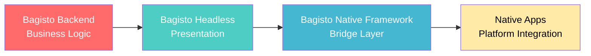
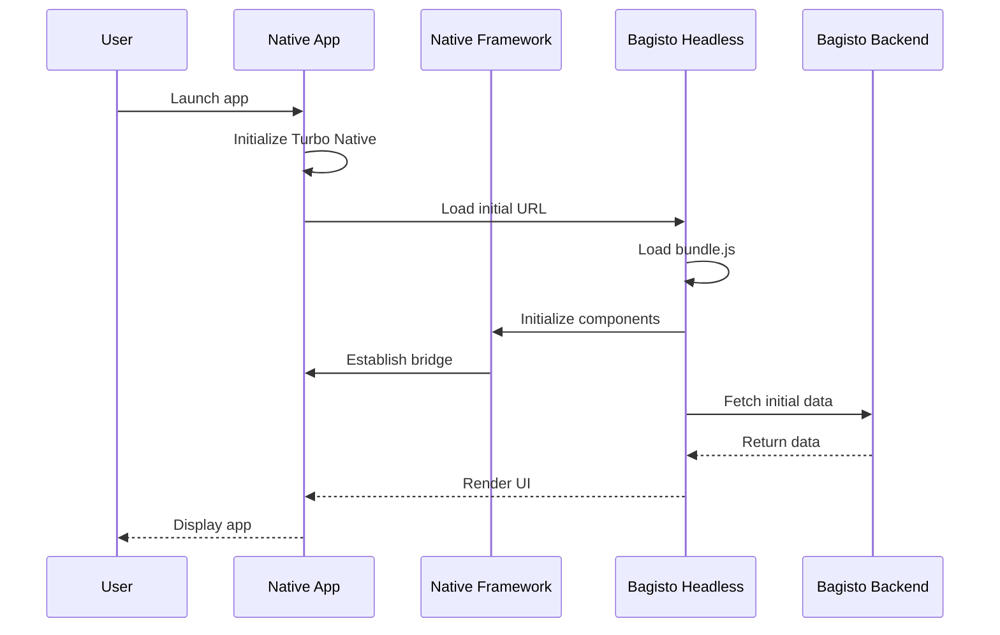
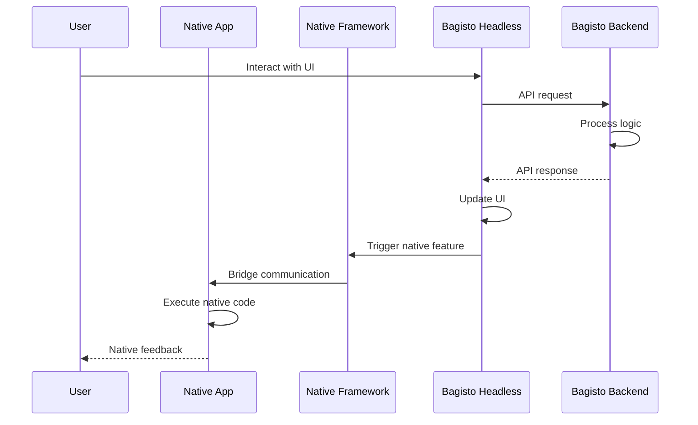
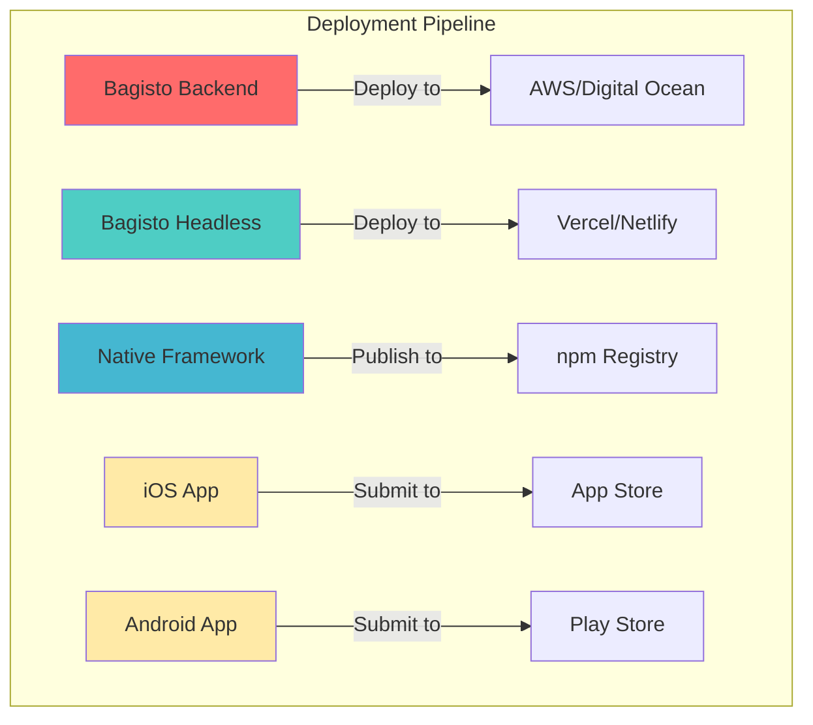

# Roles of Components

The Bagisto Native ecosystem consists of four key components, each with distinct responsibilities. Understanding these roles helps you architect, develop, and maintain your native commerce application effectively.

## Component Overview



## Quick Reference

| Component | Technology | Primary Role | Key Responsibility |
|-----------|-----------|--------------|-------------------|
| Bagisto Backend | Laravel | Data & Business Logic | API provider, data management |
| Bagisto Headless | Next.js | UI Rendering | User interface, SSR/SSG |
| Bagisto Native Framework | TypeScript/JS | Bridge Layer | Web-native communication |
| Native Apps | Swift/Kotlin | Platform Shell | Native features, app distribution |

## Detailed Component Roles

### [Bagisto Backend →](./role/bagisto-backend.md)
Laravel-based e-commerce platform providing APIs and business logic.

**Key Responsibilities:**
- Product catalog and inventory management
- Order processing and fulfillment
- User authentication and authorization
- Payment gateway integration
- RESTful/GraphQL API endpoints

---

### [Bagisto Headless →](./role/bagisto-headless.md)
Next.js-based headless storefront rendering the user interface.

**Key Responsibilities:**
- Server-side rendering (SSR) and static generation (SSG)
- Client-side routing and navigation
- Integration with Bagisto Native components
- API consumption from backend
- SEO optimization

---

### [Bagisto Native Framework →](./role/bagisto-native-framework.md)
TypeScript/JavaScript bridge enabling web-native communication.

**Key Responsibilities:**
- Provide Web Components for native features
- Manage bidirectional event communication
- Expose utility functions and helpers
- Bundle Hotwire bridge code (`bundle.js`)
- Platform detection and compatibility

---

### [Native Apps (iOS / Android) →](./role/native-apps.md)
Native mobile applications built with Turbo Native.

**Key Responsibilities:**
- WebView management via Turbo Native
- Native UI components (navigation bars, toolbars)
- Platform-specific features (camera, location, push notifications)
- App store presence and distribution
- Native performance optimization

## Component Interaction Flow

### Startup Flow



### User Action Flow



## Responsibility Matrix

### What Each Component Does

| Responsibility | Backend | Headless | Framework | Native |
|----------------|---------|----------|-----------|--------|
| Data Storage | ✅ Primary | ❌ | ❌ | ❌ |
| Business Logic | ✅ Primary | ⚠️ Client-side | ❌ | ❌ |
| API Endpoints | ✅ Primary | ❌ | ❌ | ❌ |
| UI Rendering | ❌ | ✅ Primary | ❌ | ⚠️ Native UI |
| Routing | ❌ | ✅ Primary | ❌ | ⚠️ Navigation |
| Web Components | ❌ | ⚠️ Integration | ✅ Primary | ❌ |
| Bridge Code | ❌ | ❌ | ✅ Primary | ⚠️ Implementation |
| Native Features | ❌ | ❌ | ⚠️ Triggers | ✅ Primary |
| App Distribution | ❌ | ❌ | ❌ | ✅ Primary |

**Legend:**
- ✅ Primary responsibility
- ⚠️ Partial responsibility
- ❌ Not responsible

### What Each Component Does NOT Do

| Anti-Pattern | Component | Why |
|--------------|-----------|-----|
| Direct database access | Headless | Should use APIs only |
| Business logic | Native | Belongs in backend |
| Payment processing | Headless/Native | Must be server-side |
| Native UI rendering | Headless | Native's responsibility |
| API implementation | Framework | Backend's responsibility |
| Bridge implementation | Backend/Headless | Framework's responsibility |

## Development Workflow

### When to Work in Each Component

#### Work in Bagisto Backend When:
- Adding new API endpoints
- Implementing business rules
- Configuring payment gateways
- Managing database schemas
- Setting up authentication logic

#### Work in Bagisto Headless When:
- Designing UI/UX
- Implementing page layouts
- Adding client-side interactions
- Optimizing SEO
- Integrating native components

#### Work in Bagisto Native Framework When:
- Creating new bridge components
- Adding native feature integrations
- Extending utility functions
- Updating `bundle.js`
- Improving type definitions

#### Work in Native Apps When:
- Implementing platform-specific features
- Customizing native UI elements
- Configuring app settings
- Managing app store metadata
- Optimizing native performance

## Deployment Considerations

### Independent Deployment

Each component can be deployed independently:



### Update Strategies

| Component | Update Method | User Impact |
|-----------|---------------|-------------|
| Backend | Server deployment | Immediate, all users |
| Headless | CDN deployment | Immediate, all users |
| Framework | npm update | Next deployment |
| Native Apps | App store review | User must update |

## Version Compatibility

### Recommended Version Alignment

```
Bagisto Backend v2.0.x
  ↓ (Compatible API)
Bagisto Headless v2.0.x
  ↓ (Integrates)
Bagisto Native Framework v1.0.x
  ↓ (Communicates)
iOS App v1.0.x / Android App v1.0.x
```

### Breaking Changes

When making breaking changes:

1. **Backend API changes**: Version your API (`/api/v2/`)
2. **Headless changes**: Ensure backward compatibility
3. **Framework changes**: Follow semantic versioning
4. **Native apps**: Minimum version checks

## Communication Boundaries

### Valid Communication Paths

✅ **Allowed:**
- Backend ↔ Headless (API calls)
- Headless ↔ Framework (Component usage)
- Framework ↔ Native (Bridge events)

❌ **Not Allowed:**
- Backend ↔ Native (Must go through Headless/Framework)
- Backend ↔ Framework (No direct connection)

## Scalability & Performance

### Component-Level Scaling

| Component | Scaling Strategy | When to Scale |
|-----------|------------------|---------------|
| Backend | Horizontal (load balancers) | High API traffic |
| Headless | CDN + serverless | High page views |
| Framework | N/A (client-side) | Not applicable |
| Native | N/A (user device) | Not applicable |

### Performance Ownership

- **Backend**: Database queries, API response times
- **Headless**: Page load speed, SEO scores
- **Framework**: Bridge communication overhead
- **Native**: App launch time, memory usage

## Development Team Structure

### Suggested Team Roles

```
┌─────────────────────────────────────┐
│       Product/Project Manager       │
└─────────────────────────────────────┘
                  │
    ┌─────────────┼─────────────┬─────────────┐
    │             │             │             │
┌───▼───┐   ┌────▼────┐   ┌────▼────┐   ┌───▼────┐
│Backend│   │Frontend │   │ Bridge  │   │ Native │
│Laravel│   │Next.js  │   │Framework│   │iOS/And.│
│  Dev  │   │   Dev   │   │   Dev   │   │  Devs  │
└───────┘   └─────────┘   └─────────┘   └────────┘
```

### Cross-Component Knowledge

- **Backend devs** should understand: API design for headless consumption
- **Frontend devs** should understand: Native component integration
- **Framework devs** should understand: Both web and native platforms
- **Native devs** should understand: Turbo Native and bridge concepts

## Testing Strategy

### Component-Level Testing

| Component | Testing Type | Tools |
|-----------|--------------|-------|
| Backend | Unit, Integration, API | PHPUnit, Pest |
| Headless | Unit, E2E, Visual | Jest, Playwright, Cypress |
| Framework | Unit, Integration | Jest, Testing Library |
| Native | UI, Integration | XCTest (iOS), Espresso (Android) |

## Next Steps

Dive deeper into each component:

- [Bagisto Backend Details](./role/bagisto-backend.md)
- [Bagisto Headless Details](./role/bagisto-headless.md)
- [Bagisto Native Framework Details](./role/bagisto-native-framework.md)
- [Native Apps Details](./role/native-apps.md)

Or continue learning about:

- [Hotwire & Turbo Native](./hotwire-turbo-native.md)
- [Why WebView + Native Bridge](./why-webview-native-bridge.md)
## Next Steps

- Explore [Bagisto Backend](./role/bagisto-backend.md)
- Learn about [Bagisto Headless](./role/bagisto-headless.md)
- Understand the [Bagisto Native Framework](./role/bagisto-native-framework.md)
