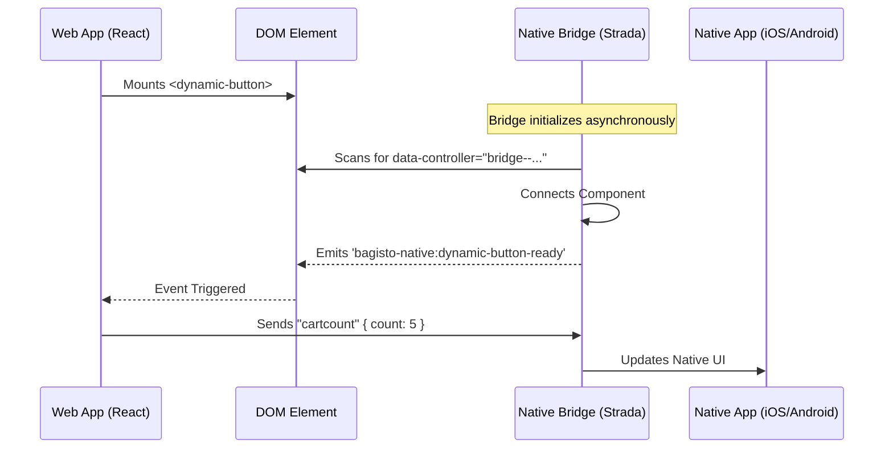

# Core Module Overview

The `@bagisto-native/core` package is the engine that powers the Bagisto Native experience. It operates invisibly for the most part but is responsible for every interaction between your web interface and the native app shell.

## Architecture

It is built as a set of **Web Components** (Custom Elements) that adhere to the W3C standard. This means they are browser-native and can be used with any JavaScript framework (React, Vue, Angular, or Vanilla JS).

This section dives deep into the internals of the core module, explaining how it works and how to use it effectively.

## Race Conditions & Event Architecture

One common challenge in Hybrid App development is the **Race Condition** between the Native Bridge initialization and your Web App's logic (e.g., React Hydration).

**The Problem:**
When your app loads, you might want to immediately send data to the native layer (e.g., "Set Cart Count to 5"). However, the Strada Bridge might not be fully connected yet. If you try to send a message before the bridge is ready, it will be ignored.

**The Solution: Event-Based Architecture**
To solve this, Bagisto Native components emit a specific event when they are fully connected and ready to receive messages.

### Communication Flow

### Standard Events

Each bridge component emits a standardized event upon connection:

| Component | Event Name | Purpose |
| :--- | :--- | :--- |
| DynamicButton | `bagisto-native:dynamic-button-ready` | Used to sync initial cart count or navbar state. |
| ThemeMode | `bagisto-native:theme-mode-ready` | Used to sync initial theme (dark/light) preference. |

By listening to these events, you ensure your code never fails due to a race condition.

## Next Steps

- Explore [Web Components](./web-components.md)
- Learn about [Utility Functions](./utility-functions.md)
- Understand [Best Practices](./best-practices.md)
