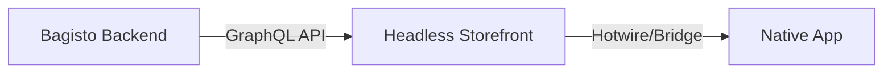

# Overview of the Setup Flow

Bagisto Native is designed for extreme speed and efficiency. By leveraging [Bagisto Headless Commerce](https://bagisto.com/en/headless-ecommerce/), anyone can transform their e-commerce storefront into a powerful native mobile experience in just a few minutes.

::: tip Two-in-One Deployment
When you build with this framework, you aren't just building a website; you are simultaneously preparing your **iOS and Android apps**. One setup gives you a presence across the Web, App Store, and Play Store instantly.
:::

## The Architecture Pipeline

## Step-by-Step Flow

1.  **Backend Setup**: Ensure your backend (Bagisto or any generic API) is running and accessible.
2.  **Step 1: Install Headless Storefront**: Generate your Next.js application.
3.  **Step 2: API Configuration**: Connect your storefront to your API.
4.  **Step 3: Connect Bagisto Native**: Install the SDK and setup the bridge bundle.
5.  **Step 4: Integrate Native Components**: Add the bridges and wrappers for native behavior.

::: tip Why this order?
The Native App is essentially a smart browser wrapper. It needs a website to display. The website (Headless Storefront) needs data to show. The Backend provides that data.
:::

## Seamless Headless Integration

This framework is built to be "Native Ready" from day one. By following the setup flow, you ensure that your **Bagisto Headless Commerce** instance acts as the brain for your mobile apps. 

- ✅ **Instant Mobile Presence**: No need to write separate native code for common features.
- ✅ **Web & App Sync**: Any change you make to your web storefront is instantly reflected in your mobile apps.
- ✅ **Developer Friendly**: Lowers the barrier to entry for web developers to enter the mobile app market.

## Next Steps

- Go to [**Step 1: Install Bagisto Headless**](./integrate-bagisto-native.md)
- Go to [**Step 2: API & Environment Configuration**](./configure-run-headless-storefront.md)
- Check [Limitations](./limitations.md)
