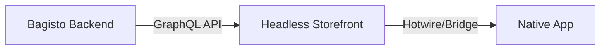

# Overview of the Setup Flow

Building a Bagisto Native application involves connecting three major components in a specific order.

## The Architecture Pipeline

## Step-by-Step Flow

1.  **Backend Setup**: First, you ensure your Bagisto (Laravel) backend is running and serving GraphQL APIs.
2.  **Headless Storefront Creation**: You generate a Next.js application using the Bagisto Headless starter. This is your "Web" layer.
3.  **Bagisto Native Integration**: You install the `@bagisto-native` packages into your Next.js app to make it "Native Ready."
4.  **Native App Configuration**: Finally, you point your native iOS/Android shell to the URL of your Next.js application.

::: tip Why this order?
The Native App is essentially a smart browser wrapper. It needs a website to display. The website (Headless Storefront) needs data to show. The Backend provides that data.
:::

## Next Steps

- Understand [Create Bagisto Headless Commerce](./create-headless-commerce.md)
- Explore [Configure & Run Headless Storefront](./configure-run-headless-storefront.md)
- Check [Limitations](./limitations.md)
