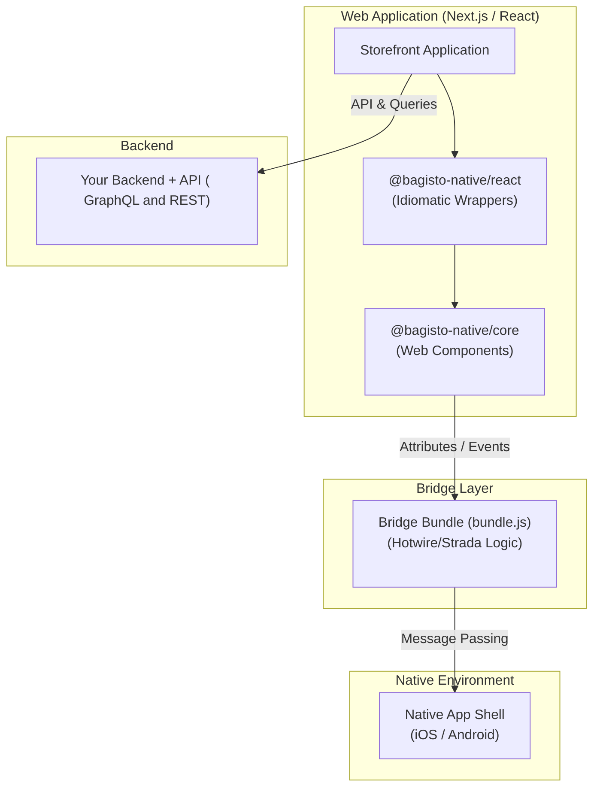

# Getting Started

Welcome to the **Bagisto Native** integration guide. This document outlines the essential requirements and provides a high-level overview of how the framework components work together to bridge your web storefront and native mobile applications.

## High-Level Architecture

Bagisto Native creates a seamless connection between your Next.js/React application and the native iOS/Android shell. The following diagram illustrates how the different layers interact:

### How it works:
1.  **React Wrappers**: Provide a developer-friendly syntax and type safety for use in your Next.js components.
2.  **Core Web Components**: Handle the low-level DOM attributes and event listeners that the Hotwire bridge expects.
3.  **Bridge Bundle**: A JavaScript bundle that facilitates the actual communication between the web view and the native mobile code.
4.  **Native Shell**: The mobile application that hosts the web view and responds to messages (e.g., opening a scanner, showing a toast).

## Technical Prerequisites

To ensure a smooth development experience with Bagisto Native, your environment must meet the following requirements.

### 1. Environment & Tools
*   **Node.js**: `v18.x` or higher (`v20.x` LTS recommended).
*   **Package Manager**: `npm` (9.x+), `yarn`, or `pnpm`.
*   **OS**: Any OS (macOS, Linux, Windows) can be used for web development. *Note: macOS is required for iOS-specific native builds.*

### 2. Backend & API Services
Your storefront needs a reliable source of data. Ensure you have the following set up:
*   **Any Backend / Admin**: Whether you use Bagisto Core (v2.0+) or any other custom backend, ensure your administrative panel is fully configured.
*   **Functional API**: You must have a working GraphQL or REST API. If using Bagisto, the [Bagisto GraphQL API](https://github.com/bagisto/bagisto-graphql-api) package should be active.
*   **API Accessibility**: Ensure your API endpoint is reachable from your development machines, mobile devices, and simulators.
*   **Active Storefront**: You should have a headless storefront (Next.js/React) ready to be enhanced with native features.

### 3. Next.js Knowledge
Since Bagisto Native is primarily designed for headless environments:
*   Familiarity with **Next.js 13/14+** (App Router or Pages Router).
*   Understanding of **Client vs Server Components** (as bridge components are client-side only).

## Next Steps

Now that you understand the architecture and have your environment ready:
1.  Explore the [**@bagisto-native/core**](../sdk-reference/core-package.md) package.
2.  Learn about the [**@bagisto-native/react**](../sdk-reference/react-package.md) wrappers.
3.  Check [**Versioning & Compatibility**](../sdk-reference/versioning-compatibility.md).
