# What is Bagisto Native?

**Bagisto Native** is a universal framework that transforms any React or Next.js web application into fully native iOS and Android mobile applications using Hotwire Bridge technology. It's completely API-agnostic and works with any backend system.

### Definition
Bagisto Native is a framework that enables you to build native mobile applications using your existing Next.js/React.js web projects through Hotwire technology, without needing to rebuild everything from scratch in Swift or Kotlin.

### Universal Compatibility
While officially optimized for Bagisto eCommerce, **Bagisto Native works with ANY backend API** including:
- REST APIs
- GraphQL APIs
- Custom backend systems
- Third-party services
- Microservices architectures
- Serverless functions
- Any headless CMS or commerce platform

**The key principle**: If your web app works with your API, Bagisto Native will work with it too.

## Core Architecture

### The Universal Three-Layer System

```mermaid
%%{init: {
  "theme": "neutral",
  "flowchart": {
    "nodeSpacing": 80,
    "rankSpacing": 100,
    "padding": 30,
    "useMaxWidth": false,
    "htmlLabels": true
  }
}}%%

graph TB

    subgraph Backend["Backend Layer – Your Choice"]
        API["Any Backend Technology<br/><br/>REST / GraphQL / Custom APIs<br/><br/>Node.js • Python • PHP • Java • .NET • Go<br/>Firebase • Supabase • Custom Services"]
    end
    
    subgraph WebLayer["Web Application Layer"]
        WebApp["Your Next.js / React App<br/>@bagisto-native/core<br/>@bagisto-native/react<br/><br/> "]
    end
    
    subgraph NativeLayer["Native Mobile Layer"]
        iOS["iOS App<br/>Swift + WebView"]
        Android["Android App<br/>Kotlin + WebView"]
    end
    
    API -->|API Calls<br/>HTTP / GraphQL / etc| WebApp
    WebApp -->|Hotwire Bridge| iOS
    WebApp -->|Hotwire Bridge| Android

    %% Soft neutral colors that work on both light & dark backgrounds
    style API fill:#dbeafe,stroke:#2563eb,color:#111827
    style WebApp fill:#ede9fe,stroke:#7c3aed,color:#111827
    style iOS fill:#d1fae5,stroke:#059669,color:#111827
    style Android fill:#ffedd5,stroke:#ea580c,color:#111827
```

### Data Flow Architecture

### Components Breakdown

1. **Backend Layer (Your Choice)**
   - **Any technology**: Node.js, Python, Ruby, PHP, Java, .NET, Go, etc.
   - **Any API style**: REST, GraphQL, gRPC, WebSockets
   - **Any service**: Custom backend, Firebase, Supabase, Strapi, Contentful, Shopify, WooCommerce, etc.
   - Business logic and data management
   - Authentication and authorization
   - Database operations

2. **Web Layer (Next.js/React)**
   - Your existing headless frontend application
   - API integration (fetch, axios, Apollo Client, etc.)
   - `@bagisto-native/core` - Core native functionality
   - `@bagisto-native/react` - React-specific bridge components
   - Server-side rendering and routing

3. **Native Layer (Swift/Kotlin)**
   - Native iOS and Android containers
   - WebView wrapper with native shell
   - Native navigation and animations
   - Platform-specific features (camera, notifications, biometrics)

## Key Features

### 🚀 Single Codebase Philosophy
- **One Source of Truth**: Maintain web and mobile apps from a single codebase
- **Unified Updates**: Changes to your web app automatically reflect in mobile apps
- **Reduced Development Time**: No need to write separate native codebases

### 🔄 Hotwire Bridge Technology
Hotwire Native is a high-level native framework that:
- Wraps web views within native shells
- Renders HTML from your server/web app
- Provides native navigation and transitions automatically
- Enables seamless communication between web and native code

### 🌐 API-Agnostic Design
- **Works with ANY backend**: REST, GraphQL, custom APIs
- **No vendor lock-in**: Use your existing API infrastructure
- **Framework independent**: Compatible with any server technology
- **Service agnostic**: Works with third-party APIs and microservices

### 📱 Progressive Native Enhancement
- Start with web views
- Progressively add native components where needed
- Choose which features become truly native
- Web-first approach with native upgrades

### 🎯 Bridge Components
Enable communication between web and native layers:
- Native buttons and form controls
- Platform-specific menus and dialogs
- Device features (camera, location, biometrics)
- Push notifications
- Native transitions and animations

## How Bagisto Native Works

### The Complete Workflow

### Step-by-Step Process

1. **Web-First Foundation**
   - Your existing Next.js or React application serves as the foundation
   - Your app continues to work with your existing API exactly as before
   - The web content is displayed within native containers with fully native behaviors

2. **API Independence**
   - Your web app makes API calls to your backend (any technology)
   - REST, GraphQL, Firebase, custom APIs - all work perfectly
   - No changes needed to your existing API integration
   - Bagisto Native doesn't interact with your API - it wraps your web app

3. **Native Container Wrapper**
   - Provides native iOS app shell (Swift + WebView)
   - Provides native Android app shell (Kotlin + WebView)
   - Manages native navigation stack
   - Adds platform-specific UI elements
   - **No API interaction** - your web app handles all API calls

4. **Bridge Communication**
   - Web components trigger native features through the bridge
   - JavaScript controllers communicate with Swift/Kotlin
   - Native code provides platform-specific enhancements
   - All communication abstracted through the Bridge
   - Your API calls remain in the web layer, unchanged

5. **Seamless Integration**
   - Your web app communicates with your API (unchanged)
   - Bridge enables native features (camera, notifications, etc.)
   - Native shell provides platform behaviors
   - Users get a true native experience

## Universal API Compatibility

### Technology Compatibility Matrix

### Works With Any Backend

**Backend Technologies:**
- Node.js (Express, Nest.js, Fastify)
- Python (Django, Flask, FastAPI)
- PHP (Laravel, Symfony, WordPress)
- Ruby (Rails, Sinatra)
- Java (Spring Boot, Micronaut)
- .NET (ASP.NET Core)
- Go (Gin, Echo, Fiber)
- Any other server technology

**API Protocols:**
- RESTful APIs
- GraphQL
- gRPC
- WebSockets
- SOAP (legacy systems)
- Custom protocols

**Third-Party Services:**
- Firebase / Supabase
- Shopify / WooCommerce
- Stripe / PayPal
- SendGrid / Twilio
- AWS / Azure / GCP
- Any API-accessible service

### How It Works With Your API

**Key Points:**
1. Your web app makes API calls to your backend
2. Your backend responds with data (JSON, XML, whatever you use)
3. Your web app renders the UI based on that data
4. Bagisto Native wraps your web app in native containers
5. Native features enhance the experience (camera, notifications, etc.)

**The bridge doesn't touch your API** - it only handles web ↔ native communication for platform features.

## Bagisto Native vs Headless Commerce

### Architecture Comparison

### Comparison Table

| Aspect | Bagisto Native | Traditional Headless Commerce |
|--------|----------------|------------------------------|
| **Architecture** | Native wrapper + Web views + Bridge | Frontend separate from backend via APIs |
| **Backend Flexibility** | **Works with ANY API backend** | Works with any API backend |
| **Development Approach** | Single codebase (web-first) | Multiple codebases (web, iOS, Android) |
| **Native Features** | Progressive enhancement via Bridge | Fully custom native development |
| **Maintenance** | Update once, deploy everywhere | Maintain separate apps |
| **Time to Market** | Fast (leverage existing web app) | Slower (build each platform separately) |
| **API Integration** | **In web layer only (any API)** | In each platform separately |
| **Team Size** | Small (web developers) | Large (web + iOS + Android teams) |
| **Update Speed** | Instant (no app store approval needed) | Slow (app store approval required) |
| **Cost** | Low (one codebase) | High (three codebases) |

## Bagisto Native vs API-First Projects

### Development Model Comparison

### Comparison Table

| Feature | Bagisto Native | API-First / REST Projects |
|---------|----------------|---------------------------|
| **Mobile Strategy** | Native apps via web wrapper | Custom native apps consuming APIs |
| **API Compatibility** | **Works with ANY API** | Works with any API |
| **API Integration** | **Once in web layer** | Separately in each platform |
| **Development Model** | Web-first with native enhancement | API-first with client implementations |
| **Code Distribution** | Server-driven (web app) | Client-driven |
| **Update Mechanism** | Instant (server updates) | App store releases required |
| **Backend Changes** | **Reflects immediately** | Requires app updates |
| **Platform Consistency** | Guaranteed (same source) | Varies (different implementations) |
| **Offline Support** | Limited (web-based) | Extensive (client-side logic) |
| **Learning Curve** | Low (web technologies) | High (multiple platforms) |

### Advantages Over API-First Approach

**1. Single API Integration Point**
- **API-First**: Implement API calls, auth, error handling in Swift, Kotlin, and JavaScript
- **Bagisto Native**: Implement once in Next.js/React
- **Works with any API**: REST, GraphQL, gRPC, custom protocols

**2. Server-Driven Updates**
- **API-First**: Mobile apps must be updated via app stores (days/weeks delay)
- **Bagisto Native**: Update web app, all apps reflect changes instantly
- **API changes**: Update web layer only, not 3 separate apps

**3. Rapid Development**
- **API-First**: Design API, build 3 clients, test integration on 3 platforms
- **Bagisto Native**: Integrate API in web, automatically works in apps
- **Test API integration once**

**4. Resource Efficiency**
- **API-First**: Large teams (web, iOS, Android), all learning your API
- **Bagisto Native**: Single web team handles all platforms
- **One team maintains API integration**

**5. Feature Parity**
- **API-First**: New API endpoints require updates to 3 apps
- **Bagisto Native**: New API features deploy simultaneously everywhere
- **No platform-specific API bugs**

**6. Backend Flexibility**
- **API-First**: Changing backend requires updating all client apps
- **Bagisto Native**: Change backend, update web layer, done
- **Switch from REST to GraphQL**: Update web app only

**7. Version Management**
- **API-First**: Manage API versions for different app versions
- **Bagisto Native**: Always latest version, no compatibility issues
- **No deprecated endpoint problems**

### When API-First is Better

- Building platform-specific experiences
- Offline-first requirements
- Heavy client-side data processing
- Multiple apps consuming same APIs (third-party developers)
- Microservices architecture with various consumer types
- Public API for external developers

## Benefits & Advantages

### For Businesses

**✅ Faster Time to Market**
- Launch native apps in weeks, not months
- Leverage existing web development
- Reuse existing API integrations
- No need to build from scratch

**✅ Cost Effective**
- One team instead of three ($100-150k vs $330k+/year)
- Single codebase to maintain
- One API integration point
- Reduced QA and testing effort
- Lower infrastructure costs

**✅ Instant Updates**
- Push changes without app store approval
- Fix bugs in real-time
- Update API integration instantly
- A/B test features easily
- Deploy on your schedule

**✅ Consistent Experience**
- Same functionality across all platforms
- Unified brand experience
- Same API behavior everywhere
- Reduced platform-specific bugs
- Guaranteed feature parity

**✅ Backend Flexibility**
- Switch APIs without rebuilding apps
- Migrate from REST to GraphQL easily
- Change backend technology freely
- No vendor lock-in
- Future-proof architecture

**✅ Scalability**
- Scale web infrastructure (familiar territory)
- No need to scale multiple codebases
- Easier to add new features
- Simple deployment process

### For Developers

**✅ Familiar Technologies**
- Use JavaScript/React knowledge
- No need to master Swift/Kotlin deeply
- Use your existing API client libraries
- Standard web development tools

**✅ Simplified Architecture**
- Single source of truth
- Less context switching
- One place for all API calls
- Cleaner dependency management
- Standard debugging tools

**✅ Progressive Enhancement**
- Start basic, add native features gradually
- Choose what needs to be native
- API integration stays simple
- Test web-first, enhance mobile later
- Incremental improvements

**✅ API Independence**
- Works with ANY backend
- No framework lock-in
- Use your preferred API client
- Standard HTTP/GraphQL tools
- Freedom of choice

**✅ Built-in Features**
- Native navigation out of the box
- Platform transitions automatic
- Ready-made bridge components
- Focus on business logic
- Less boilerplate code

**✅ Better Work-Life Balance**
- Less code to maintain
- Fewer production issues
- Easier debugging
- Clear separation of concerns
- One deployment pipeline

### For Users

**✅ Native Experience**
- Real native navigation and animations
- Platform-specific UI elements
- Fast, responsive interface
- Familiar platform behaviors
- Smooth transitions

**✅ Always Up-to-Date**
- Latest features without app updates
- Bug fixes applied immediately
- New API features available instantly
- No "update required" prompts
- Security patches in real-time

**✅ Smaller App Size**
- Web content doesn't bloat app
- Faster downloads
- Less device storage used
- Quick installation
- Minimal data usage

**✅ Consistent Experience**
- Same features on all platforms
- No platform favoritism
- Synchronized updates
- Unified user journey

## Use Cases

### Perfect Scenarios for Bagisto Native

### 1. **E-commerce Applications (Any Platform)**

**Perfect For:**
- Shopify stores wanting native apps
- WooCommerce mobile experiences
- Custom e-commerce platforms
- Magento, BigCommerce stores
- Multi-vendor marketplaces
- B2B wholesale platforms

**Why It Works:**
- Product catalogs display beautifully
- Shopping cart functionality
- Checkout flows with native payments
- Order tracking and history
- Customer account management
- Push notifications for orders

**Example:** Existing Shopify store with React frontend → Native iOS/Android apps in 2-3 weeks

### 2. **Content Management & Publishing**

**Perfect For:**
- WordPress headless sites
- Contentful, Strapi, Sanity powered apps
- News and media platforms
- Magazine and blog apps
- Documentation portals
- Educational content platforms

**Why It Works:**
- Content-heavy apps perform well
- Easy content updates
- Rich media support
- Reading experience optimized
- Offline reading capabilities (with caching)
- Push notifications for new content

**Example:** WordPress blog with Next.js frontend → Native news app with offline reading

### 3. **SaaS & Business Applications**

**Perfect For:**
- Dashboard applications
- Admin panels
- Project management tools
- CRM systems
- Analytics platforms
- Business intelligence tools
- Internal company apps

**Why It Works:**
- Complex interfaces work well
- Data visualization support
- Real-time updates
- Role-based access
- Multi-tenant support
- Secure authentication

**Example:** React dashboard consuming Node.js API → Native mobile app for field teams

### 4. **Service & Booking Platforms**

**Perfect For:**
- Appointment scheduling
- Hotel/restaurant bookings
- Event ticketing
- Service marketplaces
- Rental platforms (cars, homes, equipment)
- Healthcare appointment systems

**Why It Works:**
- Calendar integrations
- Real-time availability
- Payment processing
- Booking confirmations
- Location services
- Push reminders

**Example:** Booking system with React frontend → Native app with calendar and notifications

### 5. **Social & Community Platforms**

**Perfect For:**
- Community forums
- Social networking apps
- Discussion platforms
- Member directories
- Event communities
- Professional networks

**Why It Works:**
- User profiles and authentication
- Real-time messaging
- Content feeds
- Social features (likes, comments, shares)
- Push notifications
- Media uploads

**Example:** React-based forum → Native community app with real-time updates

### 6. **Food & Delivery Services**

**Perfect For:**
- Restaurant ordering
- Food delivery platforms
- Grocery delivery
- Ghost kitchen apps
- Cloud kitchen systems

**Why It Works:**
- Menu displays
- Order placement
- Real-time order tracking
- Payment integration
- Location services
- Push order updates

**Example:** Restaurant website with Next.js → Native ordering app with order tracking

### 7. **Healthcare & Wellness**

**Perfect For:**
- Telemedicine platforms
- Appointment booking
- Health records access
- Fitness tracking
- Wellness programs
- Patient portals

**Why It Works:**
- Secure data handling
- HIPAA compliant (web layer)
- Appointment scheduling
- Document uploads
- Secure messaging
- Health data integration

**Example:** Healthcare portal with React → Native patient app with secure messaging

### 8. **Education & Learning**

**Perfect For:**
- Learning management systems
- Online courses
- Educational content
- Student portals
- Quiz and assessment platforms
- Virtual classrooms

**Why It Works:**
- Content delivery
- Progress tracking
- Assignment submissions
- Video support
- Interactive lessons
- Push notifications for deadlines

**Example:** LMS with Next.js frontend → Native student app with offline course access

### 9. **Real Estate & Property**

**Perfect For:**
- Property listings
- Real estate marketplaces
- Property management
- Tenant portals
- Rental applications

**Why It Works:**
- Image galleries
- Virtual tours
- Property search
- Favorites and saved searches
- Appointment scheduling
- Document uploads

**Example:** Real estate website → Native app with property alerts and saved searches

### 10. **Financial & Fintech**

**Perfect For:**
- Banking dashboards
- Investment platforms
- Expense tracking
- Invoice management
- Payment portals
- Financial planning tools

**Why It Works:**
- Secure transactions
- Real-time data
- Charts and analytics
- Biometric authentication
- Push transaction alerts
- Document management

**Example:** Banking dashboard with React → Native app with biometric login

## Comparison Summary

### Decision Framework

```mermaid
flowchart TD
    Start[Need Mobile Apps?] -->|Yes| WebApp{Have Web App?}
    WebApp -->|Yes| API{Works with API?}
    WebApp -->|No| Build[Build Web First]
    
    API -->|Yes| BN[✅ Use Bagisto Native]
    API -->|No| Fix[Integrate API]
    
    Start -->|No| End1[Continue Web Only]
    
    BN --> Benefits[Benefits:<br/>- Fast Development<br/>- Low Cost<br/>- Easy Maintenance<br/>- Works with Any API<br><br/> ]
    
    WebApp -->|Need Platform-Specific| Custom{Budget Available?}
    Custom -->|Yes| Native[Build Native Apps]
    Custom -->|No| BN
    
    style BN fill:#4caf50,color:#fff
    style Benefits fill:#81c784
```

### Quick Decision Matrix

| Your Situation | Recommendation |
|----------------|----------------|
| ✅ Have React/Next.js web app | **Bagisto Native** |
| ✅ Use any backend API (REST/GraphQL/etc) | **Bagisto Native** |
| ✅ Want fast mobile app launch | **Bagisto Native** |
| ✅ Small team, limited budget | **Bagisto Native** |
| ✅ Need instant updates | **Bagisto Native** |
| ✅ Content-heavy application | **Bagisto Native** |
| ✅ E-commerce or SaaS platform | **Bagisto Native** |
| ✅ Want single codebase | **Bagisto Native** |

## Next Steps

- Understand [Why Bagisto Native](./why-bagisto-native.md) 
- Explore [When to Use Bagisto Native](./when-to-use-bagisto-native.md)
- Learn about [Supported Ecosystems](./supported-ecosystems.md)
