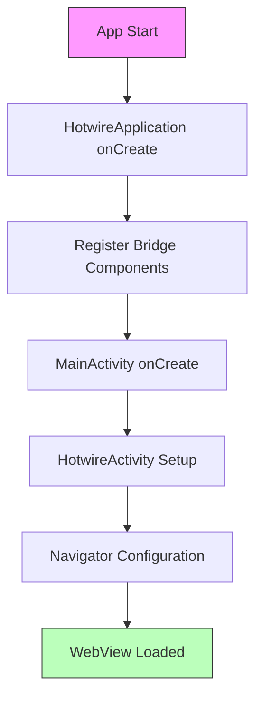

# Configuration Example

This document provides a complete example of configuring Bagisto Native Android with Hotwire Native.

## Configuration Flow



## Application Class

Create `HotwireApplication.kt`:

```kotlin
package com.example.yourapp

import android.app.Application
import com.mobikul.bagisto.utils.CustomBridgeComponents
import dev.hotwire.core.bridge.KotlinXJsonConverter
import dev.hotwire.core.config.Hotwire
import dev.hotwire.navigation.config.registerBridgeComponents

class HotwireApplication : Application() {
    override fun onCreate() {
        super.onCreate()
        
        // Register all bridge components
        Hotwire.registerBridgeComponents(
            *CustomBridgeComponents.all
        )
        
        // Configure JSON converter for web communication
        Hotwire.config.jsonConverter = KotlinXJsonConverter()
        
        // Set custom user agent
        Hotwire.config.applicationUserAgentPrefix = "BagistoApp"
    }
}
```

## MainActivity Configuration

Create `MainActivity.kt` extending `HotwireActivity`:

```kotlin
package com.example.yourapp

import android.os.Bundle
import android.view.View
import androidx.activity.enableEdgeToEdge
import dev.hotwire.navigation.activities.HotwireActivity
import dev.hotwire.navigation.navigator.NavigatorConfiguration
import dev.hotwire.navigation.util.applyDefaultImeWindowInsets

class MainActivity : HotwireActivity() {
    
    override fun onCreate(savedInstanceState: Bundle?) {
        enableEdgeToEdge()
        super.onCreate(savedInstanceState)
        setContentView(R.layout.activity_main)
        
        // Apply window insets for edge-to-edge display
        findViewById<View>(R.id.main_nav_host).applyDefaultImeWindowInsets()
    }

    override fun navigatorConfigurations(): List<NavigatorConfiguration> {
        return listOf(
            NavigatorConfiguration(
                name = "main",
                startLocation = "https://your-storefront.com",
                navigatorHostId = R.id.main_nav_host
            )
        )
    }
}
```

## AndroidManifest.xml

```xml
<?xml version="1.0" encoding="utf-8"?>
<manifest xmlns:android="http://schemas.android.com/apk/res/android"
    xmlns:tools="http://schemas.android.com/tools">

    <!-- Network permissions -->
    <uses-permission android:name="android.permission.INTERNET" />
    
    <!-- Location permissions (optional) -->
    <uses-permission android:name="android.permission.ACCESS_FINE_LOCATION" />
    <uses-permission android:name="android.permission.ACCESS_COARSE_LOCATION" />
    
    <!-- Camera permission (optional - for barcode/image search) -->
    <uses-permission android:name="android.permission.CAMERA" />
    
    <!-- Notification permission (Android 13+) -->
    <uses-permission android:name="android.permission.POST_NOTIFICATIONS" />

    <application
        android:name=".HotwireApplication"
        android:allowBackup="true"
        android:enableOnBackInvokedCallback="true"
        android:icon="@mipmap/ic_launcher"
        android:label="@string/app_name"
        android:theme="@style/Theme.BagistoNative"
        android:usesCleartextTraffic="true"
        android:hardwareAccelerated="true">

        <activity
            android:name=".MainActivity"
            android:exported="true"
            android:configChanges="orientation|screenSize|keyboardHidden"
            android:launchMode="singleTop">
            <intent-filter>
                <action android:name="android.intent.action.MAIN" />
                <category android:name="android.intent.category.LAUNCHER" />
            </intent-filter>
            
            <!-- Deep linking -->
            <intent-filter android:autoVerify="true">
                <action android:name="android.intent.action.VIEW" />
                <category android:name="android.intent.category.DEFAULT" />
                <category android:name="android.intent.category.BROWSABLE" />
                <data
                    android:scheme="https"
                    android:host="your-storefront.com" />
            </intent-filter>
        </activity>

    </application>
</manifest>
```

## Layout File

Create `res/layout/activity_main.xml`:

```xml
<?xml version="1.0" encoding="utf-8"?>
<FrameLayout 
    xmlns:android="http://schemas.android.com/apk/res/android"
    android:id="@+id/main_nav_host"
    android:layout_width="match_parent"
    android:layout_height="match_parent" />
```

## Build Configuration

In `app/build.gradle.kts`:

```kotlin
plugins {
    id("com.android.application")
    id("org.jetbrains.kotlin.android")
}

android {
    namespace = "com.example.yourapp"
    compileSdk = 34

    defaultConfig {
        applicationId = "com.example.yourapp"
        minSdk = 28  // Android 9.0 minimum
        targetSdk = 34
        versionCode = 1
        versionName = "1.0.0"
    }

    buildTypes {
        release {
            isMinifyEnabled = true
            proguardFiles(
                getDefaultProguardFile("proguard-android-optimize.txt"),
                "proguard-rules.pro"
            )
        }
    }

    compileOptions {
        sourceCompatibility = JavaVersion.VERSION_17
        targetCompatibility = JavaVersion.VERSION_17
    }

    kotlinOptions {
        jvmTarget = "17"
    }
}

dependencies {
    // Bagisto Native Android library
    implementation("com.github.SocialMobikul:BagistoNative_Android:1.0.0")
    
    // AndroidX Core
    implementation("androidx.core:core-ktx:1.12.0")
    implementation("androidx.appcompat:appcompat:1.6.1")
    
    // Hotwire Native
    implementation("dev.hotwire:hotwire-native:1.2.0")
}
```

## Requirements Summary

| Requirement | Minimum Version |
|-------------|-----------------|
| Android API | 28 (Android 9.0) |
| Java | 17 |
| Hotwire Native | 1.2.0 |

## Next Steps

- [Bridge Components Overview](../bridge-components/overview.md) - Available components
- [Adding Library to Project](../how-to-guides/adding-library-to-project.md) - Full integration
- [Build Release APK](../how-to-guides/build-release-apk.md) - Prepare for release
