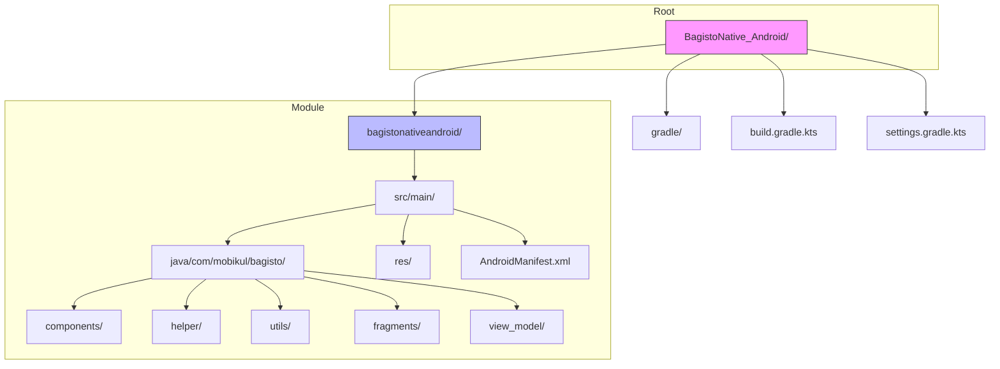

# Project Structure

Understanding the Bagisto Native Android project structure is essential for effective development and customization.

## Actual Project Structure



## Directory Structure

```
BagistoNative_Android/
├── bagistonativeandroid/           # Main application module
│   ├── src/
│   │   └── main/
│   │       ├── java/
│   │       │   └── com/mobikul/bagisto/
│   │       │       ├── components/     # Bridge components
│   │       │       │   ├── AlertComponent.kt
│   │       │       │   ├── ToastComponent.kt
│   │       │       │   ├── LocationComponent.kt
│   │       │       │   └── ...
│   │       │       ├── helper/         # Helper utilities
│   │       │       ├── utils/         # SDK utilities
│   │       │       │   ├── CustomBridgeComponents.kt
│   │       │       │   ├── BagistoSdkInitializer.kt
│   │       │       │   └── ...
│   │       │       ├── fragments/     # WebView fragment
│   │       │       └── view_model/    # ViewModels
│   │       ├── res/                  # Android resources
│   │       └── AndroidManifest.xml
│   └── build.gradle.kts
├── gradle/                          # Gradle wrapper
├── build.gradle.kts                 # Root build file
├── settings.gradle.kts              # Project settings
├── gradle.properties                # Gradle properties
└── README.md
```

## Package: com.mobikul.bagisto

### Components Package

```kotlin
com.mobikul.bagisto.components/
├── AlertComponent.kt           # Native alerts
├── ToastComponent.kt           # Toast messages
├── LocationComponent.kt        # GPS location
├── HapticComponent.kt          # Vibration feedback
├── BarcodeScannerComponent.kt  # QR/barcode scanner
├── ImageSearchComponent.kt     # ML image search
├── SearchComponent.kt         # Native search
├── ThemeComponent.kt           # Theme switching
├── MenuComponent.kt            # Navigation menu
├── FormComponent.kt           # Form handling
├── DownloadComponent.kt        # File downloads
├── ReviewPromptComponent.kt   # App review prompts
├── ShareComponent.kt           # Native share
├── NavigationHistoryComponent.kt
└── features/                   # Feature screens
    ├── QrScannerScreen.kt
    └── image_search/
```

### Utils Package

```kotlin
com.mobikul.bagisto.utils/
├── CustomBridgeComponents.kt   # Component registry
├── BagistoSdkInitializer.kt   # SDK initialization
├── AppSharedPreference.kt     # Shared preferences
├── PermissionUtils.kt          # Permission handling
├── CameraPermissionHelper.kt  # Camera permissions
└── ...
```

### Helper Package

```kotlin
com.mobikul.bagisto.helper/
├── LocationHelper.kt
├── ToastHelper.kt
└── ToolbarButton.kt
```

## Integration Structure

When integrating into your own project via JitPack:

```
YourProject/
├── app/
│   └── src/main/
│       ├── java/com/yourcompany/yourapp/
│       │   ├── HotwireApplication.kt
│       │   └── MainActivity.kt
│       ├── res/
│       └── AndroidManifest.xml
├── build.gradle.kts
└── settings.gradle.kts
```

## Build Configuration

### Root `build.gradle.kts`

```kotlin
plugins {
    id("com.android.application") version "8.2.2" apply false
    id("org.jetbrains.kotlin.android") version "1.9.22" apply false
}
```

### App Module `build.gradle.kts`

```kotlin
plugins {
    id("com.android.application")
    id("org.jetbrains.kotlin.android")
}

android {
    namespace = "com.example.yourapp"
    compileSdk = 34

    defaultConfig {
        applicationId = "com.example.yourapp"
        minSdk = 28  // Android 9.0 minimum
        targetSdk = 34
        versionCode = 1
        versionName = "1.0.0"
    }

    buildTypes {
        release {
            isMinifyEnabled = true
        }
        debug {
            isDebuggable = true
        }
    }
}

dependencies {
    // Bagisto Native Android via JitPack
    implementation("com.github.SocialMobikul:BagistoNative_Android:1.0.0")
    
    // Hotwire Native
    implementation("dev.hotwire:hotwire-native:1.2.0")
}
```

## Requirements

| Requirement | Version |
|-------------|---------|
| minSdk | 28 (Android 9.0) |
| compileSdk | 34 |
| Java | 17+ |
| Kotlin | 1.9.x |

## Next Steps

- [Configuration Example](./configuration-example.md) - Full setup guide
- [Adding Library to Project](../how-to-guides/adding-library-to-project.md) - JitPack integration
- [Bridge Components Overview](../bridge-components/overview.md) - Available components
