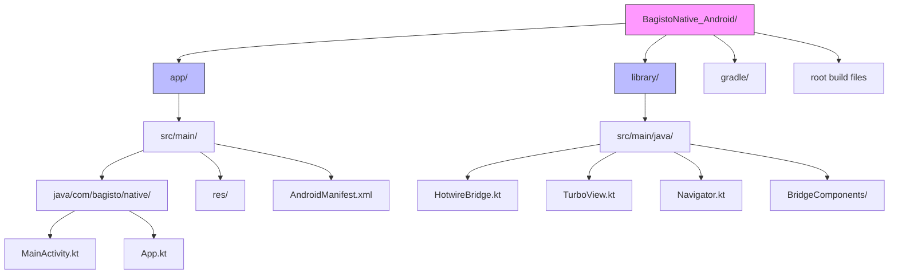

# Repository Overview

This document provides an overview of the Bagisto Native Android repository structure.

## Repository Location

```bash
git clone https://github.com/SocialMobikul/BagistoNative_Android.git
```

## Project Structure



```
BagistoNative_Android/
├── app/
│   ├── src/
│   │   ├── main/
│   │   │   ├── java/com/bagisto/native/
│   │   │   │   ├── MainActivity.kt
│   │   │   │   ├── App.kt
│   │   │   │   └── ...
│   │   │   ├── res/
│   │   │   │   ├── layout/
│   │   │   │   ├── values/
│   │   │   │   └── drawable/
│   │   │   └── AndroidManifest.xml
│   │   └── build.gradle
├── library/
│   ├── src/main/java/com/bagisto/native/library/
│   │   ├── HotwireBridge.kt
│   │   ├── TurboView.kt
│   │   ├── Navigator.kt
│   │   └── ...
│   └── build.gradle
├── build.gradle (root)
├── settings.gradle
└── gradle.properties
```

## Key Components

### 1. app Module
The main application module that uses the library:
- **MainActivity.kt**: Entry point, configures navigation
- **App.kt**: Application class for global setup

### 2. library Module
The reusable native library:
- **HotwireBridge**: Handles JavaScript bridge communication
- **TurboView**: WebView wrapper with Turbo integration
- **Navigator**: Manages navigation between screens
- **BridgeComponents**: Native UI components (Alert, Toast, etc.)

## Dependencies

Key dependencies in `build.gradle`:

```kotlin
dependencies {
    implementation("androidx.core:core-ktx:1.12.0")
    implementation("androidx.appcompat:appcompat:1.6.1")
    implementation("com.google.android.material:material:1.11.0")
    implementation("androidx.webkit:webkit:1.9.0")
    
    // Kotlin Coroutines
    implementation("org.jetbrains.kotlinx:kotlinx-coroutines-android:1.7.3")
}
```

## Version Compatibility

| Component | Version |
|-----------|---------|
| Min SDK | 24 (Android 7.0) |
| Target SDK | 36 (Android 16) |
| Kotlin | 1.9.22 |
| Gradle | 8.2 |
| AGP | 8.2.2 |

## Getting the Code

```bash
# Clone the repository
git clone https://github.com/SocialMobikul/BagistoNative_Android.git

# Navigate to project
cd BagistoNative_Android

# Open in Android Studio
# File → Open → Select project folder
```
