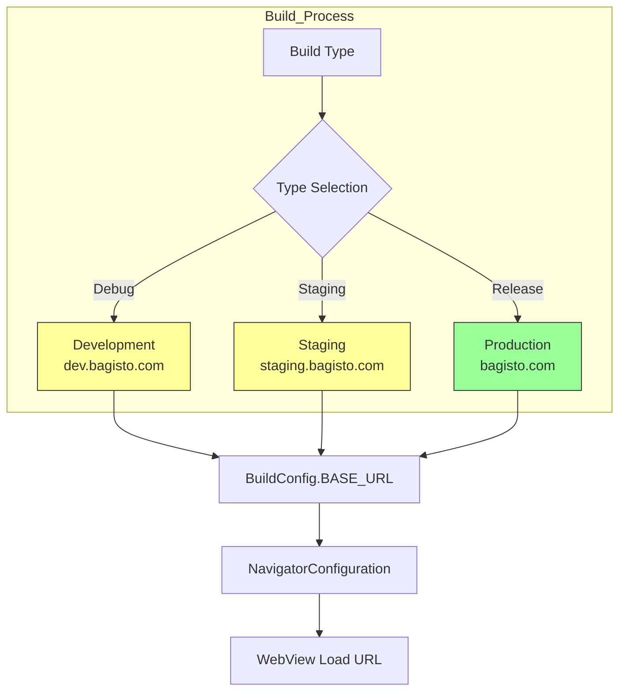

# Environment Switching in Android

This guide explains how to configure and switch between different environments (development, staging, production) in your Bagisto Native Android application.

## Why Environment Switching?

- **Development**: Local testing, debug features enabled
- **Staging**: Pre-production testing with production-like data
- **Production**: Live environment for end users

## Environment Flow



## Configuration Methods

- **Development**: Local testing, debug features enabled
- **Staging**: Pre-production testing with production-like data
- **Production**: Live environment for end users

## Configuration Methods

### Method 1: Build Variants (Recommended)

Configure different URLs based on build types:

```kotlin
// build.gradle.kts (app level)
android {
    buildTypes {
        debug {
            buildConfigField("String", "BASE_URL", "\"https://dev.bagisto.com\"")
            buildConfigField("Boolean", "DEBUG_ENABLED", "true")
        }
        release {
            buildConfigField("String", "BASE_URL", "\"https://bagisto.com\"")
            buildConfigField("Boolean", "DEBUG_ENABLED", "false")
        }
    }
    
    // Optional: Product flavors for multiple environments
    flavorDimensions += "environment"
    productFlavors {
        create("dev") {
            dimension = "environment"
            buildConfigField("String", "BASE_URL", "\"https://dev.bagisto.com\"")
        }
        create("staging") {
            dimension = "environment"
            buildConfigField("String", "BASE_URL", "\"https://staging.bagisto.com\"")
        }
        create("prod") {
            dimension = "environment"
            buildConfigField("String", "BASE_URL", "\"https://bagisto.com\"")
        }
    }
}
```

### Method 2: BuildConfig with Properties

Use gradle.properties for easy switching:

```properties
# gradle.properties
BASE_URL=https://dev.bagisto.com
```

```kotlin
// build.gradle.kts
android {
    defaultConfig {
        buildConfigField("String", "BASE_URL", "\"${project.properties.getProperty("BASE_URL", "https://dev.bagisto.com")}\"")
    }
}
```

### Method 3: Runtime Configuration

Switch environments at runtime:

```kotlin
object EnvironmentConfig {
    private const val DEV_URL = "https://dev.bagisto.com"
    private const val STAGING_URL = "https://staging.bagisto.com"
    private const val PROD_URL = "https://bagisto.com"
    
    fun getBaseUrl(environment: Environment): String {
        return when (environment) {
            Environment.DEVELOPMENT -> DEV_URL
            Environment.STAGING -> STAGING_URL
            Environment.PRODUCTION -> PROD_URL
        }
    }
}

enum class Environment {
    DEVELOPMENT, STAGING, PRODUCTION
}
```

## Using with Hotwire

### Navigator Configuration

```kotlin
override fun navigatorConfigurations() = listOf(
    NavigatorConfiguration(
        name = "main",
        startLocation = BuildConfig.BASE_URL,
        navigatorHostId = R.id.main_nav_host
    )
)
```

### Application Class

```kotlin
class YourApplication : Application() {
    
    override fun onCreate() {
        super.onCreate()
        
        // Configure based on environment
        Hotwire.config.logging = BuildConfig.DEBUG_ENABLED
    }
}
```

## Environment-Specific Features

### Development Features

Enable these in development only:

```kotlin
if (BuildConfig.DEBUG) {
    // Enable Hotwire logging
    Hotwire.config.logging = true
    
    // Show debug overlay
    // Enable Redux DevTools connection
    // Allow cleartext traffic (if needed)
}
```

### Staging Features

Configure for testing:

```kotlin
if (BuildConfig.BUILD_TYPE == "staging") {
    // Enable analytics for staging
    // Use test payment gateway
    // Show staging banner
}
```

### Production Features

Optimize for release:

```kotlin
if (BuildConfig.BUILD_TYPE == "release") {
    // Disable all debug features
    // Enable ProGuard/R8 obfuscation
    // Use production APIs
}
```

## Quick Switch Commands

### Using Gradle

```bash
# Development
./gradlew assembleDevDebug

# Staging
./gradlew assembleStagingDebug

# Production
./gradlew assembleProdRelease
```

### Build Variants Summary

| Variant | URL | Debug | Use Case |
|---------|-----|-------|----------|
| devDebug | dev.bagisto.com | ✅ | Local development |
| devRelease | dev.bagisto.com | ❌ | Testing dev build |
| stagingDebug | staging.bagisto.com | ✅ | QA testing |
| stagingRelease | staging.bagisto.com | ❌ | UAT |
| prodDebug | bagisto.com | ✅ | Pre-production |
| prodRelease | bagisto.com | ❌ | App Store |

## Best Practices

### ✅ Do's

1. **Use Build Variants** - Clean separation between environments
2. **Never Hardcode URLs** - Always use BuildConfig or configuration classes
3. **Separate API Keys** - Different keys for each environment
4. **Test All Variants** - Ensure each variant builds and runs

### ❌ Don'ts

1. **Don't Switch URLs at Runtime in Production** - Security risk
2. **Don't Use Production URLs in Debug** - Data contamination
3. **Don't Forget to Test Release Builds** - Performance may differ

## Troubleshooting

### Build Fails After Switching

- Clean project: `./gradlew clean`
- Invalidate caches: File → Invalidate Caches

### Wrong URL Loading

- Verify BuildConfig values in Build tab
- Check you're running the correct variant
- Confirm URL in logs: `Hotwire.config.logging = true`

## Next Steps

- [Common Mistakes](./common-mistakes) - Avoid configuration errors
- [Bridge Components](../bridge-components/overview) - Configure native features
