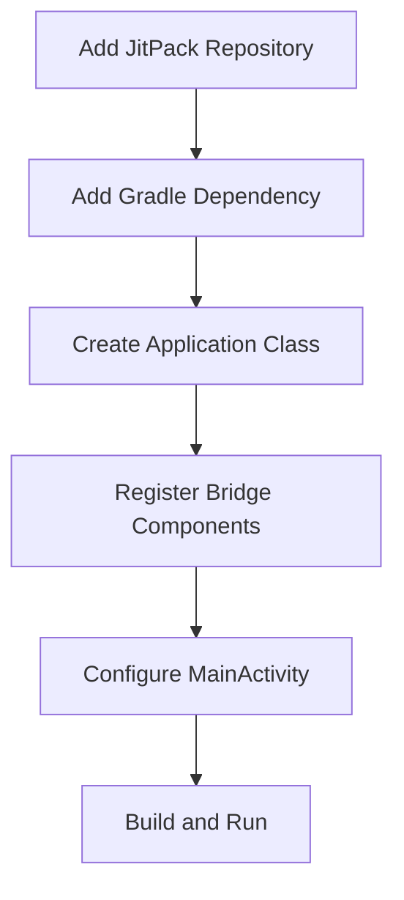

# Adding Library to Project

This guide provides the complete integration steps for adding BagistoNative_Android to your Hotwire Native Android project.

## Overview



## Step 1: Add JitPack Repository

In your `settings.gradle.kts`:

```kotlin
dependencyResolutionManagement {
    repositoriesMode.set(RepositoriesMode.FAIL_ON_PROJECT_REPOS)
    repositories {
        mavenCentral()
        maven { url 'https://jitpack.io' }
    }
}
```

## Step 2: Add Library Dependency

In your `app/build.gradle.kts`:

```kotlin
dependencies {
    implementation 'com.github.SocialMobikul:BagistoNative_Android:Tag'
}
```

::: tip
Replace `Tag` with the latest version from [GitHub Releases](https://github.com/SocialMobikul/BagistoNative_Android/releases)
:::

## Step 3: Create Application Class

Create a custom Application class to register bridge components:

```kotlin
package com.example.yourapp

import android.app.Application
import com.mobikul.bagisto.utils.CustomBridgeComponents
import dev.hotwire.core.bridge.KotlinXJsonConverter
import dev.hotwire.core.config.Hotwire
import dev.hotwire.navigation.config.registerBridgeComponents

class HotwireApplication : Application() {
    override fun onCreate() {
        super.onCreate()
        
        // Register all bridge components
        Hotwire.registerBridgeComponents(
            *CustomBridgeComponents.all
        )
        
        // Configure JSON converter
        Hotwire.config.jsonConverter = KotlinXJsonConverter()
        
        // Set user agent prefix
        Hotwire.config.applicationUserAgentPrefix = "HotwireApp"
    }
}
```

## Step 4: Update AndroidManifest.xml

Register your Application class:

```xml
<application
    android:name=".HotwireApplication"
    android:allowBackup="true"
    android:enableOnBackInvokedCallback="true"
    ... >
```

## Step 5: Configure MainActivity

Extend `HotwireActivity` in your main activity:

```kotlin
package com.example.yourapp

import android.os.Bundle
import android.view.View
import androidx.activity.enableEdgeToEdge
import dev.hotwire.navigation.activities.HotwireActivity
import dev.hotwire.navigation.navigator.NavigatorConfiguration
import dev.hotwire.navigation.util.applyDefaultImeWindowInsets

class MainActivity : HotwireActivity() {
    override fun onCreate(savedInstanceState: Bundle?) {
        enableEdgeToEdge()
        super.onCreate(savedInstanceState)
        setContentView(R.layout.activity_main)
        
        findViewById<View>(R.id.main_nav_host).applyDefaultImeWindowInsets()
    }

    override fun navigatorConfigurations() = listOf(
        NavigatorConfiguration(
            name = "main",
            startLocation = "https://your-storefront.com",
            navigatorHostId = R.id.main_nav_host
        )
    )
}
```

## Step 6: Update Layout

Ensure your activity layout has the navigation host:

```xml
<?xml version="1.0" encoding="utf-8"?>
<FrameLayout xmlns:android="http://schemas.android.com/apk/res/android"
    android:id="@+id/main_nav_host"
    android:layout_width="match_parent"
    android:layout_height="match_parent" />
```

## Requirements

- Android 9.0 (API Level 28) or higher
- Java 17 or higher
- Hotwire Native Android v1.2 or later

## Next Steps

- [Bridge Components Overview](../bridge-components/overview.md) - Available components
- [Component Registration](../bridge-components/registration.md) - Custom registration
- [Build Release APK](./build-release-apk.md) - Prepare for release
