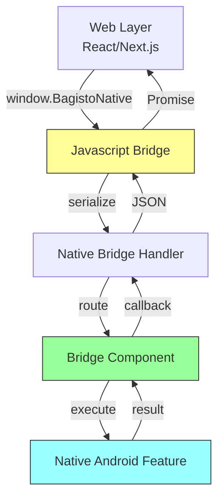

# Adding Native Components

Learn how to extend Bagisto Native Android with custom native components using Hotwire Native.

## Overview

Native components allow your web frontend to access native Android features through a JavaScript bridge.

## Component Architecture



## Creating a Custom Bridge Component

### 1. Define the Bridge Component

Create a Kotlin class extending `HotwireBridgeComponent`:

```kotlin
package com.example.yourapp.components

import android.content.Context
import dev.hotwire.core.bridge.HotwireBridgeComponent
import dev.hotwire.core.bridge.HotwireEvent
import dev.hotwire.core.bridge.Hotwire JsInterface

class CustomBridgeComponent(
    private val context: Context
) : HotwireBridgeComponent(context, "customComponent") {

    @JsInterface
    fun getDeviceInfo(): Map<String, Any> {
        return mapOf(
            "manufacturer" to android.os.Build.MANUFACTURER,
            "model" to android.os.Build.MODEL,
            "androidVersion" to android.os.Build.VERSION.SDK_INT
        )
    }

    @JsInterface
    fun showCustomDialog(data: Map<String, Any>) {
        val title = data["title"] as? String ?: "Custom Dialog"
        val message = data["message"] as? String ?: ""
        
        android.app.AlertDialog.Builder(context)
            .setTitle(title)
            .setMessage(message)
            .setPositiveButton("OK") { _, _ -> 
                respondToBridge(enabled = true)
            }
            .setNegativeButton("Cancel") { _, _ -> 
                respondToBridge(enabled = false)
            }
            .show()
    }
}
```

### 2. Create Bridge Component Registry

```kotlin
package com.example.yourapp.utils

import com.example.yourapp.components.CustomBridgeComponent

object CustomBridgeComponents {
    val all = arrayOf(
        CustomBridgeComponent::class.java
    )
}
```

### 3. Register in Application Class

In `HotwireApplication.kt`:

```kotlin
class HotwireApplication : Application() {
    override fun onCreate() {
        super.onCreate()
        
        // Register custom bridge components
        Hotwire.registerBridgeComponents(
            *CustomBridgeComponents.all
        )
    }
}
```

### 4. Use from JavaScript

```javascript
// Call native component from web
window.BagistoNative.custom.getDeviceInfo()
    .then(deviceInfo => {
        console.log('Device:', deviceInfo.model);
    });

window.BagistoNative.custom.showCustomDialog({
    title: 'Hello',
    message: 'This is a native dialog!'
});
```

## Component Structure

```
app/src/main/java/com/example/yourapp/
├── components/
│   ├── CustomBridgeComponent.kt
│   └── AnotherComponent.kt
└── utils/
    └── CustomBridgeComponents.kt
```

## Using Library Components

The Bagisto Native Android library includes pre-built components:

```kotlin
import com.mobikul.bagisto.utils.CustomBridgeComponents

// In Application class
Hotwire.registerBridgeComponents(
    *CustomBridgeComponents.all  // Registers all 14+ components
)
```

## Best Practices

1. **Always handle errors** - Return meaningful error messages
2. **Use callbacks** - Don't block the main thread
3. **Validate input** - Check data before processing
4. **Keep it simple** - One component = one responsibility
5. **Follow naming convention** - Component name matches JS interface

## Available Native Features

| Feature | Component Name | Description |
|---------|---------------|-------------|
| Alert | `alert` | Show native alerts |
| Toast | `toast` | Show toast messages |
| Location | `location` | GPS location access |
| Camera | `camera` | Camera access |
| Haptic | `haptic` | Vibration feedback |
| Barcode | `barcodeScanner` | QR/barcode scanning |
| Search | `search` | Native search UI |
| Image Search | `imageSearch` | ML image search |
| Download | `download` | File downloads |
| Share | `share` | Native share |
| Theme | `theme` | Theme switching |
| Review | `reviewPrompt` | App review prompts |

## Next Steps

- [Bridge Components Overview](../bridge-components/overview.md) - All available components
- [Component Registration](../bridge-components/registration.md) - Detailed registration
- [Build Release APK](./build-release-apk.md) - Prepare for release
