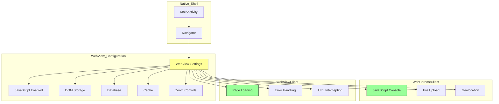

# Customizing WebView

Learn how to customize the WebView in Bagisto Native Android for better user experience.

## WebView Configuration

### Configuration Layers



### Basic Customization

```kotlin
class MainActivity : AppCompatActivity() {

    override fun onCreate(savedInstanceState: Bundle?) {
        super.onCreate(savedInstanceState)
        
        navigator = Navigator(this)
        
        // Configure with custom WebView settings
        val config = NavigatorConfiguration(
            name = "main",
            startLocation = "https://your-storefront.com"
        ).apply {
            // JavaScript settings
            isJavaScriptEnabled = true
            isJavaScriptCanOpenWindowsAutomatically = true
            
            // DOM storage
            isDomStorageEnabled = true
            
            // Database storage
            isDatabaseEnabled = true
            
            // Cache settings
            cacheMode = WebSettings.LOAD_DEFAULT
            
            // Zoom controls
            isBuiltInZoomControls = false
            isDisplayZoomControls = false
            
            // Viewport
            useWideViewPort = true
            loadWithOverviewMode = true
            
            // Media
            allowsInlineMediaPlayback = true
            mediaPlaybackRequiresUserGesture = false
        }
        
        navigator.configure(config)
        setContentView(navigator.getView())
    }
}
```

## Advanced Settings

### 1. Enable Debugging

```kotlin
// Enable WebView debugging
WebView.setWebContentsDebuggingEnabled(true)
```

### 2. Custom User Agent

```kotlin
val config = NavigatorConfiguration(
    name = "main",
    startLocation = "https://your-storefront.com"
).apply {
    userAgent = "BagistoNative/1.0 Android ${Build.VERSION.SDK_INT}"
}
```

### 3. Cookie Management

```kotlin
// Enable cookies
CookieManager.getInstance().setAcceptCookie(true)

// Allow third-party cookies
CookieManager.getInstance().setAcceptThirdPartyCookies(webView, true)
```

### 4. SSL/TLS Settings

```kotlin
webView.webViewClient = object : WebViewClient() {
    override fun onReceivedSslError(
        view: WebView?, 
        handler: SslErrorHandler?, 
        error: SslError?
    ) {
        // WARNING: Never use this in production!
        // For development only:
        handler?.proceed()
        
        // In production, handle appropriately:
        // handler?.cancel()
    }
}
```

## Performance Optimization

### 1. Enable Hardware Acceleration

```xml
<!-- AndroidManifest.xml -->
<application
    android:hardwareAccelerated="true"
    ... >
</application>
```

### 2. Enable Fast Loading

```kotlin
val config = NavigatorConfiguration(
    name = "main",
    startLocation = "https://your-storefront.com"
).apply {
    // Enable fast loading
    isLoadWithOverviewMode = true
    isUseWideViewPort = true
    
    // Block popups
    isJavaScriptCanOpenWindowsAutomatically = false
}
```

### 3. Configure Cache

```kotlin
val config = NavigatorConfiguration(
    name = "main",
    startLocation = "https://your-storefront.com"
).apply {
    // Use cache if available
    cacheMode = WebSettings.LOAD_CACHE_ELSE_NETWORK
    
    // Enable app cache
    isAppCacheEnabled = true
    appCachePath = cacheDir.absolutePath
}
```

## Custom ChromeClient

### Handle JavaScript Dialogs

```kotlin
webView.webChromeClient = object : WebChromeClient() {
    override fun onJsAlert(
        view: WebView?,
        url: String?,
        message: String?,
        result: JsResult?
    ): Boolean {
        // Show native dialog
        AlertDialog.Builder(context)
            .setMessage(message)
            .setPositiveButton("OK") { _, _ -> result?.confirm() }
            .show()
        return true
    }

    override fun onJsConfirm(
        view: WebView?,
        url: String?,
        message: String?,
        result: JsResult?
    ): Boolean {
        // Show confirmation dialog
        AlertDialog.Builder(context)
            .setMessage(message)
            .setPositiveButton("OK") { _, _ -> result?.confirm() }
            .setNegativeButton("Cancel") { _, _ -> result?.cancel() }
            .show()
        return true
    }

    override fun onJsPrompt(
        view: WebView?,
        url: String?,
        message: String?,
        defaultValue: String?,
        result: JsPromptResult?
    ): Boolean {
        // Handle prompt
        return true
    }

    override fun onProgressChanged(view: WebView?, newProgress: Int) {
        // Update progress bar
        if (newProgress < 100) {
            progressBar.visibility = View.VISIBLE
        } else {
            progressBar.visibility = View.GONE
        }
    }
}
```

## Custom WebViewClient

### Handle Page Loading

```kotlin
webView.webViewClient = object : WebViewClient() {
    override fun onPageStarted(view: WebView?, url: String?, favicon: Bitmap?) {
        super.onPageStarted(view, url, favicon)
        // Show loading indicator
    }

    override fun onPageFinished(view: WebView?, url: String?) {
        super.onPageFinished(view, url)
        // Hide loading indicator
    }

    override fun shouldOverrideUrlLoading(
        view: WebView?,
        request: WebResourceRequest?
    ): Boolean {
        // Handle URL navigation
        val url = request?.url?.toString() ?: return false
        
        // Open external links in browser
        if (url.startsWith("http://") && !url.contains("your-storefront.com")) {
            Intent(Intent.ACTION_VIEW, Uri.parse(url)).apply {
                startActivity(this)
            }
            return true
        }
        
        return false
    }

    override fun onReceivedError(
        view: WebView?,
        request: WebResourceRequest?,
        error: WebResourceError?
    ) {
        // Handle error
        if (request?.isForMainFrame == true) {
            // Show error page
        }
    }
}
```

## Best Practices

| Practice | Description |
|----------|-------------|
| Enable hardware acceleration | Smoother rendering |
| Configure caching | Faster page loads |
| Handle errors gracefully | Better UX |
| Use WebViewClient | Control navigation |
| Optimize images | Reduce data usage |

## Troubleshooting

| Issue | Solution |
|-------|----------|
| White screen | Check network, JavaScript enabled |
| Can't open links | Override shouldOverrideUrlLoading |
| Cookies not working | Enable CookieManager |
| SSL errors | Check certificate validity |
| Slow loading | Enable cache, optimize images |
