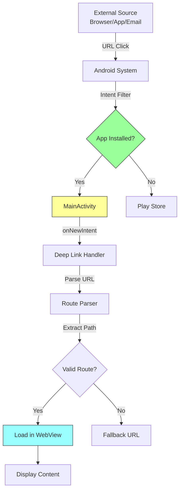

# Handling Deep Links

Deep linking allows your Bagisto Native Android app to respond to custom URLs from external sources.

## What are Deep Links?

Deep links are URLs that:
- Open your app from a browser
- Open your app from another app
- Handle custom URL schemes

**Examples:**
- `https://your-storefront.com/products/123`
- `bagisto://products/123`
- `myapp://checkout`

## Deep Link Flow



## Configure Deep Links

Deep links are URLs that:
- Open your app from a browser
- Open your app from another app
- Handle custom URL schemes

**Examples:**
- `https://your-storefront.com/products/123`
- `bagisto://products/123`
- `myapp://checkout`

## Configure Deep Links

### AndroidManifest.xml

Add intent filters to your `MainActivity`:

```xml
<activity
    android:name=".MainActivity"
    android:exported="true"
    android:launchMode="singleTop">
    
    <!-- HTTPS Deep Links -->
    <intent-filter android:autoVerify="true">
        <action android:name="android.intent.action.VIEW" />
        <category android:name="android.intent.category.DEFAULT" />
        <category android:name="android.intent.category.BROWSABLE" />
        <data
            android:scheme="https"
            android:host="your-storefront.com" />
    </intent-filter>
    
    <!-- HTTP (optional) -->
    <intent-filter>
        <action android:name="android.intent.action.VIEW" />
        <category android:name="android.intent.category.DEFAULT" />
        <category android:name="android.intent.category.BROWSABLE" />
        <data
            android:scheme="http"
            android:host="your-storefront.com" />
    </intent-filter>
    
    <!-- Custom URL Scheme -->
    <intent-filter>
        <action android:name="android.intent.action.VIEW" />
        <category android:name="android.intent.category.DEFAULT" />
        <category android:name="android.intent.category.BROWSABLE" />
        <data
            android:scheme="bagisto"
            android:host="app" />
    </intent-filter>
    
</activity>
```

## Handle Deep Links in Code

### MainActivity.kt

```kotlin
class MainActivity : AppCompatActivity() {

    override fun onCreate(savedInstanceState: Bundle?) {
        super.onCreate(savedInstanceState)
        
        navigator = Navigator(this)
        
        // Handle deep link from intent
        intent?.data?.let { uri ->
            handleDeepLink(uri)
        }
        
        // Configure navigator
        val config = NavigatorConfiguration(
            name = "main",
            startLocation = "https://your-storefront.com"
        )
        navigator.configure(config)
        setContentView(navigator.getView())
    }

    override fun onNewIntent(intent: Intent?) {
        super.onNewIntent(intent)
        // Handle new deep link when app is already running
        intent?.data?.let { uri ->
            handleDeepLink(uri)
        }
    }

    private fun handleDeepLink(uri: Uri) {
        val url = uri.toString()
        Log.d("DeepLink", "Received: $url")
        
        // Navigate to the deep link URL
        navigator.navigateTo(url)
    }
}
```

## Deep Link Types

### 1. Universal Links (iOS) / App Links (Android)

```xml
<!-- Android App Links - verified ownership -->
<data
    android:scheme="https"
    android:host="your-storefront.com"
    android:pathPrefix="/products" />
```

### 2. Custom URL Schemes

```xml
<!-- Custom scheme -->
<data
    android:scheme="bagisto"
    android:host="app"
    android:pathPrefix="/products" />
```

## Route Mapping

### Simple Route Handling

```kotlin
private fun handleDeepLink(uri: Uri) {
    val path = uri.path
    val host = uri.host
    
    when {
        // Product pages
        path?.startsWith("/products/") == true -> {
            val productId = path.substringAfter("/products/")
            navigator.navigateTo("https://your-storefront.com/products/$productId")
        }
        
        // Categories
        path?.startsWith("/category/") == true -> {
            val categoryId = path.substringAfter("/category/")
            navigator.navigateTo("https://your-storefront.com/category/$categoryId")
        }
        
        // Cart
        path == "/cart" -> {
            navigator.navigateTo("https://your-storefront.com/cart")
        }
        
        // Checkout
        path == "/checkout" -> {
            navigator.navigateTo("https://your-storefront.com/checkout")
        }
        
        // Default - homepage
        else -> {
            navigator.navigateTo("https://your-storefront.com")
        }
    }
}
```

## Testing Deep Links

### Using ADB

```bash
# Test HTTPS deep link
adb shell am start -d "https://your-storefront.com/products/123"

# Test custom scheme
adb shell am start -d "bagisto://app/products/123"
```

### Using Android Studio

1. **Device Explorer** → Select device
2. **Pull a file** from `/data/data/<package>/files/`
3. Check logs for deep link handling

## Best Practices

1. **Use App Links** - More secure than custom schemes
2. **Verify domain ownership** - Use `android:autoVerify="true"`
3. **Handle all cases** - Default to homepage if route unknown
4. **Test thoroughly** - Test all routes before release
5. **Support both HTTP and HTTPS** - For maximum compatibility

## Troubleshooting

| Issue | Solution |
|-------|----------|
| Deep link not opening app | Check intent filter configuration |
| App opens but wrong page | Check route mapping logic |
| Browser opens instead of app | Ensure `android:autoVerify="true"` is set |
| Deep link doesn't work in release | Check Play Store App Links configuration |
