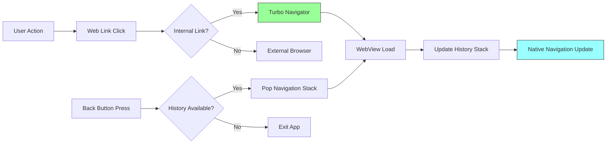

# Implementing Navigation

Learn how to configure and handle navigation in Bagisto Native Android.

## Navigation Overview

Bagisto Native uses Turbo Navigator for managing web-based navigation within a native wrapper.

## Navigation Flow



## Basic Navigation Setup

Bagisto Native uses Turbo Navigator for managing web-based navigation within a native wrapper.

## Basic Navigation Setup

### Configure Navigator

```kotlin
class MainActivity : AppCompatActivity() {

    private lateinit var navigator: Navigator

    override fun onCreate(savedInstanceState: Bundle?) {
        super.onCreate(savedInstanceState)
        
        navigator = Navigator(this)
        
        // Create navigation configuration
        val config = NavigatorConfiguration(
            name = "main",
            startLocation = "https://your-storefront.com",
            actionBarEnabled = true,
            navigationHistoryEnabled = true
        )
        
        // Apply configuration
        navigator.configure(config)
        
        // Set the content view
        setContentView(navigator.getView())
    }

    override fun onBackPressed() {
        // Handle back button - try to go back in web history first
        if (!navigator.canGoBack()) {
            super.onBackPressed()
        }
    }
}
```

## Navigation Types

### 1. Standard Navigation

Standard web navigation within the WebView:
- Links clicked in the web content
- Form submissions
- JavaScript redirects

### 2. Deep Link Navigation

Handle URLs that open the app from external sources:

```kotlin
// AndroidManifest.xml
<intent-filter>
    <action android:name="android.intent.action.VIEW" />
    <category android:name="android.intent.category.DEFAULT" />
    <category android:name="android.intent.category.BROWSABLE" />
    <data
        android:scheme="https"
        android:host="your-storefront.com"
        android:pathPrefix="/products" />
</intent-filter>
```

### 3. Programmatic Navigation

Navigate to specific URLs from native code:

```kotlin
// Navigate to a specific page
navigator.navigateTo("https://your-storefront.com/cart")

// Navigate with custom properties
navigator.navigateTo("https://your-storefront.com/checkout", 
    presentationStyle = PresentationStyle.PUSH
)
```

## Navigation Events

### Listening to Navigation Events

```kotlin
navigator.setNavigationListener(object : NavigationListener {
    override fun onPageStarted(url: String) {
        // Called when navigation starts
        Log.d("Navigation", "Page started: $url")
    }

    override fun onPageFinished(url: String) {
        // Called when page finishes loading
        Log.d("Navigation", "Page finished: $url")
    }

    override fun onPageError(url: String, error: WebViewError) {
        // Called on navigation error
        Log.e("Navigation", "Error: ${error.description}")
    }

    override fun onFormSubmissionStarted(url: String) {
        // Called when form submission starts
    }

    override fun onFormSubmissionFinished(url: String) {
        // Called when form submission finishes
    }
})
```

## Navigation History

### Enable Navigation History

```kotlin
val config = NavigatorConfiguration(
    name = "main",
    startLocation = "https://your-storefront.com",
    navigationHistoryEnabled = true  // Enable back/forward
)
```

### Navigate Through History

```kotlin
// Check if can go back
if (navigator.canGoBack()) {
    navigator.goBack()
}

// Check if can go forward
if (navigator.canGoForward()) {
    navigator.goForward()
}

// Clear history
navigator.clearHistory()
```

## Navigation Configuration Options

| Option | Type | Description |
|--------|------|-------------|
| `startLocation` | String | Initial URL to load |
| `actionBarEnabled` | Boolean | Show/hide action bar |
| `navigationHistoryEnabled` | Boolean | Enable back/forward buttons |
| `viewportMetaTagEnabled` | Boolean | Respect viewport meta tag |
| `allowsInlineMediaPlayback` | Boolean | Allow inline video |

## Custom Navigation

### Custom Navigator Implementation

```kotlin
class CustomNavigator(context: Context) : Navigator(context) {
    
    override fun shouldNavigate(request: NavigationRequest): Boolean {
        // Custom logic to decide if navigation should proceed
        val url = request.url
        
        // Block certain URLs
        if (url.contains("external.com")) {
            return false
        }
        
        return true
    }
    
    override fun presentationFor(url: String): PresentationStyle {
        // Determine how to present the new page
        return when {
            url.contains("/checkout") -> PresentationStyle.PUSH
            url.contains("/modal") -> PresentationStyle.MODAL
            else -> PresentationStyle.REPLACE
        }
    }
}
```

## Best Practices

1. **Handle back button properly** - Don't exit app without warning
2. **Show loading states** - Indicate navigation progress
3. **Handle errors gracefully** - Show user-friendly error pages
4. **Test deep links** - Verify all routes open correctly
5. **Clear history when needed** - Prevent memory issues
