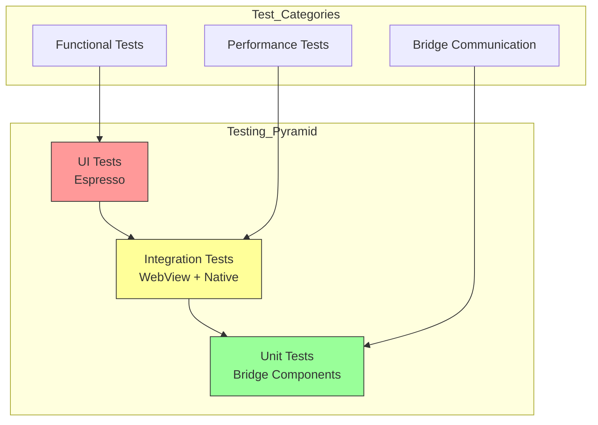

# Testing Your App

Comprehensive testing guide for Bagisto Native Android applications.

## Testing Overview

Testing is crucial for delivering a quality mobile experience. Here's how to test your app effectively.

## Testing Strategy



## Unit Testing

### Testing Bridge Components

```kotlin
// Example: Testing a custom bridge component
class CustomBridgeComponentTest {

    @Test
    fun `getDeviceInfo returns correct format`() {
        val context = ApplicationProvider.getApplicationContext<Context>()
        val component = CustomBridgeComponent(context)
        
        var result: Map<String, Any>? = null
        component.handle("getDeviceInfo", emptyMap()) { data ->
            result = data as? Map<String, Any>
        }
        
        assertNotNull(result)
        assertTrue(result!!.containsKey("manufacturer"))
        assertTrue(result!!.containsKey("model"))
    }

    @Test
    fun `handle unknown method returns error`() {
        val context = ApplicationProvider.getApplicationContext<Context>()
        val component = CustomBridgeComponent(context)
        
        var result: Exception? = null
        component.handle("unknownMethod", emptyMap()) { data ->
            if (data is Exception) result = data
        }
        
        assertTrue(result is UnsupportedOperationException)
    }
}
```

### Testing Navigator

```kotlin
class NavigatorTest {

    @Test
    fun `configuration sets correct values`() {
        val config = NavigatorConfiguration(
            name = "test",
            startLocation = "https://example.com"
        )
        
        assertEquals("test", config.name)
        assertEquals("https://example.com", config.startLocation)
    }
}
```

## Integration Testing

### Testing WebView Interactions

```kotlin
@RunWith(AndroidJUnit4::class)
class WebViewIntegrationTest {

    @Test
    fun `webView loads URL correctly`() {
        val scenario = ActivityScenario.launch(MainActivity::class.java)
        
        scenario.onActivity { activity ->
            // Wait for page to load
            Thread.sleep(3000)
            
            // Verify WebView is visible
            val webView = activity.findViewById<WebView>(R.id.webView)
            assertTrue(webView.visibility == View.VISIBLE)
        }
    }
}
```

## Manual Testing Checklist

### 1. Navigation Testing

- [ ] Homepage loads correctly
- [ ] Back button works
- [ ] Forward button works
- [ ] Deep links open correct pages
- [ ] External links open in browser

### 2. Native Components

- [ ] Alert dialogs display correctly
- [ ] Toast messages appear
- [ ] Location permission works
- [ ] Camera access works
- [ ] Haptic feedback works

### 3. Network Conditions

- [ ] Works on WiFi
- [ ] Works on mobile data
- [ ] Works offline (if supported)
- [ ] Handles slow connections

### 4. Device Compatibility

- [ ] Test on different screen sizes
- [ ] Test on different Android versions
- [ ] Test on different manufacturers

## Automated UI Testing

### Espresso Test Example

```kotlin
@RunWith(AndroidJUnit4::class)
class MainActivityTest {

    @Test
    fun testNavigation() {
        // Launch activity
        val scenario = ActivityScenario.launch(MainActivity::class.java)
        
        // Wait for page to load
        onWebView().withElement(findElement(Locator.ID, "content"))
            .check(webMatches(getText(), containsString("Home")))
        
        // Click a link
        onWebView().withElement(findElement(Locator.ID, "products-link"))
            .perform(webClick())
        
        // Verify navigation
        onWebView().check(webMatches(getCurrentUrl(), containsString("/products")))
    }
}
```

## Performance Testing

### Using Android Profiler

1. **Open Android Studio**
2. **View → Tool Windows → Profiler**
3. **Select device and app**
4. **Record** CPU, memory, network usage

### Key Metrics

| Metric | Target |
|--------|--------|
| Cold start | < 2 seconds |
| Warm start | < 500ms |
| Memory usage | < 150MB |
| CPU usage | < 30% idle |

## Testing on Real Devices

### Using Firebase Test Lab

```bash
# Upload APK to Firebase Test Lab
gcloud firebase test android run \
  --app path/to/app-debug.apk \
  --test path/to/app-debug-androidTest.apk \
  --device model=Pixel7,version=34
```

### Device Lab Recommendations

Test on these device categories:
- High-end (Pixel, Samsung S series)
- Mid-range (OnePlus, Moto G)
- Low-end (older budget phones)

## Debugging Tools

### 1. Logcat

```bash
# Filter app logs
adb logcat -s BagistoNative:D

# Filter by tag
adb logcat -s TurboView:D WebView:D Bridge:D
```

### 2. Chrome Inspector

1. Enable: `WebView.setWebContentsDebuggingEnabled(true)`
2. Open `chrome://inspect` in Chrome desktop
3. Select your device and WebView

### 3. Stetho

Add to `build.gradle`:

```kotlin
dependencies {
    implementation("com.facebook.stetho:stetho:1.6.0")
}
```

Initialize in code:

```kotlin
Stetho.initializeWithDefaults(this)
```

Then open `chrome://inspect` to use DevTools.

## Pre-Release Testing

### Beta Testing with Firebase

1. **Create Firebase project**
2. **Upload APK to App Distribution**
3. **Add testers**
4. **Collect feedback**

### Store Pre-release

- **Internal Testing** (Google Play)
- **TestFlight** (iOS)
