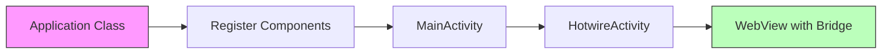

# How to Use the Library

This guide explains how to use the Bagisto Native Android library with Hotwire Native.

## Integration Overview



## Package Structure

The library uses these key imports:

```kotlin
// Bridge component registration
import com.mobikul.bagisto.utils.CustomBridgeComponents

// Hotwire Native core
import dev.hotwire.core.bridge.KotlinXJsonConverter
import dev.hotwire.core.config.Hotwire
import dev.hotwire.navigation.config.registerBridgeComponents
import dev.hotwire.navigation.activities.HotwireActivity
import dev.hotwire.navigation.navigator.NavigatorConfiguration
```

## Application Setup

The Application class registers all bridge components:

```kotlin
class HotwireApplication : Application() {
    override fun onCreate() {
        super.onCreate()
        
        // Register all bagisto bridge components
        Hotwire.registerBridgeComponents(
            *CustomBridgeComponents.all
        )
        
        // Configure JSON converter
        Hotwire.config.jsonConverter = KotlinXJsonConverter()
    }
}
```

## MainActivity Configuration

Extend `HotwireActivity` for full Hotwire Native integration:

```kotlin
class MainActivity : HotwireActivity() {
    
    override fun onCreate(savedInstanceState: Bundle?) {
        super.onCreate(savedInstanceState)
        setContentView(R.layout.activity_main)
    }

    override fun navigatorConfigurations(): List<NavigatorConfiguration> {
        return listOf(
            NavigatorConfiguration(
                name = "main",
                startLocation = "https://your-storefront.com",
                navigatorHostId = R.id.main_nav_host
            )
        )
    }
}
```

## Bridge Components Available

The library provides these components via `CustomBridgeComponents.all`:

| Component | Description |
|-----------|-------------|
| AlertComponent | Native alert dialogs |
| ToastComponent | Native toast messages |
| LocationComponent | GPS location services |
| HapticComponent | Vibration feedback |
| BarcodeScannerComponent | QR/barcode scanning |
| ImageSearchComponent | ML-powered image search |
| SearchComponent | Native search UI |
| ThemeComponent | Theme switching |
| MenuComponent | Navigation menu |
| FormComponent | Native form handling |
| DownloadComponent | File downloads |
| ReviewPromptComponent | App review prompts |
| ShareComponent | Native share sheet |
| NavigationHistoryComponent | Back/forward navigation |

## Custom Component Registration

To register individual components:

```kotlin
Hotwire.registerBridgeComponents(
    AlertComponent(context),
    ToastComponent(context),
    LocationComponent(context)
)
```

## Next Steps

- [Adding Library to Project](./adding-library-to-project.md) - Complete setup guide
- [Bridge Components Overview](../bridge-components/overview.md) - Component details
- [Build Release APK](./build-release-apk.md) - Prepare for release
