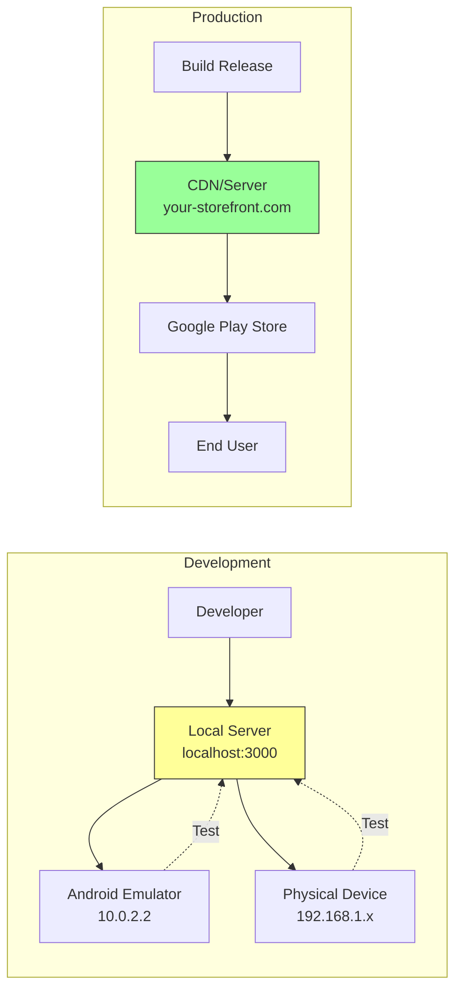

# Local vs Production URLs

Understanding when to use local URLs versus production URLs is crucial for effective development.

## Local URLs

Use local URLs during **development** to test changes quickly.

**Examples:**
- `http://localhost:3000`
- `http://10.0.2.2:3000` (Android emulator accessing host machine)
- `http://192.168.1.x:3000` (physical device on same network)

### When to Use Local URLs

- Developing new features
- Debugging issues
- Testing changes in real-time
- No internet required

## Development Workflow



## Configuration

Use local URLs during **development** to test changes quickly.

**Examples:**
- `http://localhost:3000`
- `http://10.0.2.2:3000` (Android emulator accessing host machine)
- `http://192.168.1.x:3000` (physical device on same network)

### When to Use Local URLs

- Developing new features
- Debugging issues
- Testing changes in real-time
- No internet required

### Configuration

```kotlin
// MainActivity.kt
override fun navigatorConfigurations() = listOf(
    NavigatorConfiguration(
        name = "main",
        startLocation = "http://10.0.2.2:3000"  // Local development server
    )
)
```

## Production URLs

Use production URLs for **release builds** deployed to users.

**Examples:**
- `https://store.bagisto.com`
- `https://myapp.example.com`

### When to Use Production URLs

- Publishing to Play Store
- User testing (QA)
- Beta releases

### Configuration

```kotlin
// MainActivity.kt
override fun navigatorConfigurations() = listOf(
    NavigatorConfiguration(
        name = "main",
        startLocation = "https://store.bagisto.com"  // Production
    )
)
```

## Environment Switching

Use build variants to switch between URLs automatically:

```kotlin
// build.gradle.kts
android {
    buildTypes {
        debug {
            buildConfigField("String", "BASE_URL", "\"http://10.0.2.2:3000\"")
        }
        release {
            buildConfigField("String", "BASE_URL", "\"https://store.bagisto.com\"")
        }
    }
}
```

## Best Practices

| Environment | URL Type | Purpose |
|-------------|----------|---------|
| Development | Local | Fast iteration |
| Staging | Production-like | QA testing |
| Production | Production | End users |

## Important Notes

- **Local URLs don't work in release builds** - Users won't see your localhost
- **Use HTTPS in production** - Required for WebView security
- **Test with production URL before releasing** - Catch issues early
