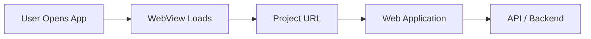

# What is Project URL

The Project URL is the foundation of your Bagisto Native Android application. It's the web address that your Android app will load in the WebView.

## Definition

The **Project URL** is the base URL of your deployed web application (Next.js, React, etc.) that the Android app will display inside the WebView component.

## Why It Matters

The Project URL determines:

- **What users see** when they open your app
- **How updates are delivered** - web changes appear instantly
- **How the app behaves** in offline mode

## URL Requirements

Your Project URL must:

- ✅ Be publicly accessible (not localhost)
- ✅ Use **HTTPS** (required for WebView)
- ✅ Be responsive/mobile-friendly
- ✅ Have CORS headers configured for your app

## Example

If your store is deployed at:

```
https://my-store.bagisto.com
```

This becomes your Project URL in the Android configuration.

## Architecture Flow



## Next Steps

- [Local vs Production URLs](./local-vs-production-urls) - Understanding the difference
- [Network Considerations](./network-considerations) - How to handle connectivity
