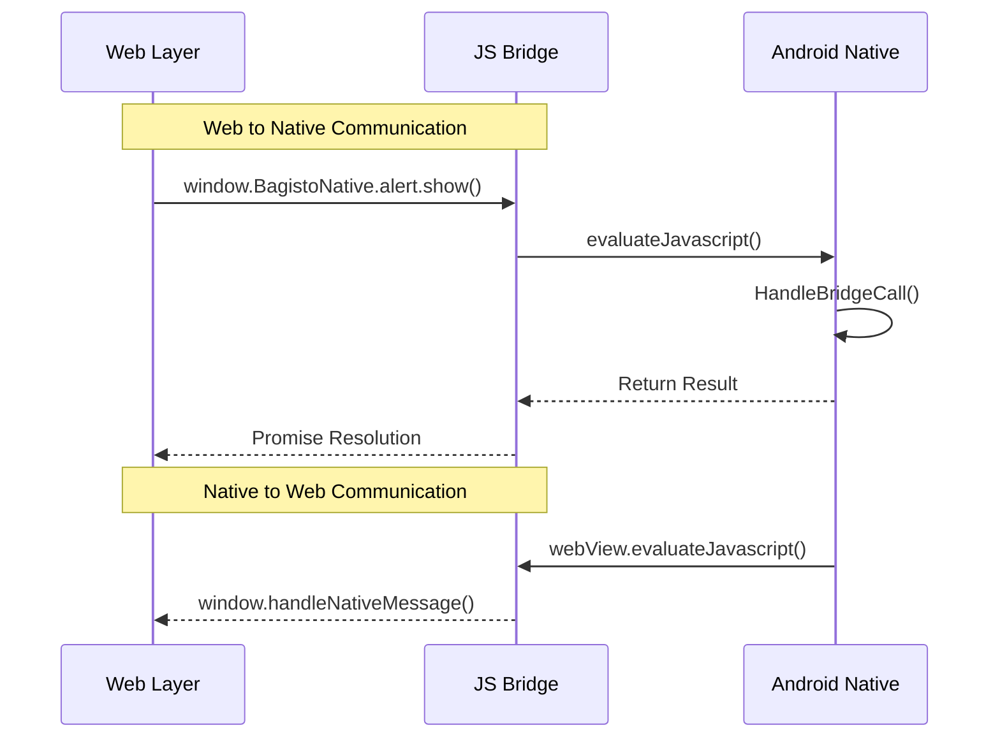

# Verifying Native-Web Communication

This guide helps you verify that the communication between the native Android app and web content is working correctly.

## Communication Overview

Bagisto Native Android uses a JavaScript bridge to enable communication between the WebView and native Android code.



## Native to Web Communication

### Calling JavaScript from Native

```kotlin
// Inject JavaScript into WebView
webView.evaluateJavascript("console.log('Hello from native!')", null)

// Call a specific JavaScript function
webView.evaluateJavascript("window.handleNativeMessage('data')", null)

// Get return value
webView.evaluateJavascript("window.getAppState()") { value ->
    Log.d("WebView", "App state: $value")
}
```

### Verifying Native to Web

1. **Add test function in web:**
```javascript
// In your web app
window.testNativeToWeb = function(message) {
    console.log('Received from native:', message);
    return 'success';
};
```

2. **Call from Android:**
```kotlin
webView.evaluateJavascript("window.testNativeToWeb('Hello!')") { result ->
    Log.d("Test", "Result: $result")
}
```

## Web to Native Communication

### Calling Native from JavaScript

```javascript
// Call native alert component
window.BagistoNative.alert.show({
    title: 'Hello',
    message: 'This is from web!'
});

// Call native toast
window.BagistoNative.toast.show('Hello from web!');

// Get device info
window.BagistoNative.device.getInfo().then(info => {
    console.log('Device info:', info);
});
```

### Verifying Web to Native

1. **Check bridge is available:**
```javascript
console.log('BagistoNative available:', !!window.BagistoNative);
console.log('Components:', Object.keys(window.BagistoNative));
```

2. **Test alert component:**
```javascript
if (window.BagistoNative && window.BagistoNative.alert) {
    window.BagistoNative.alert.show({
        title: 'Test Alert',
        message: 'Bridge is working!'
    });
} else {
    console.error('Alert component not available');
}
```

## Debugging Bridge Communication

### 1. Enable Logging

```kotlin
// Enable WebView debugging
WebView.setWebContentsDebuggingEnabled(true)

// Add console logging
webView.webChromeClient = object : WebChromeClient() {
    override fun onConsoleMessage(message: String?, lineNumber: Int, sourceID: String?) {
        Log.d("WebView Console", message ?: "")
    }
}
```

### 2. Check JavaScript Interface

```kotlin
// Verify interface is registered
Log.d("Bridge", "Interfaces: " + webView.settings.javaScriptEnabled)
Log.d("Bridge", "Object names: ${getRegisteredInterfaces()}")
```

### 3. Monitor All Calls

```kotlin
class DebugBridgeComponent(context: Context) : BridgeComponent {
    
    override fun handle(method: String, data: Map<String, Any>, callback: (Any?) -> Unit) {
        Log.d("BridgeCall", "Method: $method, Data: $data")
        
        // Log before and after
        try {
            val result = processMethod(method, data)
            Log.d("BridgeResult", "Success: $result")
            callback(result)
        } catch (e: Exception) {
            Log.e("BridgeError", "Error: ${e.message}")
            callback(e)
        }
    }
}
```

## Common Communication Issues

### Issue: Bridge Not Available

**Symptoms:** `window.BagistoNative` is undefined

**Solutions:**
```kotlin
// Ensure JavaScript is enabled
webView.settings.javaScriptEnabled = true

// Add JavaScript interface
webView.addJavascriptInterface(MyBridgeInterface(), "BagistoNative")

// Wait for page to load
webView.webViewClient = object : WebViewClient() {
    override fun onPageFinished(view: WebView?, url: String?) {
        // Bridge is ready after page loads
    }
}
```

### Issue: Method Not Found

**Symptoms:** Error "Method not found"

**Solutions:**
- Check method name spelling
- Ensure component is registered
- Verify data format matches

### Issue: Callback Never Called

**Solutions:**
- Check if callback is invoked
- Add timeout for async operations
- Verify data is being passed correctly

## Testing Checklist

- [ ] `window.BagistoNative` is defined
- [ ] Can call native methods from web
- [ ] Can call web methods from native
- [ ] Data passes correctly between layers
- [ ] Error handling works properly
- [ ] Works on different Android versions

## Utility Functions

### Check Bridge Status

```javascript
function checkBridgeStatus() {
    const status = {
        bagistoNativeExists: !!window.BagistoNative,
        components: window.BagistoNative ? Object.keys(window.BagistoNative) : [],
        userAgent: navigator.userAgent
    };
    
    console.log('Bridge Status:', JSON.stringify(status, null, 2));
    return status;
}

// Run in browser console
checkBridgeStatus();
```

### Test All Components

```javascript
async function testAllComponents() {
    const results = [];
    
    if (window.BagistoNative) {
        // Test each component
        for (const component of Object.keys(window.BagistoNative)) {
            try {
                results.push({ component, status: 'available' });
            } catch (e) {
                results.push({ component, status: 'error', message: e.message });
            }
        }
    }
    
    console.table(results);
    return results;
}
```

## Best Practices

1. **Always handle errors** - Wrap calls in try-catch
2. **Validate data** - Check types and formats
3. **Use async/await** - Don't block the main thread
4. **Test thoroughly** - Verify on multiple devices
5. **Log important events** - For debugging issues
