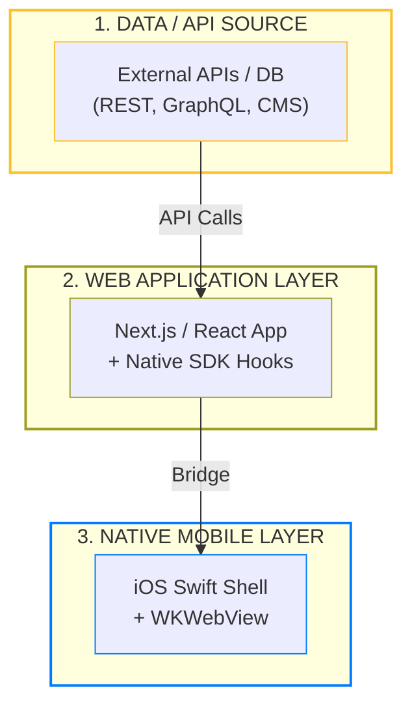

# Introduction to iOS Integration

Welcome to the **iOS Integration Guide**. This documentation is designed to help you transform **any** existing **Next.js** or **React.js** web application into a high-performance native iOS experience.

While this framework is part of the Bagisto ecosystem, it is designed to be **platform-agnostic**. You can use it to bridge any responsive web project to iOS, regardless of your backend technology.

## 🏗️ Core Architecture

This system follows a **Universal Three-Layer Architecture** that ensures your web logic is reused across all mobile platforms.

### 1. Data / API Source
The framework is backend-agnostic. Whether you use **Bagisto (Laravel)**, **Node.js**, **Python**, or a **Headless CMS**, as long as your web app can consume the data, it can be bridged to iOS.

### 2. Web Storefront Layer
Any responsive **Next.js** or **React.js** application. This layer manages your user interface and integrates our lightweight bridge hooks.

### 3. Bridge Layer (Bagisto Native Framework)
This is the communication engine. It provides the `@bagisto-native/core` and `@bagisto-native/react` SDKs that create the bi-directional link between your web code and the native device.

### 4. Native Layer (Turbo Native iOS)
A high-performance Swift application that hosts your web project in a `WKWebView`. It provides native navigation, animations, and access to hardware features like the **Camera**, **Haptics**, and **Apple Pay**.

## 🔄 The Native Feature Flow

The bridge works the same way for any project:
1. **Trigger**: A React component calls a hook (e.g., `showToast`).
2. **Dispatch**: The bridge serializes the request into a JSON payload.
3. **Execution**: The iOS app intercepts the payload and performs the native action.
4. **Callback**: Any result (like a barcode scan string) is sent back to your web app.

## 🌟 Strategic Benefits

- **Backend Flexibility**: Use any API or backend infrastructure.
- **Universal Frontend**: Works with any React-based framework (Next.js, Vite, etc.).
- **Instant Updates**: Deploy changes to your web server and see them instantly in the app, bypassing the App Store review process for UI tweaks.

## 📋 Prerequisites

To be successful with this integration, you should have:
- A **responsive** web project (built with Next.js or React).
- **macOS** with the latest version of **Xcode** installed.
- (Recommended) A basic understanding of your web app's routing and state management.

## 🗺️ Integration Roadmap

1.  **Prepare Web**: Install `@bagisto-native` SDKs in your web project.
2.  **Add Provider**: Wrap your application with the bridge provider.
3.  **Setup iOS**: Configure the native shell project with your web URL.
4.  **Verify**: Test the bridge communication in the simulator.
5.  **Publish**: Bundle your application for the App Store.

## Next Steps

Start with the [Integration Guide](./index.md) to add the bridge to your web project.
